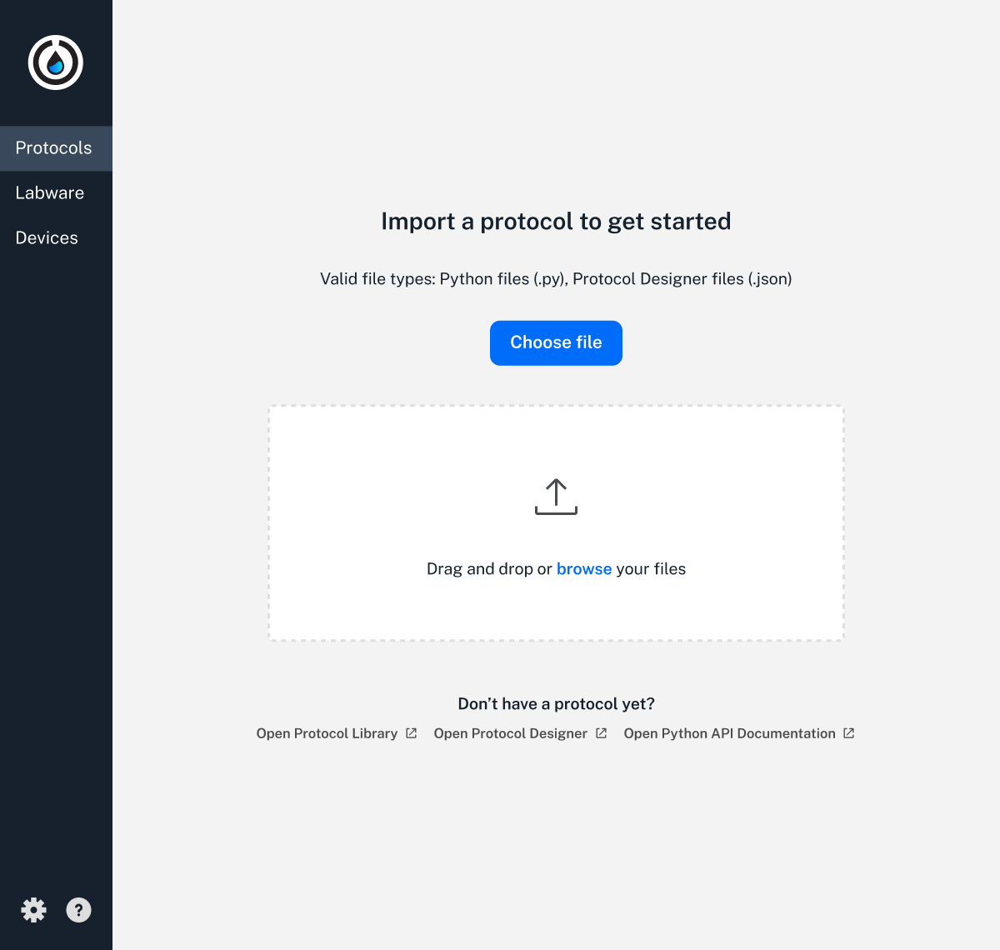
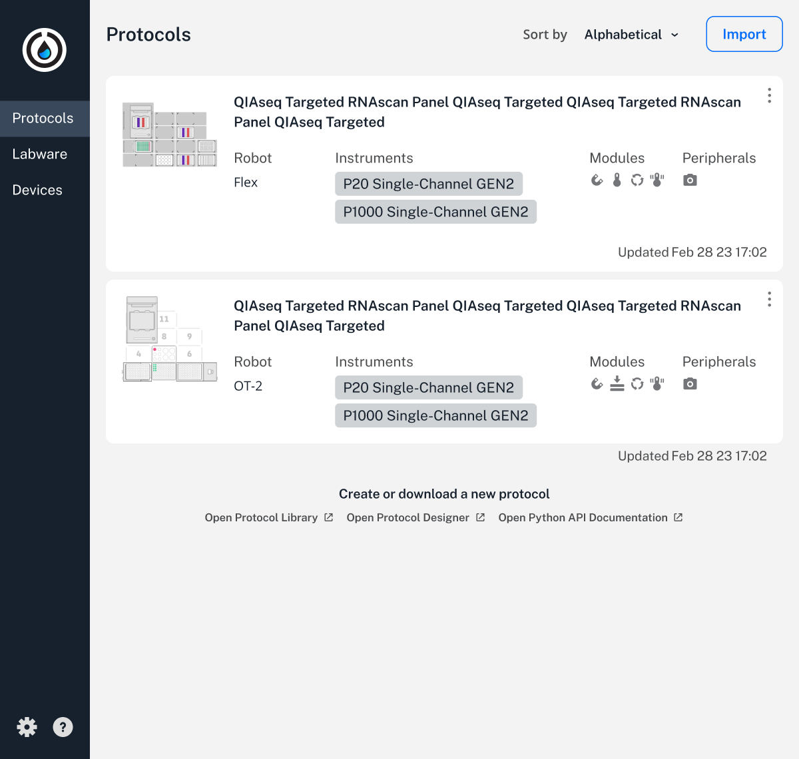
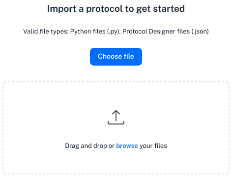
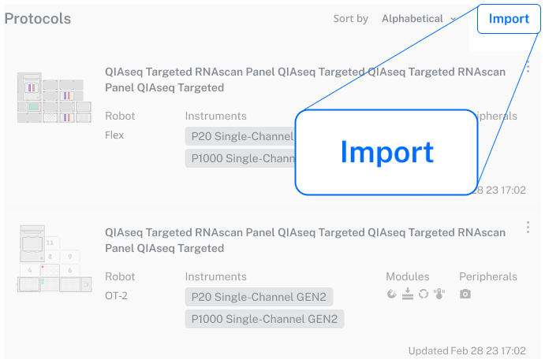

<!--- wonky, use as working title for now --->

This section provides an overview of the Protocols screen in the [Opentrons App](https://opentrons.com/ot-app). The Protocols screen is selected by default when you first launch the app.

## Protocols screen

The Protocols screen provides software features for importing and managing saved protocols. When working in other parts of the app, you can click the **Protocols** tab on the left side of the screen to return to this section anytime.

<figure class="side-by-side" markdown>

<figcaption>Protocol import features and saved protocols.</figcaption>
</figure>

## Importing protocols

If your OT-2 is new, or you've deleted all its protocols, the Protocols screen provides controls that let you import a protocol. To upload a protocol, click **Choose file** to browse your computer file system to find the protocols you want to import. You can also drag and drop a protocol onto this screen to import it.

<figure class="screenshot" markdown>

<figcaption>Protocol import controls.</figcaption>
</figure>

If there are already protocols stored on your OT-2, click **Import** in the top right corner of the screen. This opens a file picker that lets you navigate to a protocol and add it to the others saved on your robot.

<figure class="screenshot" markdown>
{ width="80%" }
<figcaption>Protocol import button.</figcaption>
</figure>

## Analyzing protocols

The Opentrons App will analyze your protocol as soon as you import it. _Protocol analysis_ is the process of taking the JSON object or Python code contained in the protocol file and turning it into a series of commands that the robot can execute in order. If there are any errors in your protocol file, or if you're missing custom labware definitions, the app shows a warning on the protocol's card. Correct the errors and re-import the protocol. The OT-2 can use your protocol when after importing it without any error warnings.

## Managing existing protocols

Summary here. TBD