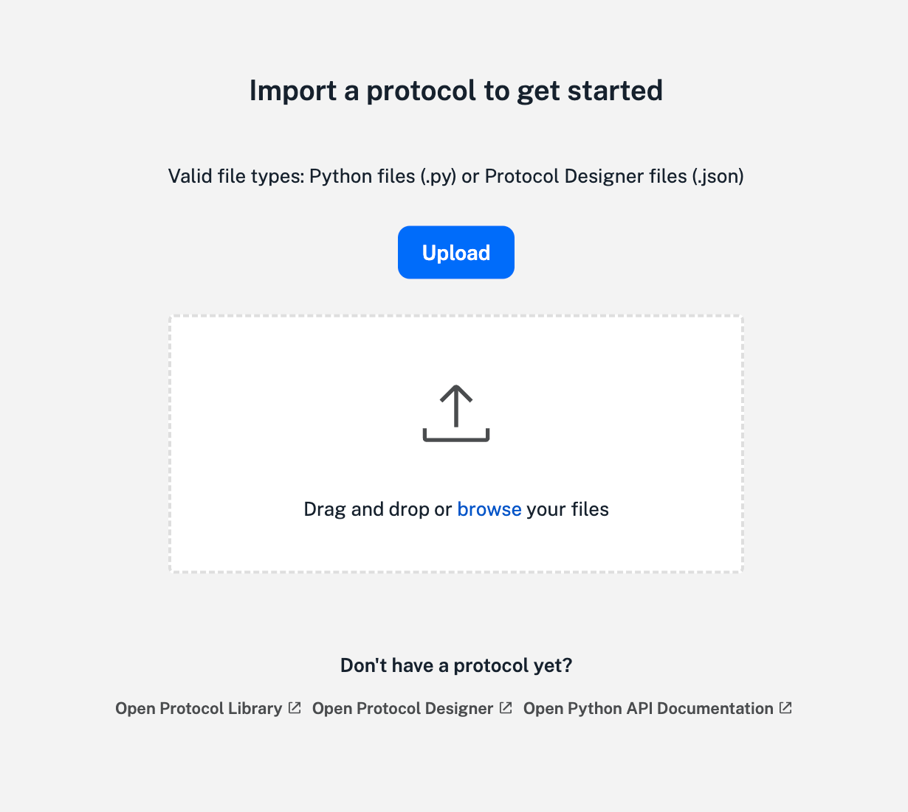
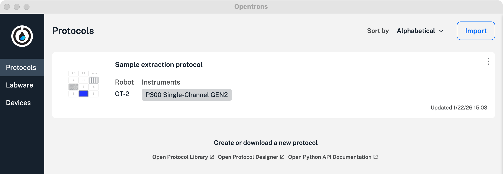

<!--- wonky, use as working title for now --->

This section provides an overview of the Protocols screen in the [Opentrons App](https://opentrons.com/ot-app). The Protocols screen is selected by default when you first launch the app.

## Function summary

The Protocols screen allows you to import new protocol files and review saved files. When working in other parts of the app, you can click the **Protocols** tab on the left side of the screen to return to this section anytime.

<figure class="side-by-side" markdown>

<figcaption>Protocol import features and saved protocols.</figcaption>
</figure>

## Importing protocols

If your OT-2 is new, or you've deleted your saved protocols, the app lets you import a protocol. To upload a protocol, you can either:

- Click **Choose file** to browse your computer file system to find the protocols you want to import.
- Drag and drop a protocol onto this screen to import it.

<figure class="screenshot" markdown>
{ width="70%" }
<figcaption>Protocol upload features.</figcaption>
</figure>

If there are already protocols stored on your OT-2 (or other networked robots), click **Import** in the top right corner of the screen. This opens a file picker that lets you navigate to a protocol and add it to the others saved on your robot.

<figure class="screenshot" markdown>
{ width="80%" }
<figcaption>Protocol import button.</figcaption>
</figure>

## Analyzing protocols

The Opentrons App will analyze your protocol as soon as you import it. _Protocol analysis_ is the process of taking the JSON object or Python code contained in the protocol file and turning it into a series of commands that the robot can execute in order. If there are any errors in your protocol file, or if you're missing custom labware definitions, the app shows a warning on the protocol's card. Correct the errors and re-import the protocol. The OT-2 can use your protocol after importing it, provided there are no error warnings.

## Protocol screen features

The basic protocol screen displays a summary list of all the protocols stored on your computer.

Other screen elements and actions let you sort protocols, assign a protocol to a robot, and expand the protocol summary to see more information about each protocol.

<table>
  <thead>
    <tr>
      <th>Feature</th>
      <th>Description</th>
    </tr>
  </thead>
  <tbody>
    <tr>
      <td>Sort by</td>
      <td>Opens a drop-down menu that offers protocol sorting options which include:
        <ul>
            <li>Alphabetical</li>
            <li>Reverse alphabetical</li>
            <li>Most recent updates</li>
            <li>Oldest updates</li>
            <li>Flex protocols first</li>
            <li>OT-2 protocols first</li>
        </ul>
      </td>
    </tr>
    <tr>
      <td><strong>Import</strong> button</td>
      <td>Opens a file picker that lets you browse to and upload other saved protocols.</td>
    </tr>
    <tr>
        <td>Three-dot (⋮) menu</td>
        <td>Opens a pop-up menu that includes these options:
            <ul>
                <li>Start setup: choose a networked Opentrons robot to run a protocol.</li>
                <li>Reanalyze: runs protocol analysis on a saved or revised protocol.</li>
                <li>Show in folder: opens the file location for stored protocols.</li>
                <li>Delete: deletes a protocol. Tip: Use the "Show in folder" option to delete protocols in bulk.</li>
            </ul>
        </td>
    </tr>
    <tr>
        <td>Create or download a new protocol</td>
        <td>Provides links to the <a href="https://library.opentrons.com/">Protocol Library</a>, <a href="https://designer.opentrons.com/">Protocol Designer</a>, and the <a href="https://docs.opentrons.com/python-api/">Python API</a>.</td>
    </tr>
  </tbody>
</table>

## Protocol details

You can click on each protocol summary tile to expand it. An expanded tile shows you more information about the protocol.

Click the **Protocols** tab to return to the default summary list view.