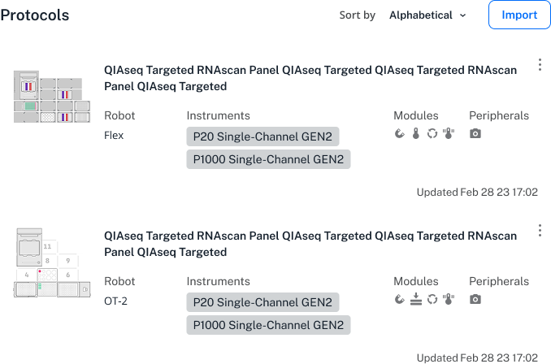

<!--- wonky, use as working title for now --->

The Protocols tab is selected by default when you first launch the app. This section provides an overview of the main features provided in this section of the app. The app is compatible with the Opentrons OT-2 and Flex liquid handling robots. It is also the only way to interact with an OT-2 because this robot does not have an external touchscreen like the Flex.

The OT-2 accepts protocols created with the Opentrons [Protocol Designer](https://designer.opentrons.com/) and our [Python API](https://docs.opentrons.com/python-api/).

## Protocols screen

When you first launch the Opentrons App, you will see the Protocols screen. This the main interface for importing and managing protocols. When in the app, you can click the **Protocols** tab on the left side of the screen to return to this section anytime.

<figure class="side-by-side" markdown>

<figcaption>The Protocols screen: import features and saved protocols.</figcaption>
</figure>

## Importing protocols

If your OT-2 is new, or you've deleted all its protocols, the Protocols screen provides controls that let you import a protocol. To upload a protocol, click **Choose file** to browse your computer file system to find the protocols you want to import. You can also drag and drop a protocol onto this screen to import it.

<figure class="screenshot" markdown>

<figcaption>Protocol import features: file chooser or drag-and-drop.</figcaption>
</figure>

If there are already protocols stored on your OT-2, click **Import** in the top, right corner of the screen. This opens a file picker that lets you navigate to a saved protocol and add it to the other protocols saved on your robot.

<figure class="screenshot" markdown>

<figcaption>Protocol import feature: **Import** button.</figcaption>

The Opentrons App will analyze your protocol as soon as you import it. _Protocol analysis_ is the process of taking the JSON object or Python code contained in the protocol file and turning it into a series of commands that the robot can execute in order. If there are any errors in your protocol file, or if you're missing custom labware definitions, the app shows a warning on the protocol's card. Correct the errors and re-import the protocol. The OT-2 can use your protocol when after importing it without any error warnings.

## Managing existing protocols

features for protocols on the page