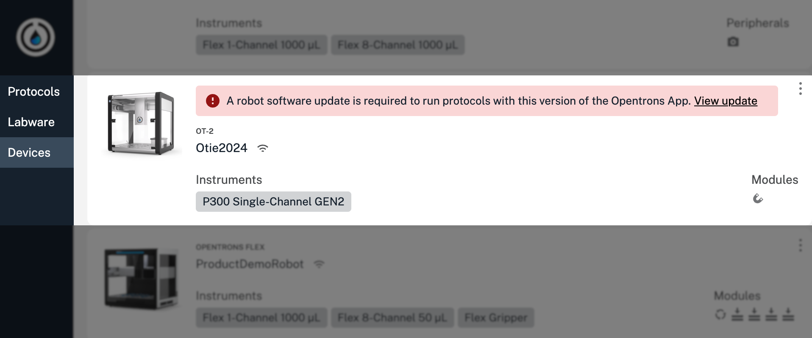

Follow these instructions to download and install the latest software on an OT-2. Updating the robot software gives you access to new features and bug fixes released since your OT-2 was manufactured.

!!! note
    OT-2 robot software is packaged separately but versioned the same as the Opentrons OT-2 App. Consequently, the software that powers your OT-2 is not automatically updated when you [update the Opentrons OT-2 App](./installation.md#app-software-updates). You cannot run protocols if the robot software version and app versions do not match.

To update the OT-2 robot software:

1. Click the **Devices** tab in the Opentrons OT-2 App.

2. Look for an OT-2 that shows the software update warning banner.

    <figure class="screenshot" markdown>
    
    <figcaption>An OT-2 that needs a software update.</figcaption>
    </figure>

3. Click **View update** in the banner. This opens a window that describes any new features and fixes in the release.

4. Click **Update robot now** in the update window to download and automatically install the latest software.

It may take up to 15 minutes for the update to complete. Your OT-2 is ready for use after it updates itself and restarts.