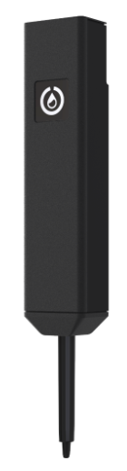
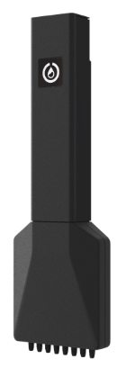
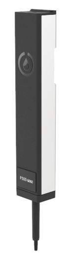
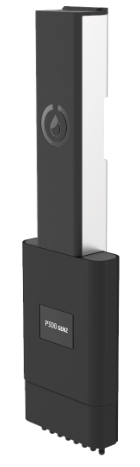

OT-2 pipettes are a class of gantry-mounted instruments you attach to an Opentrons OT-2 liquid handling robot. They move liquids throughout the working area during protocol execution. For an OT-2, this class of instruments includes single-channel and multi-channel GEN1 and GEN2 pipettes. 

!!! note
    OT-2 pipettes are not compatible with the Opentrons Flex. Flex pipettes are not compatible with an OT-2.

## GEN1 pipettes

OT-2 GEN1 pipettes are black and marked by a white or black Opentrons drop logo. They may have an affixed sticker that identifies these instruments as GEN1 pipettes and/or their volumetric capacity.

<figure class="side-by-side" markdown>

<figcaption>GEN1 single and multi-channel pipettes.</figcaption>
</figure>

GEN1 pipettes are discontinued and obsolete. They have been replaced by the more accurate and fully supported GEN2 models.

## GEN2 pipettes

OT-2 GEN2 pipettes are different than their GEN1 predecessors. GEN2 pipettes are longer than the GEN1, they have a black and silver housing, and display exterior markings that identify these instruments as GEN2 pipettes along with their volumetric capacity.

<figure class="side-by-side" markdown>

<figcaption>GEN2 single and multi-channel pipettes.</figcaption>
</figure>

## Installing OT-2 pipettes

For instructions on installing, calibrating, and detaching pipettes, see the [Instrument Installation and Calibration section](installation/instruments.md).

## Replacing OT-2 pipettes

If you need to replace an older GEN1 pipette or just need another GEN2 pipette, see the [Pipettes section](https://opentrons.com/products/categories/pipettes) of the Opentrons website.

The available OT-2 GEN2 pipettes can handle volumes from 1 µL to 1000 µL in single- or multi-channel (8-channel) configurations:

- P20 Single-Channel (1–20 µL)
- P300 Single-Channel (20–300 µL)
- P1000 Single-Channel (100–1000 µL)
- P20 Multi-Channel (1–20 µL)
- P300 Multi-Channel (20–300 µL)

A single-channel or multi-channel pipette each occupies one mount (left or right) on the carriage.

## Picking up and dropping tips

OT-2 pipettes pick up disposable plastic tips by pressing them onto the pipette nozzles, and then aspirate and dispense liquids using the tips. The total force required for pickup increases as more tips are picked up simultaneously.

To discard tips (or return them to their rack), the pipette ejector mechanism pushes the tips off of the nozzles.

## OT-2 pipette specifications

OT-2 pipettes are designed to handle a wide range of liquid volumes and are compatible with multiple tip sizes. To help ensure performance and quality, Opentrons has tested these instruments with different tips and liquid volume combinations.

!!!tip
    For best results, use the smallest capacity tips that meet the needs of your protocol.

!!!note
    You do not have to calibrate the volume that your pipettes dispense before use. You only have to perform positional calibration. See [Robot Calibration](calibration/robot-calibration.md).

The following tables list the accuracy and precision specifications for OT-2 pipettes. For flow rate information, see [OT-2 Pipette Flow Rates](../python-api/pipettes/characteristics.md#pipette-flow-rates) in the Opentrons API documentation.

### Single-channel pipettes

<table>
  <thead>
    <tr>
      <th rowspan="2">Pipette</th>
      <th rowspan="2">Volume (µL)</th>
      <th colspan="2">Accuracy (Systematic Error)</th>
      <th colspan="2">Precision (Random Error)</th>
    </tr>
    <tr>
      <th>%D</th>
      <th>µL</th>
      <th>%CV</th>
      <th>µL</th>
    </tr>
  </thead>
  <tbody>
    <tr>
      <td><strong>P20</strong></td>
      <td>1</td>
      <td>±15%</td>
      <td>0.15 µL</td>
      <td>±5%</td>
      <td>0.05 µL</td>
    </tr>
    <tr>
      <td></td>
      <td>10</td>
      <td>±2%</td>
      <td>0.2 µL</td>
      <td>±1%</td>
      <td>0.1 µL</td>
    </tr>
    <tr>
      <td></td>
      <td>20</td>
      <td>±1.5%</td>
      <td>0.3 µL</td>
      <td>±0.8%</td>
      <td>0.16 µL</td>
    </tr>
    <tr>
      <td><strong>P300</strong></td>
      <td>20</td>
      <td>±4%</td>
      <td>0.8 µL</td>
      <td>±2.5%</td>
      <td>0.5 µL</td>
    </tr>
    <tr>
      <td></td>
      <td>150</td>
      <td>±1%</td>
      <td>1.5 µL</td>
      <td>±0.4%</td>
      <td>0.6 µL</td>
    </tr>
    <tr>
      <td></td>
      <td>300</td>
      <td>±0.6%</td>
      <td>1.8 µL</td>
      <td>±0.3%</td>
      <td>0.9 µL</td>
    </tr>
    <tr>
      <td><strong>P1000</strong></td>
      <td>100</td>
      <td>±2%</td>
      <td>2.0 µL</td>
      <td>±1%</td>
      <td>1 µL</td>
    </tr>
    <tr>
      <td></td>
      <td>500</td>
      <td>±1%</td>
      <td>5.0 µL</td>
      <td>±0.2%</td>
      <td>1 µL</td>
    </tr>
    <tr>
      <td></td>
      <td>1000</td>
      <td>±0.7%</td>
      <td>7.0 µL</td>
      <td>±0.15%</td>
      <td>1.5 µL</td>
    </tr>
  </tbody>
</table>

### Multi-channel pipettes

These instruments have 8 channels.

<table>
  <thead>
    <tr>
      <th rowspan="2">Pipette</th>
      <th rowspan="2">Volume (µL)</th>
      <th colspan="2">Accuracy (Systematic Error)</th>
      <th colspan="2">Precision (Random Error)</th>
    </tr>
    <tr>
      <th>%D</th>
      <th>µL</th>
      <th>%CV</th>
      <th>µL</th>
    </tr>
  </thead>
  <tbody>
    <tr>
      <td><strong>P20</strong></td>
      <td>1</td>
      <td>±20%</td>
      <td>0.2 µL</td>
      <td>±10%</td>
      <td>0.1 µL</td>
    </tr>
    <tr>
      <td></td>
      <td>10</td>
      <td>±3%</td>
      <td>0.3 µL</td>
      <td>±2%</td>
      <td>0.2 µL</td>
    </tr>
    <tr>
      <td></td>
      <td>20</td>
      <td>±2.2%</td>
      <td>0.44 µL</td>
      <td>±1.5%</td>
      <td>0.3 µL</td>
    </tr>
    <tr>
      <td><strong>P300</strong></td>
      <td>20</td>
      <td>±10%</td>
      <td>2.0 µL</td>
      <td>±4%</td>
      <td>0.8 µL</td>
    </tr>
    <tr>
      <td></td>
      <td>150</td>
      <td>±2.5%</td>
      <td>3.75 µL</td>
      <td>±0.8%</td>
      <td>1.2 µL</td>
    </tr>
    <tr>
      <td></td>
      <td>300</td>
      <td>±1.5%</td>
      <td>4.5 µL</td>
      <td>±0.5%</td>
      <td>1.5 µL</td>
    </tr>
  </tbody>
</table>