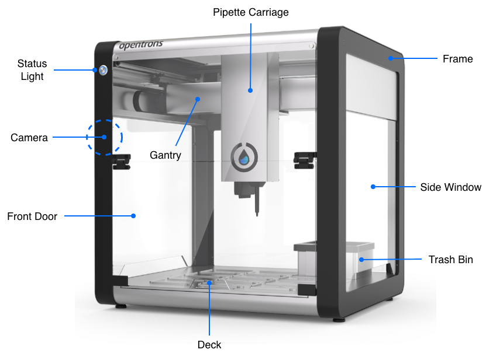
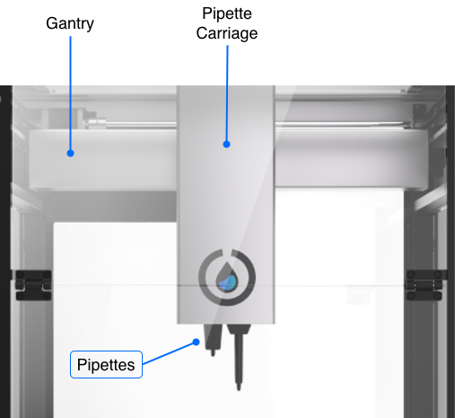
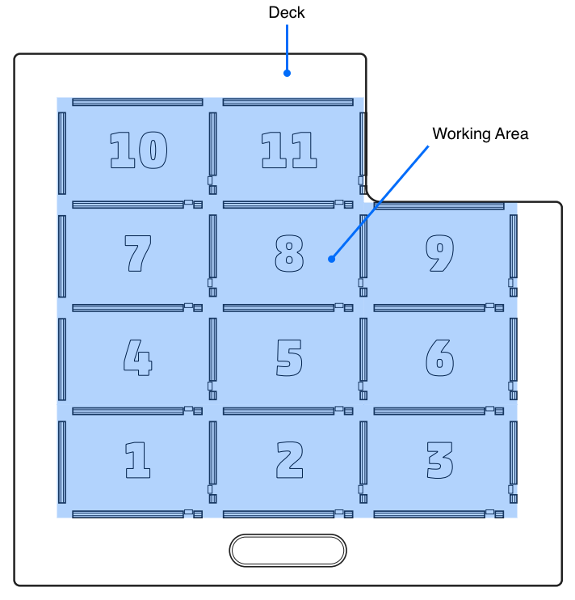
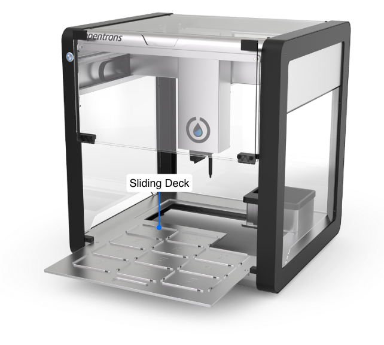
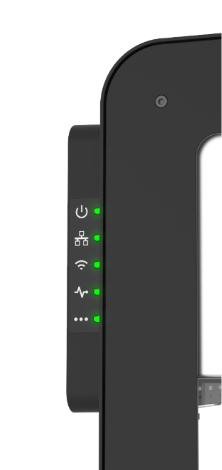
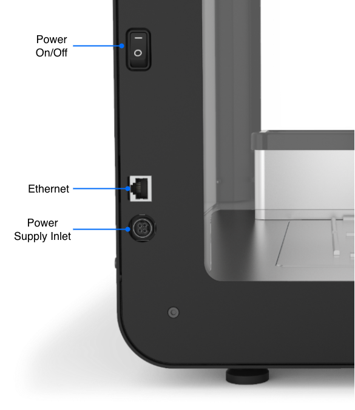
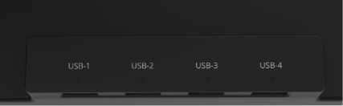

## Frame and enclosure

The frame of the OT-2 provides rigidity and structural support for its deck and gantry. It is constructed of sheet metal and aluminum extrusions. All of the mechanical subsystems are mounted to the frame. 

The metal frame has openings for side, top, and back windows along with a front door made of transparent polycarbonate that lets you see what's going on inside the robot. The lower half of the front door hinges open for access to the deck and working area. With the front door open, you can attach instruments to the gantry, place modules and labware on the deck, and prepare or organize the deck before and during a protocol run.

Other frame elements include:

- LED strips within the enclosure that provide software-controllable ambient lighting.
- A built-in 2-megapixel camera that can take still or video images of the deck and working area.
- A front LED that indicates the robot's status. It turns solid blue when your OT-2 is powered on and fully booted up.

## Gantry

Attached to the frame is the gantry, which is the robot's movement and positioning system.

The gantry moves separately along the x- and y-axis to position the pipettes at precise locations for protocol execution. Movement along these axes is precise to the nearest 0.1 mm.

In turn, the pipette carriage is attached to the gantry. The pipette carriage holds mounting points for single-channel and multi-channel pipettes. The mounting points move along the z-axis to position pipettes at precise locations for protocol execution.

The electronics in the gantry provide power and communications to attached pipettes.

## OT-2 deck and working area

The deck is the machined aluminum surface on which automated science protocols are executed. It provides 11 ANSI/SLAS-compliant slots that can hold labware, modules, and consumables. These deck slots are numbered 1 to 11. A removable trash bin occupies its own special slot in the rear right corner of the deck.

The working area is the physical space on and above the deck that is accessible for pipetting. Labware placed in slots 1–11 are in the working area.

The OT-2 deck slides in and out of the enclosure. You can pull it out part way, or remove it completely, for cleaning.

!!! note
    Remember to [calibrate the deck](../calibration/robot-calibration.md#deck-calibration) after removing, reinstalling, or replacing it.

## Other connections

Find the power switch, status lights, and Ethernet port on the left side and back of the OT-2. For module connectivity, use the internal USB ports located behind the gantry.

### Rear LEDs

These status lights allow you to quickly assess the state of your OT-2.

{ width="50%" }

The following table lists and describes these status lights.

<table>
  <thead>
    <tr>
      <th>Icon</th>
      <th>Status</th>
      <th>Description</th>
    </tr>
  </thead>
  <tbody>
    <tr>
      <td></td>
      <td>Power light</td>
      <td>The light should stay on and remain solid if the OT-2 is turned on and initialized.</td>
    </tr>
    <tr>
      <td></td>
      <td>Ethernet connection</td>
      <td>The light is solid when the robot is connected to the network and has an IP address. It is normal for the light to remain dark for a few moments after turning the robot on. If the light stays off, that indicates the OT-2 cannot connect to the local network.</td>
    </tr>
    <tr>
      <td></td>
      <td>Wi-Fi</td>
      <td>The light is solid when the OT-2 has connected to a Wi-Fi network.</td>
    </tr>
    <tr>
      <td></td>
      <td>Operating system heartbeat</td>
      <td>The light flashes once every few seconds if the robot's operating system has successfully booted up and is operating normally.</td>
    </tr>
    <tr>
      <td></td>
      <td>&mdash;</td>
      <td>Not used.</td>
    </tr>
  </tbody>
</table>

### Power and network

On the side panel below the LED status indicators, you can find the on/off switch, an Ethernet port, and the power port for the robot's external power supply.

See [First Run](../installation/first-run.md) for information on how to properly connect your OT-2 to its external power supply and local network.

### USB ports

The OT-2 has 4 USB ports, located in the left rear of the enclosure, behind the gantry. These ports, labeled USB-1 through USB-4, are used for communication between connected Opentrons modules and the robot.

{ width="80%" }

See the [OT-2 Modules section](../modules/index.md) for more information on connecting these devices and using them in your protocols.

## Serial number

Every OT-2 has a unique serial number. The format of the serial number provides additional information, including the robot's date of production. For example, the serial number OT2CEP20220927R04 would indicate:

| Characters | Category | Description |
|----|----|----|
| OT2 | Model | The robot is an OT-2. |
| CEP | Version | A code for the production version of the robot. |
| 2022 | Year | This robot was made in 2022. |
| 09 | Month | This robot was made in September. |
| 27 | Day | This robot was made on the 27th day of the month. |
| R04 | Unit | A unique code for robots made during a certain time interval. |

You can find the serial number for your OT-2:

- On the certification sticker on the back of the robot.
- In the Opentrons OT-2 App under **Devices** > your OT-2 > **Robot settings** > **Advanced**.