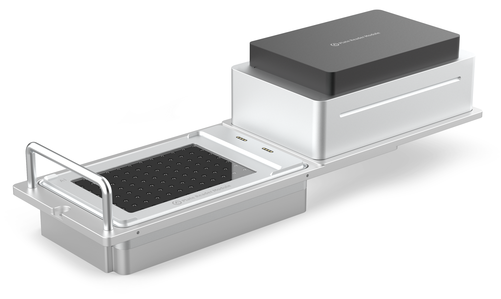

{style="width: 60%"}

# Absorbance Plate Reader Instruction Manual

{style="width: 60%"}

**Opentrons Labworks Inc.** 
October 2024

## Product description

The Opentrons Absorbance Plate Reader Module is an on-deck microplate spectrophotometer that works with the Flex liquid handling robot. It uses light absorbance to determine sample concentrations. The module accepts ANSI/SBS-standard 96-well plates and has 96 separate detection units, which allows for rapid endpoint or kinetic sample analysis. The Absorbance Plate Reader is designed for laboratory research and other non-in-vitro diagnostic analyses.

**The Opentrons Flex Absorbance Plate Reader may currently not be offered, used or put on the market in any European Patent Convention States due to a third party patent application.**

