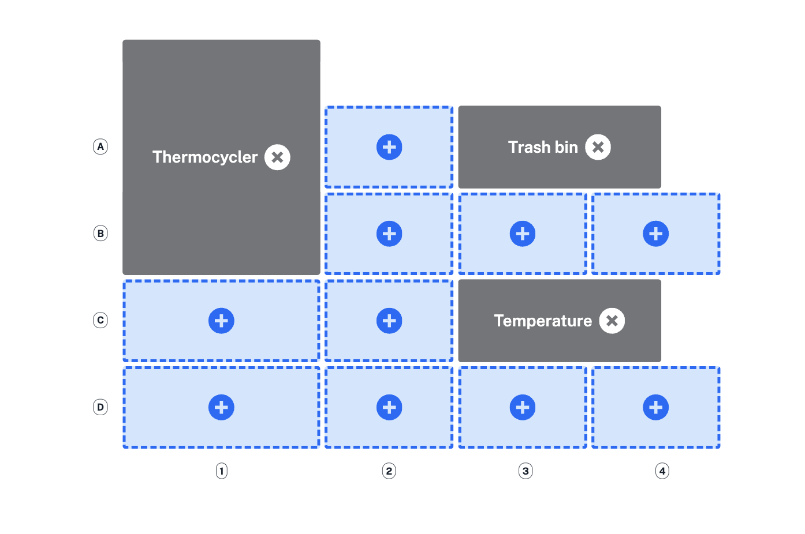
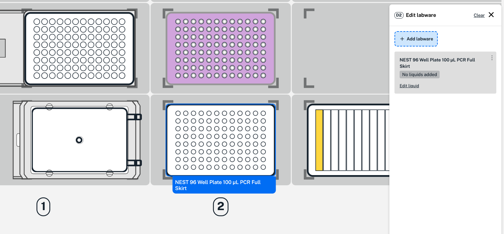
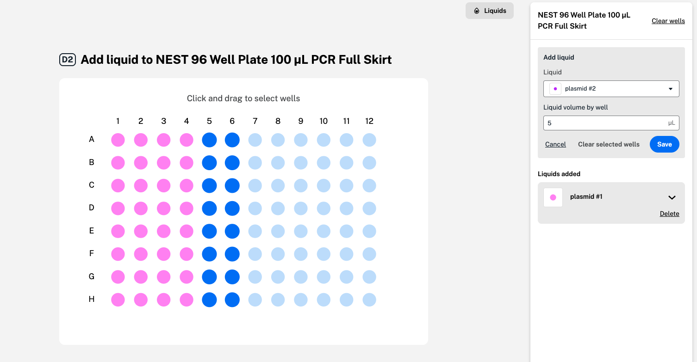
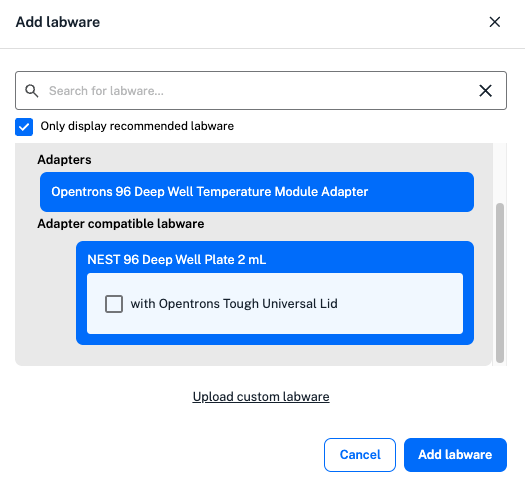
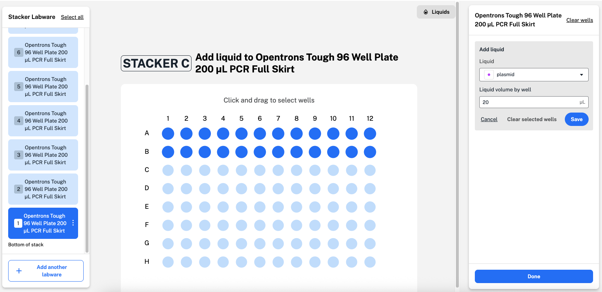

Click **Edit protocol** to add and edit hardware, labware, and liquids on the protocol starting deck. 

The protocol starting deck view shows how your Flex or OT-2 deck will look at the beginning of a protocol. This is the first step in your protocol timeline, shown on the left. It's also the same view of the deck as in the protocol overview, but editable. 

## Deck hardware

To start, the deck includes your chosen modules and fixtures. Click **Deck hardware** in the upper left to add, move, or delete modules or fixtures. Protocol Designer only shows compatible options for each slot. 

<figure class="screenshot" markdown>
  
  <figcaption>Add, move, or delete deck hardware, like modules and fixtures.</figcaption>
</figure>

## Liquids

Next, click **Liquids** in the upper left. First, define a liquid to use in your protocol with a name, description, and color. You can also define the liquid as an Opentrons-verified liquid class to apply optimized pipetting settings during transfer and mix steps. 

You'll also be able to define and add liquids in labware already added in your protocol.

## Labware

Click to return to the protocol starting deck, the first step in your protocol timeline. Here, you can edit labware on or off the robot deck. Use the toggle switch at the upper right of the protocol starting deck to view or add any off-deck labware.

To start, Protocol Designer places your chosen tip racks on the deck. You can drag and drop tip racks to new deck slots, or click and choose **Edit labware** to replace or delete the tip rack. Click any open deck slot to add additional tip racks. You can include lids on additional Flex tip racks. 

Hover over any deck slot to view slot details. Then, click individual slots to add, remove, or change labware. 

For the example below, add labware by clicking empty deck slot D2.  

<figure class="screenshot" markdown>
  
  <figcaption>Add a well plate to the deck.</figcaption>
</figure>

In the menu, search for or select a labware type and view available options from the [Labware Library](https://labware.opentrons.com "Labware Library"): 

- Additional **tip racks** 
- **Tube racks** 
- **Well plates**, **reservoirs**, and their compatible lid options 
- **Aluminum blocks** to hold tubes or well plates on a Temperature module 
- **Adapters** like the Flex Deck Riser
- Labware **lids**

You can stack up to five lids to use later in your protocol in an open deck slot or on a Flex Deck Riser. Tip rack lids can't be stacked or placed on the deck or a Deck Riser. 

Click at the bottom of the labware list to upload a JSON file and use custom labware in your protocol. 

After adding labware, drag and drop to move to another slot. Click the deck slot for additional editing options: 

* Choose **Edit labware** to replace, rename, or delete labware in a slot. You can rename any labware (with the exception of tip racks) to make them easier to identify throughout your protocol. 
* Click **Duplicate labware** to add the slot's adapters, labware, lids, and liquids to another open deck slot. 
* Clear all hardware and labware from any slot. 

Edit staging areas by clicking any deck slot in row 3 or 4. To edit a Thermocycler Module, click deck slot B1 on the Flex or 7 on the OT-2. A trash bin or waste chute is always required on the deck. On the OT-2, the trash bin is always placed in slot 12. 

### Liquids in labware

When editing labware, click **Edit liquid** in the labware menu on the right to define and add liquids. In the labware graphic, click and drag to select wells across rows and columns. From the dropdown menu, select your liquid and enter the starting volume for each well in microliters (µL). Click **Save** for each liquid added to your labware before clicking **Done**.  

<figure class="screenshot" markdown>
  
  <figcaption>Add liquid to your chosen wells. Wells shown in blue are selected to add a second liquid (plasmid #2). </figcaption>
</figure>

### Labware in modules 

To add labware to a module, click any open module and choose **Edit labware**. 

<figure class="screenshot" markdown>
  
  <figcaption>Add compatible labware to the Temperature Module. </figcaption>
</figure>

Protocol Designer only shows recommended labware in the list of available options. You can choose to view more labware, including labware that may be incompatible with the module. Add compatible adapters for modules on the deck from the "adapter" labware category. 

The Absorbance Plate Reader Module needs to be initialized before adding labware. First, add a [step](steps/module.md#absorbance-plate-reader-module-steps) to initialize the module while empty. Then, use a move step to add any labware to the Absorbance Plate Reader Module later in your protocol. 

You can add up to 4 Flex Stacker Modules to your protocol starting deck by clicking column 4, on the right side of your Flex. Each attached Stacker can store additional well plates, tip racks, or reservoirs. During a protocol, the module's attached shuttle moves stored labware from the bottom of the stack to the Flex deck.

In your protocol starting deck, click the Stacker on the right side of the Flex deck to add labware. Choose a labware type and quantity: 

- When adding tip racks, enter a quantity and choose whether to add a lid to each tip rack in the stack. 
- For well plates or reservoirs, enter a quantity. Then, click **Edit liquid and quantity** in the labware menu on the right. 

    Protocol Designer lets you add additional well plates or reservoirs until the Stacker is full. You can also define and add liquids to any labware in the stack. Use Command/^ + click to edit multiple labware and their liquids. 

<figure class="screenshot" markdown>
  
  <figcaption>View, edit, and add liquids to labware in the Flex Stacker.</figcaption>
</figure>

Each Stacker can only store a single type of labware in a protocol. If you need to store more than one kind of labware, you'll need to use multiple Flex Stackers. 

