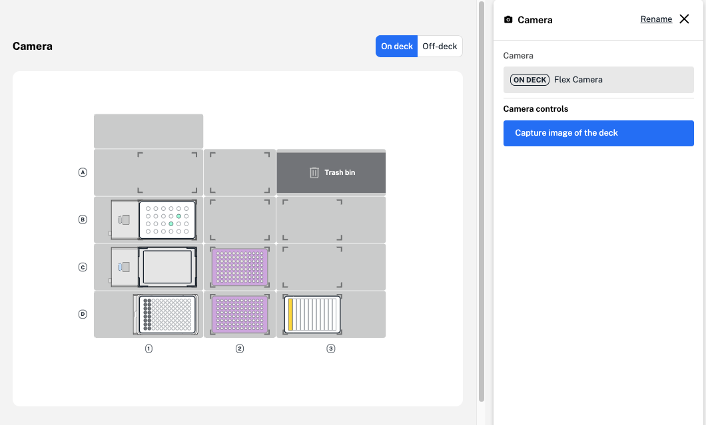

Add a camera step to take a picture of the robot's deck at any point during your protocol. 

<figure class="screenshot" markdown>
  
  <figcaption>Add a camera step to your protocol.</figcaption>
</figure>

A camera step uses the Flex or OT-2's built-in camera to take a still image of the modules, labware, and liquids currently placed on your robot's deck. You can use these images to check on key protocol steps while you're away from the lab bench. 

After running your Protocol Designer protocol, you can access and download your images from the Recent Protocol Runs section of the Opentrons App. Image filenames include information on when the image was taken: 

- your robot and protocol name 
- the step number 
- protocol and command timestamps 

There are even more options available in the Opentrons App to control the camera, including launching a live stream of your robot's deck. 