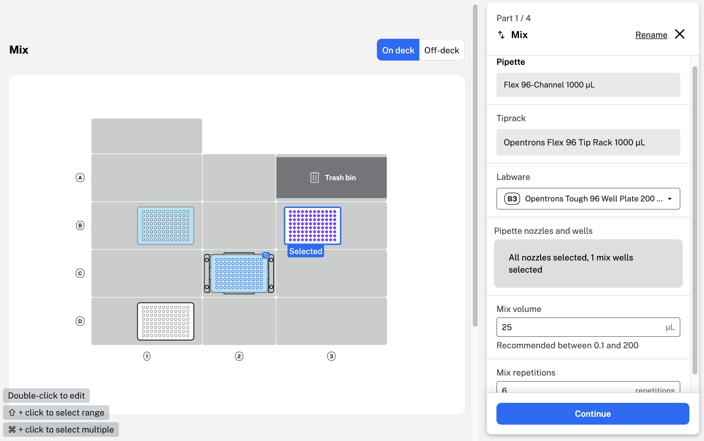

In a mix step, the robot mixes liquid by repeatedly aspirating and dispensing. Mixing occurs in each well you select, one after the other, without moving any liquid between wells. 

You can customize settings for your mix step in a four-part form. Just like in a transfer step, start by selecting a pipette, tip rack, and labware. Then, choose source and destination labware, pipette nozzles, and wells. 

<figure class="screenshot" markdown>
  
  <figcaption>Select wells, volume, and repetitions in the first mix step form.</figcaption>
</figure>

In the second and third forms, choose whether to apply liquid class or other advanced settings. In the aspirate and dispense tabs, you can adjust the flow rate, well order, and tip position within the well. Available advanced settings in a mix step include a delay after aspirating or dispensing and a push out, blowout, or touch tip after dispensing. See [additional settings](transfer.md#additional-settings) for descriptions of each.

Finally, choose [tip management](transfer.md#tip-management) settings, like how often to select a new tip and where to dispose of used tips. If you select **Tip rack** as the tip drop location, the pipette will return tips to their original position in the tip rack. 

Protocol Designer also lets you choose between automatic and manual tip tracking: 

- **Automatic**: Protocol Designer tracks which tips have been picked up and used, and selects the next available tip in the tip rack. 
- **Manual**: Choose the tips the pipette will use in your transfer step. View new, used, or selected tips in the form, as well as tips that have been discarded or are inaccessible. 

Like a transfer step, mix steps are blocked by lids on labware. Use a move step to remove lids, then add a mix step to your protocol. 