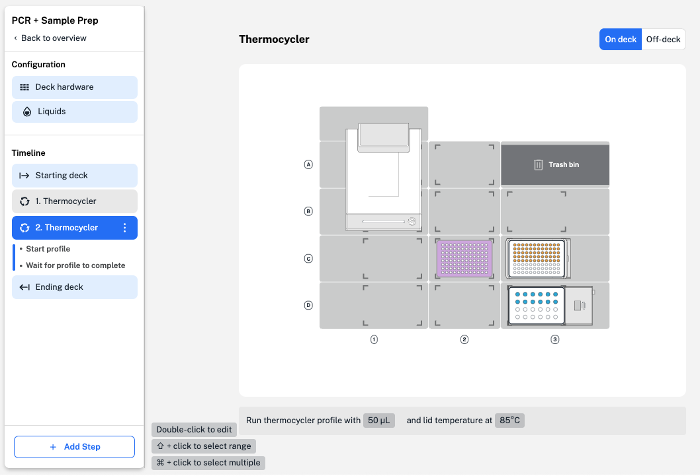
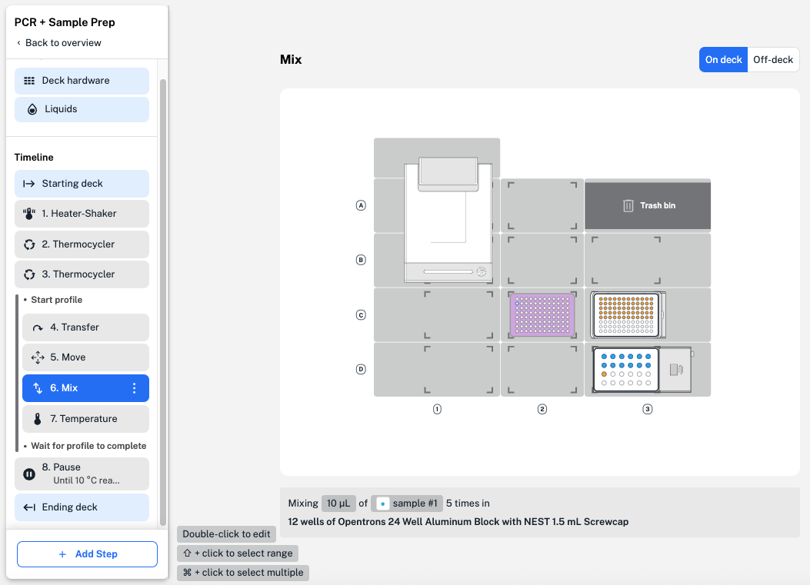

Some protocol steps can run in parallel, or *concurrently*, to speed up protocol runtime on your Flex or OT-2. In Protocol Designer, you can execute steps like pipetting, moving labware, or running another module in parallel with a Thermocycler profile. 

!!! info "Additional Documentation"
    You can read more about [concurrent module actions](../../python-api/modules/concurrent.md) in the Opentrons Python Protocol API.

First, add a Thermocycler step and create a profile. Protocol Designer separates this Thermocycler step into two parts, shown in the protocol timeline on the left: **Start profile** and **Wait for profile to complete.** 

<figure class="screenshot" markdown>

<figcaption>Two Thermocycler profile parts, **Start profile** and **Wait for profile**, are added to the protocol timeline.
</figure>

If you leave this Thermocycler step as is, the robot will wait for the profile to complete before executing any other step. To perform other steps while the profile runs, click and drag to move additional steps inside the Thermocycler profile. 

<figure class="screenshot" markdown>

<figcaption>The robot will perform other steps in parallel while running a Thermocycler profile.</figcaption>
</figure>

Here, your Flex will transfer and mix liquids, pause the protocol so you can move labware, and set the Temperature Module while the Thermocycler profile runs.

!!! note
    Reaching a target temperature for any module takes time. In the example above, a Temperature Module step inside the Thermocycler profile sets the target temperature to 10 °C. If your Thermocycler profile takes less time to run than it takes a Temperature or Heater-Shaker Module to reach or hold at their set temperature:
    
    - The Temperature or Heater-Shaker Module will continue heating or cooling even after the profile is complete.
    - The Thermocycler will hold samples either at the module's last state or your specified ending hold until the protocol reaches Step 8, a pause step to wait for the Temperature Module to reach 10 °C. 
    
        Add an ending hold in your [Thermocycler profile](steps/module.md#thermocycler-module-steps) step.