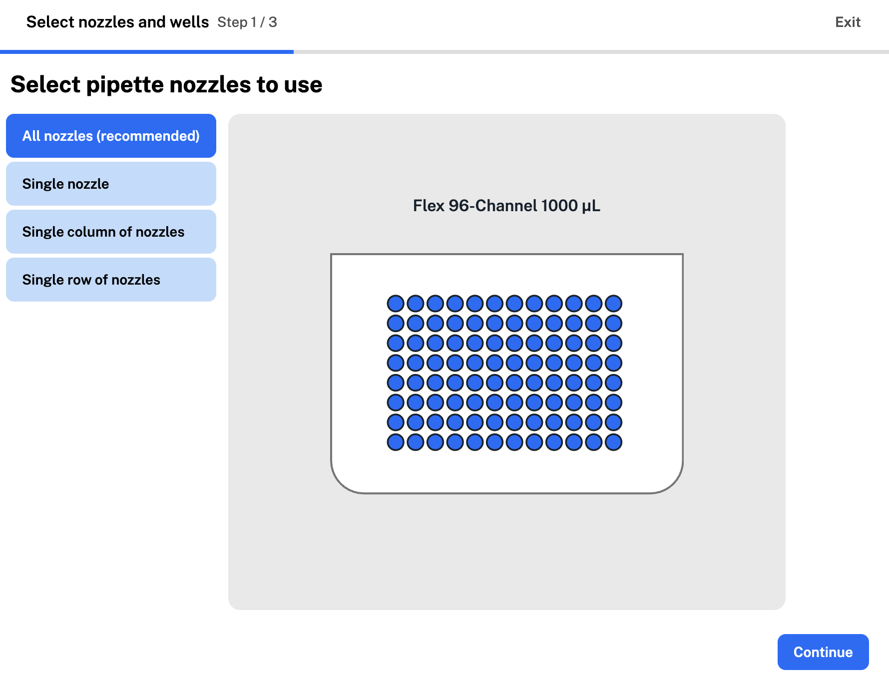
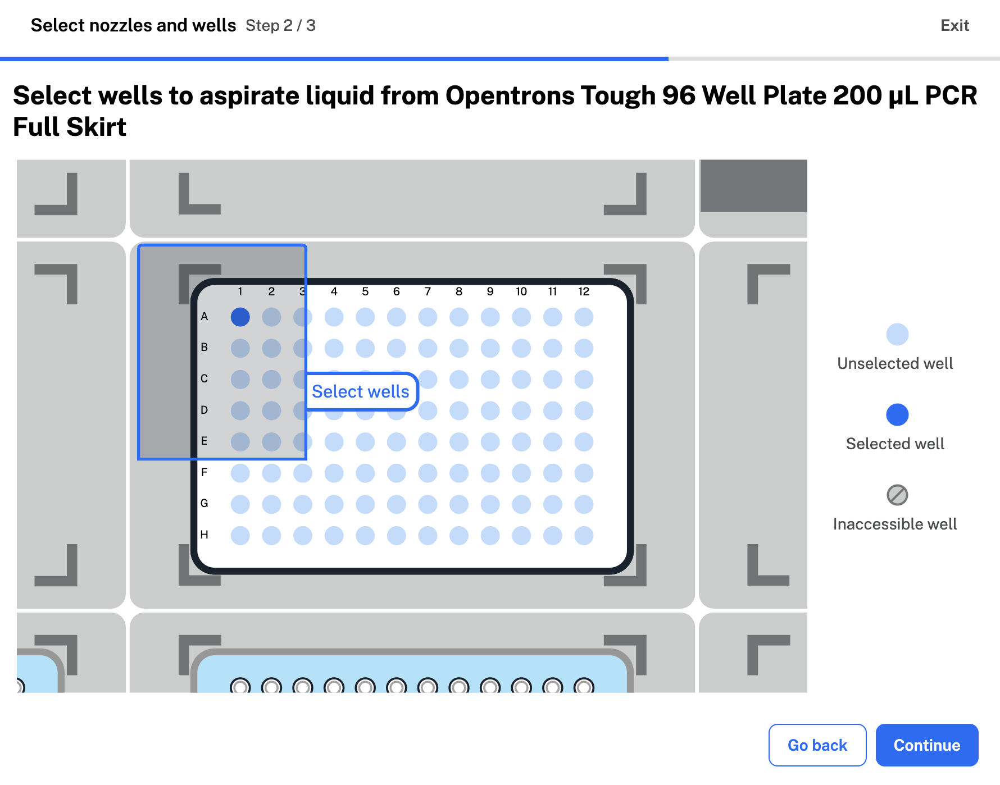
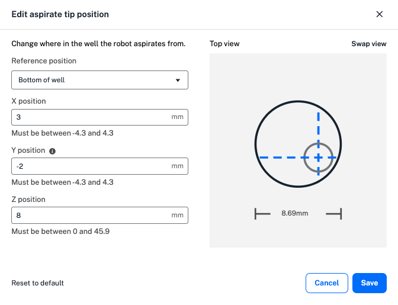
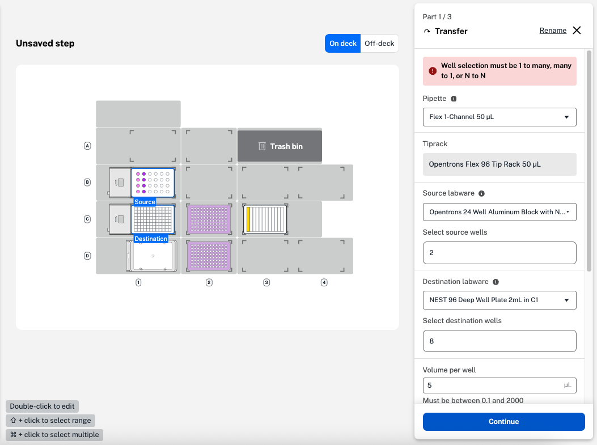
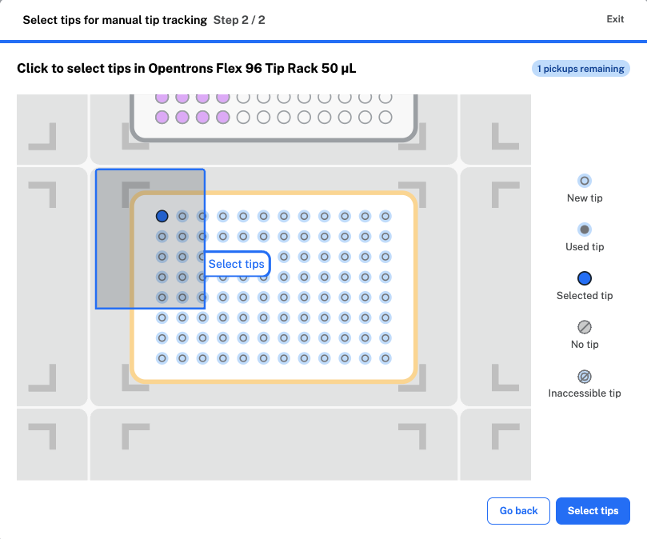
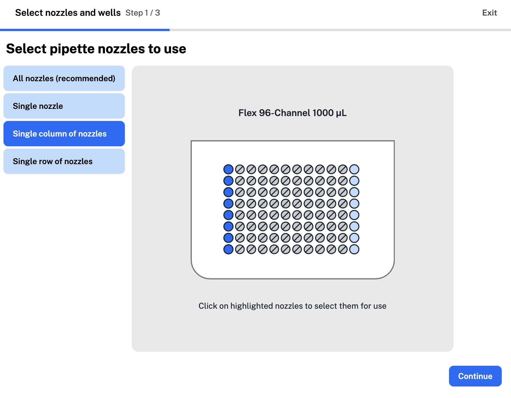
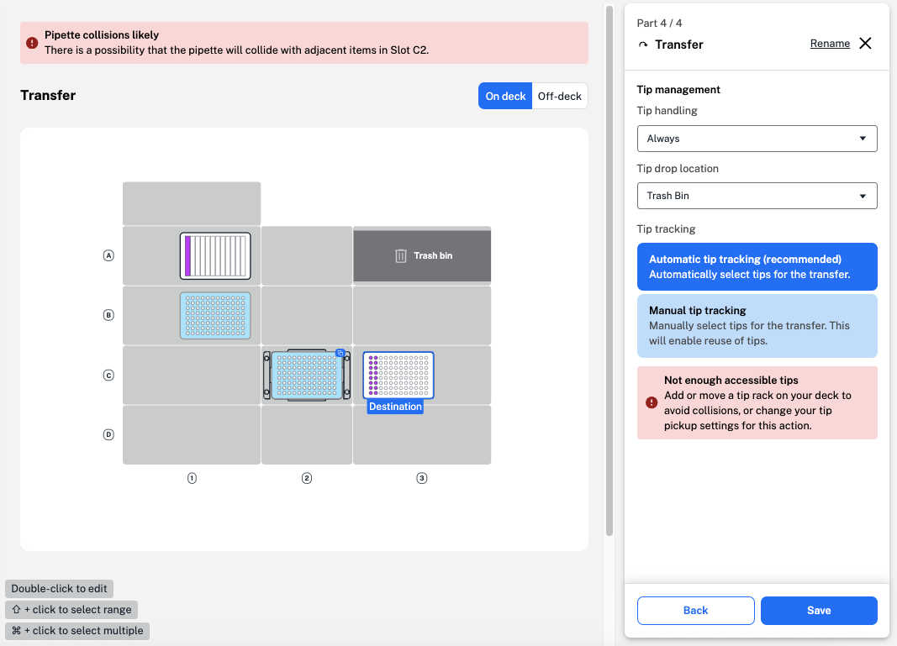
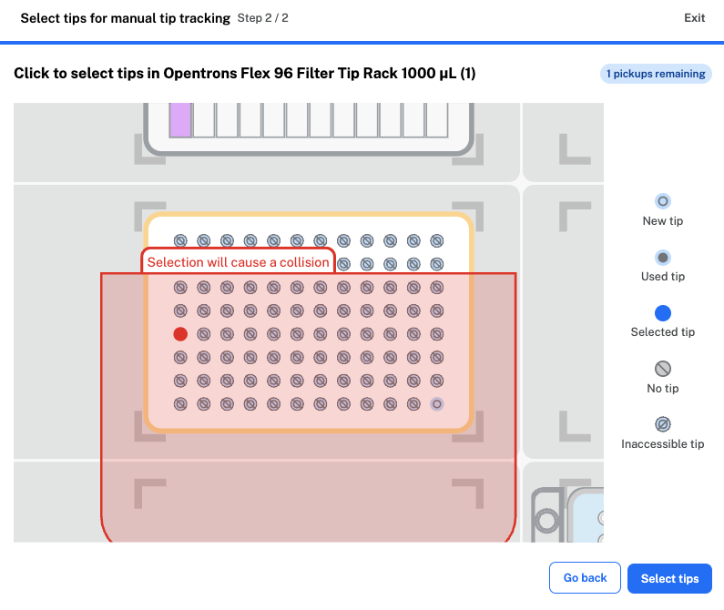

Your protocol timeline includes steps the robot will peform in your protocol. To start, the timeline includes the starting and ending deck states. Click **Add Step** in the lower left to add transfer, move, mix, pause, or module-specific steps to your protocol. 

!!! Note
    Lids on labware block transfer steps in your protocol. If every piece of labware on the deck includes a lid, only move, pause, and relevant module steps will be available. Use a move step to remove lids, then add a transfer step. 

## The basics

Transfer steps move liquid from one well or group of wells to another. Adding a transfer step opens a four-part form. In the first, select basic settings for your liquid transfer: 

* The pipette to perform the transfer and the tip rack it will use. 
* Source and destination labware.
* The number of pipette nozzles and labware wells to use during the transfer.
* Pipette path, or motion the pipette uses to perform the transfer. 
* The volume of liquid to transfer.

### Wells and nozzles

To start, use the dropdown menus to select your source and destination labware. Next, click to select your pipette nozzles and wells. 

<figure class="screenshot" markdown>
  
  <figcaption>Select the nozzles the Flex 96-channel pipette will use for the transfer.</figcaption>
</figure>

Choose from single, column, or row nozzle configurations, depending on your attached pipettes. For more, see [partial tip pickup](transfer.md#partial-tip-pickup).

Next, select source and destination wells. Protocol Designer shows available wells based on your pipette nozzle selections. 

<figure class="screenshot" markdown>
  
  <figcaption>Click to select wells a Flex 1-channel pipette will aspirate from.</figcaption>
</figure>

### Pipette path

Pipette path and tip handling options depend on your well selections and other transfer settings. In the fourth form, you can also customize [tip management](transfer.md#tip-management) settings, like how often the pipette picks up a new tip.

| **Pipette Path** | **Well Ratio** | **Description** {style="width: 25%;"}| **Tip Handling** |
| ---------------- | -------------- | --------------- | ---------------- |
| Single path | N to N | <ul><li>Aspirates enough liquid for a single transfer and repeats</li></ul> | Select a new tip: <ul><li>Always</li><li>Never</li><li>Once</li><li>Per source</li></ul> |
| Consolidate path | Many-to-1 | <ul><li>Multi-aspirate</li><li>Aspirates from multiple wells for a single dispense</li></ul> | Select a new tip: <ul><li>Always</li><li>Never</li><li>Once</li></ul> |
| Distribute path | 1-to-many | <ul><li>Multi-dispense</li><li>Aspirates enough volume from 1 well for multiple dispenses</li></ul> | Select a new tip: <ul><li>Always</li><li>Never</li><li>Once</li></ul> |

## Additional settings

In the second form, you can choose whether to use liquid class settings to transfer liquid with a Flex pipette. Choose from three Opentrons-verified liquid classes: for an aqueous, viscous, or volatile liquid. Applying a liquid class changes the transfer step's pipetting settings, so Protocol Designer will ask you each time. 

!!! Note
    When you apply liquid class settings, Protocol Designer automatically makes changes to additional settings like flow rates, submerge and retract speeds, and air gaps. You can view and edit these changes in the third transfer step form.

    You won't be able to choose a liquid class in an OT-2 protocol. You can still edit additional settings to customize your transfer and mix steps. 

In the third form, click the aspirate and dispense tabs to access additional settings.

* **Custom flow rate**: the speed the robot aspirates or dispenses liquid at. 
* **Well order**: the order the robot addresses source or destination wells in. 
* **Tip position**: where the robot aspirates or dispenses in your labware. 
* Other pipetting settings like submerge and retract speed, mix, delay, blowout, and air gap.  

If you chose to apply a liquid class to your transfer step, each tab already contains values, like flow rate, optimized to transfer your liquid. In this form, you're able to enter custom values in the valid range for settings like tip position. Default values and ranges change depending on the combination of pipette and tips selected to perform the transfer. Click at the bottom of either tab to **Reset aspirate settings** or **Reset dispense settings**. 

Click the default well order or tip position to open the menu and edit. Here, graphics show the order the robot moves from well to well, and where in each well the robot aspirates or dispenses liquid. You can choose a custom well order and adjust the X, Y, and Z tip positions within the valid range for your chosen labware. 

<figure class="screenshot" markdown>
  
  <figcaption>Edit the aspirate tip position.</figcaption>
</figure>

The default tip position value of 0 represents the middle of the well for both X and Y positions. In the example above, a positive X value moves the tip to the right within the well, a negative Y value moves the tip to the left, and a positive Z value moves the tip up towards the top of the well. as you enter custom values, the graphic changes to demonstrate the new tip position. Toggle between top and side views of the well by clicking **Swap view**.

For an aspirate or dispense, Protocol Designer lets you customize submerge and retract settings:

- The *speed* the pipette will submerge into or retract from the liquid. 
- Whether the pipette should *delay* before submerging or retracting.
- The *start point* in the labware to begin the submerge or retract from. 

Additional advanced pipetting settings are available in the Aspirate and Dispense tabs. These are listed in the order in which the robot performs them. Protocol Designer supports the following advanced settings: 

| **Advanced Setting** | **Pipette Movement** | **Description** |
| :------------------- | :------------------- | :-------------- |
| Pre-wet tip | <ul><li>Aspirate</li></ul> | <ul><li>Aspirate and dispense once in the source well before aspirating the transfer volume</li><li>Takes place at your chosen aspirate position</li></ul> |
| Mix | <ul><li>Aspirate</li><li>Dispense</li></ul> | <ul><li>Mix the contents of the well either before aspirating or after dispensing</li><li>Customize volume and number of repetitions</li><li>Can take place at your chosen aspirate or submerge position</li></ul> |
| Delay | <ul><li>Aspirate</li><li>Dispense</li></ul> | <ul><li>Hold the pipette tip at the submerge, aspirate or dispense, or retract position for a defined amount of time after aspirating or dispensing</li><li>Customize duration and position from bottom of well</li></ul> |
| Condition | <ul><li>Aspirate</li></ul> | <ul><li>Aspirate a small conditioning volume after aspirating the total volume to be transferred</li><li>Pipetted back into the source for a more accurate first dispense</li><li>Only available for distribute, or multi-dispenses</li></ul> |
| Push out | <ul><li>Dispense</li><ul> | <ul><li>Dispense past the pipette's plunger bottom to ensure all liquid leaves the tip</li><li>Customize volume</li></ul> |
| Blowout | <ul><li>Dispense</li></ul> | <ul><li>Blow any remaining liquid out of the tip</li><li>Customize location (source well, destination well, trash bin, or trash chute)</li><li>Customize flow rate and tip position from bottom during blowout</li><li>Customize blowout start point, if blowing out liquid into a source or destination well</li></ul> |
| Disposal volume | <ul><li>Dispense</li></ul> | <ul><li>Aspirate a small amount of liquid before completing a multi-dispense</li><li>Ensures each dispense is the correct volume</li><li>Customize disposal volume and blowout volume and flow rate</li><li>Only available for distribute, or multi-dispenses</li></ul> |
| Touch tip | <ul><li>Aspirate</li><li>Dispense</li></ul> | <ul><li>Touch the tip to the four sides of the well to remove droplets after aspirating or dispensing</li><li>Customize touch tip position from the top of the well</li></ul> |
| Air gap | <ul><li>Aspirate</li></ul> | <ul><li>Draw air into the tip after aspirating transfer volume</li><li>Customize air gap volume</li><li>Occurs at your retract location, as long as it's safe to do so (more than 2 mm above the top of the well)</li></ul> |

Some advanced settings, like mix and blowout, are not available with consolidate and distribute pipette paths to prevent sample contamination. Settings like touch tip are not available with some types of labware. Protocol Designer only allows you to select compatible settings in your transfer step.

## Tip management

In the fourth form, you can customize tip management in your transfer steps to help prevent contamination or reduce tip use in a protocol. First, select an available option to choose how often the robot selects a new tip: 

* **Always**: selects a new tip before every aspirate in a transfer step. 
* **Once**: selects a new tip once at the beginning of the entire transfer step. 
* **Never**: reuses the tip used in the previous step. 
* **Per source**: selects a new tip for each source well, including the first. Not compatible with a consolidate or distribute path. 
* **Per destination**: selects a new tip for each destination well, including the first. Not compatible with a consolidate or distribute path. 

Consolidate and distribute paths use a cycle of aspiration and dispensing to combine liquid in source or destination wells. When you choose "always" for a consolidate or dispense path, the robot selects a new tip before the first aspirate of the cycle: 

* Consolidate cycle: aspirate, aspirate, dispense.
* Distribute cycle: aspirate, dispense, dispense. 

If you choose an incompatible well ratio or an empty source well, Protocol Designer displays a warning in the transfer form. 

<figure class="screenshot" markdown>
  
  <figcaption>Incompatible well ratio in a transfer step.</figcaption>
</figure>

Next, choose a tip drop location to dispose of used tips before clicking **Continue**. Options include fixtures like the trash bin and waste chute, if used in your protocol, or to return tips to the tip rack. If you select **Tip rack** as the tip drop location, the pipette will return tips to their original position in the tip rack. 

You can also customize tip tracking settings in your Protocol Designer protocols. When you select automatic tip tracking, Protocol Designer keeps track of which tips have been picked up and used. You can click **manual tip tracking** to manually select the tips the pipette will use in your transfer step. Tips in your tip rack are labeled as:

* **New**: Tips that haven't been used yet.
* **Used**: Tips that have been picked up and returned to the tip rack.
* **Selected**: Tips to be used in your transfer. Tips are numbered to show how many will be picked up at once.
* **No tip**: An empty location in the tip rack. This means the tip from that location has been picked up and discarded. 
* **Inaccessible**: Tips that can't be picked up by your chosen pipette or partial nozzle configuration.

<figure class="screenshot" markdown>
  
  <figcaption>Click to select tips for your transfer step.</figcaption>
</figure> 

Protocol Designer includes warnings if your tip selections might be incompatible with other parts of your protocol, especially in partial tip pickup. See below for more.

## Partial tip pickup

You can use partial tip pickup to use less tips than a Flex or OT-2 multi-channel pipette can pick up at once. When you add a transfer or mix step, start by clicking **Pipette nozzles and wells** in the first form. Select an available partial tip nozzle option: 

| **Pipette** | **Available Nozzle Configurations** |
| ----------- | ----------------------------------- |  
| Flex 96-channel | <ul><li>All nozzles</li><li>Single nozzle (A1, A12, H1, or H12)</li><li>Single column (column 1 or 12)</li><li>Single row (row A or H)</li></ul> |
| Flex 8-channel | <ul><li>All nozzles</li><li>Single nozzle (A1 or H1)</li><li>Partial nozzles (2–7 consecutive nozzles)</li></ul> |
| OT-2 8-channel | <ul><li>All nozzles</li><li>Single nozzle (A1 or H1)</li><li>Partial nozzles (2–7 consecutive nozzles)</li></ul> |

The example below uses a single column of nozzles (1 or 12) for the Flex 96-channel pipette to use in partial tip pickup.  
<figure class="screenshot" markdown>
  
  <figcaption>Choose an individual, single column, or single row of nozzles for the Flex 96-channel pipette to use in the transfer.</figcaption>
</figure>

Next, select your source and destination wells. Protocol Designer will only let you choose wells accessible by your pipette.

!!! Note
    You'll need to place tip racks directly on the starting deck for partial tip pickup with the Flex 96-channel pipette. 

    When you select the Flex 96-channel pipette, Protocol Designer automatically places your first tip rack on the deck with a 96-channel tip rack adapter, required for picking up a full rack of tips. Add a second tip rack directly on the deck to enable partial tip pickup.

In the fourth form, you can choose between automatic and manual tip tracking for your multi-channel pipette. Protocol Designer includes warnings, both in the tip selection form and as a step error, if your partial tip selections could cause pipette collisions. 

### Collision errors

Partial tip pickup requires the pipette to hover above adjacent deck slots, and can increase the risk of collisions. Protocol Designer will always recommend selecting the total number of nozzles for your attached pipette. 

When you choose a partial tip pickup nozzle configuration, Protocol Designer includes [warnings and errors](../warnings-errors.md) to reduce collision risk. These errors can require you to change your well, tip, or deck selections in order to avoid risky situations. 

<figure class="screenshot" markdown>
  
  <figcaption>Protocol Designer shows a collision error because the pipette could collide with the tip rack in slot C2.</figcaption>
</figure> 

Even though the tip rack above is full, the "not enough tips" warning indicates that the pipette can't safely access them to complete your protocol step. This results in a collision error to prevent the pipette from striking adjacent labware in your final protocol. 

To fix the collision error in the example above, you can either:

- Move the well plate from slot C3 so the labware items are no longer adjacent.
- Change your tip pickup selections.

Fix all errors before exporting to ensure your protocol runs successfully. You won't be able to run protocols with unresolved errors. 

To make it easier to resolve tip pickup warnings, be sure **Manual tip tracking** is selected, then click to select tips for manual pickup. This form can show you which selection is causing the collision error, and which tip pickups could work for your step. 

<figure class="screenshot" markdown>
  
  <figcaption>The Flex 96-channel pipette can only access one tip in the rack.</figcaption>
</figure>

Here, the Flex 96-channel pipette can only access one tip in the rack (H8). Because of the deck layout, any other tip selection will cause a collision warning in your protocol. 

