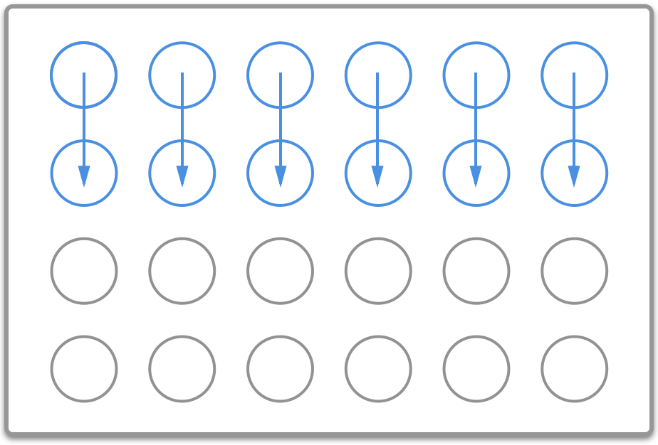
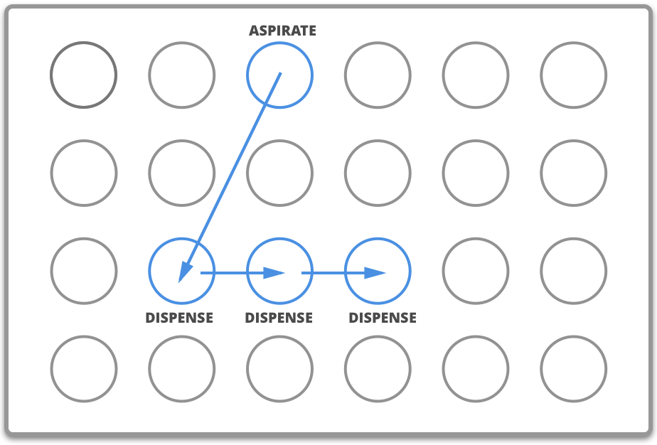
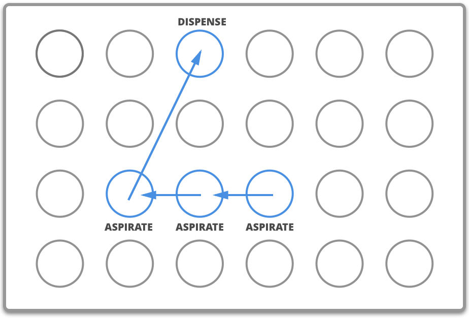

The legacy and liquid class transfer methods form the family of complex liquid handling commands. These methods require `source` and `dest` (destination) arguments to move liquid from one well, or group of wells, to another. In contrast, the [building block commands](../building-block-commands/liquids.md) `aspirate` and `dispense` only operate in a single location.

This example uses [`InstrumentContext.transfer()`][opentrons.protocol_api.InstrumentContext.transfer] to perform a transfer between two wells on a plate:

```python
pipette.transfer(
    volume=100,
    source=plate["A1"],
    dest=plate["A2"],
)
```

*New in version 2.0*

You could also use [`InstrumentContext.transfer_with_liquid_class()`][opentrons.protocol_api.InstrumentContext.transfer_with_liquid_class] to perform the transfer:

```python
liquid_1 = protocol.get_liquid_class("glycerol_50")
pipette.transfer_with_liquid_class(
    liquid_class=liquid_1,
    volume=100,
    source=plate["A1"],
    dest=plate["A2"],
)
```

This time, the `glycerol_50` liquid class definition automatically applies transfer behavior optimized for a viscous liquid in your Flex protocol.

*New in version 2.24*

This page covers the restrictions on sources and destinations for complex commands, their different patterns of aspirating and dispensing, and how to optimize them for different use cases.

## Source and destination arguments

As noted above, each complex liquid handling command requires `source` and `dest` (destination) arguments to aspirate and dispense liquid. However, each method handles liquid sources and destinations differently. Understanding how complex commands work with source and destination wells is essential to using these methods effectively.

[`transfer()`][opentrons.protocol_api.InstrumentContext.transfer] is the most versatile complex liquid handling function, because it has the fewest restrictions on what wells it can operate on. You will likely use transfer commands in many of your protocols.

Certain liquid handling cases focus on moving liquid to or from a single well. [`distribute()`][opentrons.protocol_api.InstrumentContext.distribute] and [`distribute_with_liquid_class()`][opentrons.protocol_api.InstrumentContext.distribute_with_liquid_class] limit their sources to a single well, while [`consolidate()`][opentrons.protocol_api.InstrumentContext.consolidate] and [`consolidate_with_liquid_class()`][opentrons.protocol_api.InstrumentContext.consolidate_with_liquid_class] limit their destinations to a single well. The `distribute()` method and all liquid class complex commands also make changes to liquid-handling behavior to improve accuracy.

The following table summarizes the source and destination restrictions for each method:

| Method | Accepted wells |
|--------|---------------|
| `transfer()` | **Source:** Any number of wells.<br>**Destination:** Any number of wells.<br>The larger group of wells must be evenly divisible by the smaller group. |
| `transfer_with_liquid_class()` | **Source:** Any number of wells.<br>**Destination:** Any number of wells.<br>The total number of source and destination wells must be equal to one another. |
| `distribute()` and `distribute_with_liquid_class()` | **Source:** Exactly one well.<br>**Destination:** Any number of wells. |
| `consolidate()` and `consolidate_with_liquid_class()` | **Source:** Any number of wells.<br>**Destination:** Exactly one well. |

A single well can be passed by itself or as a list with one item: `source=plate["A1"]` and `source=[plate["A1"]]` are equivalent.

The section on [many-to-many transfers](#many-to-many) below covers how `transfer()` works when specifying sources and destinations of different sizes. However, if they don't meet the even divisibility requirement, the API will raise an error. You can work around such situations by making multiple calls to `transfer()` in sequence or by using a [list of volumes][list-of-volumes] to skip certain wells.

For a `distribute()` or `consolidate()`, the API will not raise an error if you use a list of wells as the argument that is limited to exactly one well. Instead, the API will ignore everything except the first well in the list. For example, the following command will only aspirate from well A1:

```python
pipette.distribute(
    volume=100,
    source=[plate["A1"], plate["A2"]],  # A2 ignored
    dest=plate.columns()[1],
)
```

On the other hand, a `transfer()` command with the same arguments would aspirate from both A1 and A2. The next section examines the exact order of aspiration and dispensing for all six methods.

## Transfer patterns

Each complex command uses a different pattern of aspiration and dispensing. In addition, when you provide multiple wells as both the source and destination for a `transfer()`, it maps the source list onto the destination list in a certain way.

### Aspirating and dispensing

`transfer()` and `transfer_with_liquid_class()` always alternate between aspirating and dispensing, regardless of how many wells are in the source and destination. Their overall pattern is:

1. Pick up a tip.
2. Aspirate from the first source well.
3. Dispense in the first destination well.
4. Repeat the pattern of aspirating and dispensing, as needed.
5. Drop the tip in the trash.

<figure markdown>
{width="50%"}
<figcaption>This transfer aspirates six times and dispenses six times.</figcaption>
</figure>

`distribute()` and `distribute_with_liquid_class()` always fill the tip with as few aspirations as possible, and then dispense to the destination wells in order. Their overall pattern is:

1. Pick up a tip.
2. Aspirate enough to dispense in all the destination wells. This aspirate includes a disposal volume.
3. Dispense in the first destination well.
4. Continue to dispense in destination wells.
5. Drop the tip in the trash.

See [Tip Refilling][tip-refilling] for cases where the total amount to be dispensed is greater than the capacity of the tip.

<figure markdown>
{width="50%"}
<figcaption>This distribute aspirates one time and dispenses three times.</figcaption>
</figure>

`consolidate()` and `consolidate_with_liquid_class()` aspirate multiple times in a row, and then dispense as few times as possible in the destination well. Their overall pattern is:

1. Pick up a tip.
2. Aspirate from the first source well.
3. Continue aspirating from source wells.
4. Dispense in the destination well.
5. Drop the tip in the trash.

See [Tip Refilling][tip-refilling] for cases where the total amount to be aspirated is greater than the capacity of the tip.

<figure markdown>
{width="50%"}
<figcaption>This consolidate aspirates three times and dispenses one time.</figcaption>
</figure>

In addition, all liquid class commands automatically include changes like flow rate, adding an air gap, or delaying based on the liquid class definition. For more information, see [Liquid Classes](../liquid-classes/index.md).

!!! note
    By default, all complex commands begin by picking up a tip and conclude by dropping a tip. In general, don't call [`pick_up_tip()`][opentrons.protocol_api.InstrumentContext.pick_up_tip] just before a complex command, or the API will raise an error. You can override this behavior with the [tip handling complex parameter](parameters.md#tip-handling), by setting `new_tip="never"`. For liquid class commands, you can also override whether the pipette drops the last tip used in the command by setting `keep_last_tip` to `True` or `False`.

### Many-to-many

Both `transfer()` and `transfer_with_liquid_class()` let you specify both `source` and `dest` arguments that contain multiple wells. This section covers how these methods determine which wells to aspirate from and dispense to in these cases.

The number of source and destination wells must be equal to one another in a `transfer_with_liquid_class()`. Here, the mapping between wells is straightforward. You can imagine writing out the two lists one above each other, with each unique well in the source list paired to a unique well in the destination list. For example, here is the code for using one row as the source and another row as the destination, and the resulting correspondence between wells:

```python
liquid_1 = protocol.get_liquid_class("glycerol_50")
pipette.transfer_with_liquid_class(
    liquid_class=liquid_1,
    volume=50,
    source=plate.rows()[0],
    dest=plate.rows()[1],
)
```

<table>
    <tr>
        <th>Source</th>
        <td>A1</td>
        <td>A2</td>
        <td>A3</td>
        <td>A4</td>
        <td>A5</td>
        <td>A6</td>
        <td>A7</td>
        <td>A8</td>
        <td>A9</td>
        <td>A10</td>
        <td>A11</td>
        <td>A12</td>
    </tr>
    <tr>
        <th>Destination</th>
        <td>B1</td>
        <td>B2</td>
        <td>B3</td>
        <td>B4</td>
        <td>B5</td>
        <td>B6</td>
        <td>B7</td>
        <td>B8</td>
        <td>B9</td>
        <td>B10</td>
        <td>B11</td>
        <td>B12</td>
    </tr>
</table>

In a `transfer()` or `transfer_with_liquid_class()`, there's no requirement that the source and destination lists be mutually exclusive. In fact, this command adapted from the [tutorial](../tutorial.md) deliberately uses slices of the same list, saved to the variable `row`, with the effect that each aspiration happens in the same location as the previous dispense:

```python
row = plate.rows()[0]
pipette.transfer(
    volume=50,
    source=row[:11],
    dest=row[1:],
)
```

<table>
    <tr>
        <th>Source</th>
        <td>A1</td>
        <td>A2</td>
        <td>A3</td>
        <td>A4</td>
        <td>A5</td>
        <td>A6</td>
        <td>A7</td>
        <td>A8</td>
        <td>A9</td>
        <td>A10</td>
        <td>A11</td>
    </tr>
    <tr>
        <th>Destination</th>
        <td>A2</td>
        <td>A3</td>
        <td>A4</td>
        <td>A5</td>
        <td>A6</td>
        <td>A7</td>
        <td>A8</td>
        <td>A9</td>
        <td>A10</td>
        <td>A11</td>
        <td>A12</td>
    </tr>
</table>

For a `transfer()`, you can specify different numbers of source and destination wells. In this case, `transfer()` will always aspirate and dispense as many times as there are wells in the *longer* list. The shorter list will be "stretched" to cover the length of the longer list. Here is an example of transferring from 3 wells to a full row of 12 wells:

```python
pipette.transfer(
    volume=50,
    source=[plate["A1"], plate["A2"], plate["A3"]],
    dest=plate.rows()[1],
)
```

<table>
    <tr>
        <th>Source</th>
        <td>A1</td>
        <td>A1</td>
        <td>A1</td>
        <td>A1</td>
        <td>A2</td>
        <td>A2</td>
        <td>A2</td>
        <td>A2</td>
        <td>A3</td>
        <td>A3</td>
        <td>A3</td>
        <td>A3</td>
    </tr>
    <tr>
        <th>Destination</th>
        <td>B1</td>
        <td>B2</td>
        <td>B3</td>
        <td>B4</td>
        <td>B5</td>
        <td>B6</td>
        <td>B7</td>
        <td>B8</td>
        <td>B9</td>
        <td>B10</td>
        <td>B11</td>
        <td>B12</td>
    </tr>
</table>

This is why the longer list must be evenly divisible by the shorter list. Changing the destination in this example to a column instead of a row will cause the API to raise an error, because 8 is not evenly divisible by 3:

<!-- test: raises -->
```python
pipette.transfer(
    volume=50,
    source=[plate["A1"], plate["A2"], plate["A3"]],
    dest=plate.columns()[3],  # labware column 4
)
# error: source and destination lists must be divisible
```

The API raises this error rather than presuming which wells to aspirate from three times and which only two times. If you want to aspirate three times from A1, three times from A2, and two times from A3, use multiple `transfer()` commands in sequence:

```python
pipette.transfer(50, plate["A1"], plate.columns()[3][:3])
pipette.transfer(50, plate["A2"], plate.columns()[3][3:6])
pipette.transfer(50, plate["A3"], plate.columns()[3][6:])
```

Finally, be aware of the [ordering][well-ordering] of source and destination lists when constructing them with [well accessor methods][accessor-methods]. For example, at first glance this code may appear to take liquid from each well in the first row of a plate and move it to each of the other wells in the same column:

```python
pipette.transfer(
    volume=20,
    source=plate.rows()[0],
    dest=plate.rows()[1:],
)
```

However, because the well ordering of `Labware.rows` goes *across* the plate instead of *down* the plate, liquid from A1 will be dispensed in B1–B7, liquid from A2 will be dispensed in B8–C2, etc. The intended task is probably better accomplished by repeating transfers in a `for` loop:

```python
for i in range(12):
    pipette.transfer(
        volume=20,
        source=plate.rows()[0][i],
        dest=plate.columns()[i][1:],
    )
```

Here the repeat index `i` picks out:

- The individual well in the first row, for the source.
- The corresponding column, which is sliced to form the destination.

### Optimizing patterns

Choosing the right complex command optimizes gantry movement and helps save time in your protocol. For example, say you want to take liquid from a reservoir and put 50 µL in each well of the first row of a plate. You could use `transfer_with_liquid_class()`, like this:

<!-- test: syntax-only -->
```python
liquid_1 = protocol.get_liquid_class("glycerol_50")
pipette.transfer_with_liquid_class(
    liquid_class=liquid_1,
    volume=50,
    source=reservoir["A1"],
    dest=plate.rows()[0],
)
```

This will produce 12 aspirate steps and 12 dispense steps. The steps alternate, with the pipette moving back and forth between the reservoir and plate each time. Using `distribute_with_liquid_class` with the same arguments is more optimal in this scenario:

```python
liquid_1 = protocol.get_liquid_class("glycerol_50")
pipette.distribute_with_liquid_class(
    liquid_class=liquid_1,
    volume=50,
    source=reservoir["A1"],
    dest=plate.rows()[0],
)
```

This will produce *just 1* aspirate step and 12 dispense steps (when using a 1000 µL pipette). The pipette will aspirate enough liquid to fill all the wells, plus a disposal volume. Then it will move to A1 of the plate, dispense, move the short distance to A2, dispense, and so on. This greatly reduces gantry movement and the time to perform this action. And even if you're using a smaller pipette, `distribute()` or `distribute_with_liquid_class()` will fill the pipette, dispense as many times as possible, and only then return to the reservoir to refill (see [Tip Refilling][tip-refilling] for more information).
