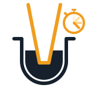
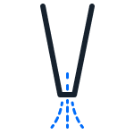

You can use multiple modules simultaneously to speed up protocol runtime and reduce your hands-on time at the bench. Beginning with API version 2.27, add concurrent module actions in Flex and OT-2 protocols: 

- Execute protocol steps in parallel with module actions, like pipetting while running a Thermocycler profile or cooling samples on the Temperature Module.
- Run multiple Heater-Shaker or Temperature Modules together, or in parallel with a Thermocycler Module.

This section covers module tasks and explains how to run multiple module actions in the same protocol, including timing tasks to work together. 

!!! note
    In API version 2.27, lids and labware latch moves are still blocking actions. These moves happen quickly, and you'll be able to proceed with other steps of your protocol immediately after.

## Module tasks

When you use a Heater-Shaker, Temperature, or Thermocycler Module in your protocol, you can choose to use a concurrent command for the module actions shown below. Each command returns a [Task](opentrons.protocol_api.task) that runs in the background of your protocol and allows the robot to continue performing protocol steps, regardless of whether the module reaches the targe temperature or completes another action. 

<table>
    <thead>
        <tr>
            <th>Module</th>
            <th>Concurrent commands</th>
        </tr>
    </thead>
    <tbody>
        <tr> 
            <td>
                Heater-Shaker Module
            </td>
            <td><li><a href="../api-reference/modules/#opentrons.protocol_api.HeaterShakerContext.set_target_temperature"><code>set_target_temperature()</code></a></li><li><a href="../api-reference/modules/#opentrons.protocol_api.HeaterShakerContext.set_shake_speed"><code>set_shake_speed()</code></a></li>
        </tr>
        <tr>
            <td>
                Temperature Module
            </td>
            <td><li><a href="../api-reference/modules/#opentrons.protocol_api.TemperatureModuleContext.start_set_temperature"><code>start_set_temperature()</code></a></li></td>
        </tr>
        <tr>
            <td>
                
                
<strong>Delay after submerging</strong>

            </td>
            <td>
                
The pipette delays a specified amount of time:

                <ul>
                    <li>before submerging into or retracting from liquid.</li>
                    <li>before or after an aspirate or dispense.</li>
                    <li>after a push out.</li>
                </ul>
            </td>
        </tr>
        <tr>
            <td>
                
                
<strong>Mix liquid</strong>

            </td>
            <td>The pipette mixes liquid inside the well before an aspirate or after a dispense.</td>
        </tr>
        <tr>
            <td>
                
                
<strong>Pre-wet tip</strong>

            </td>
            <td>The pipette pre-wets the attached tip before aspirating liquid.</td>
        </tr>
        <tr>
            <td>
                
                
<strong>Aspirate flow rate</strong>

            </td>
            <td>
                <ul>
                    <li>The pipette aspirates liquid at this speed.</li>
                    <li>Varies by volume.</li>
                </ul>
            </td>
        </tr>
        <tr>
            <td>
                
                
<strong>Dispense flow rate</strong>

            </td>
            <td>
                <ul>
                    <li>The pipette dispenses liquid at this speed.</li>
                    <li>Varies by volume.</li>
                </ul>
            </td>
        </tr>
        <tr>
            <td>
                
                
<strong>Retract position</strong>

            </td>
            <td>The pipette retracts from the liquid and moves to this position.</td>
        </tr>
        <tr>
            <td>
                
                
<strong>Retract speed</strong>

            </td>
            <td>The pipette retracts from the liquid at the specified speed.</td>
        </tr>
        <tr>
            <td>
                
                
<strong>Push out</strong>

            </td>
            <td>
                <ul>
                    <li>The pipette dispenses a small amount of air to ensure all liquid leaves the tip.</li>
                    <li>Varies by volume.</li>
                </ul>
            </td>
        </tr>
        <tr>
            <td>
                
                
<strong>Touch tip</strong>

            </td>
            <td>The pipette touches the attached tip to the sides of a well to remove droplets.</td>
        </tr>
        <tr>
            <td>
                
                
<strong>Air gap</strong>

            </td>
            <td>
                <ul>
                    <li>The pipette aspirates a small amount of air after an aspirate or dispense.</li>
                    <li>Varies by volume.</li>
                </ul>
            </td>
        </tr>
        <tr>
            <td>
                
                
<strong>Blow out</strong>

            </td>
            <td>The pipette dispenses a larger amount of air to ensure all liquid leaves the tip.</td>
        </tr>
    </tbody>
</table>