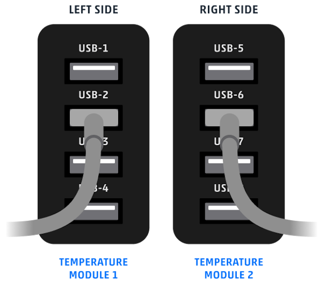
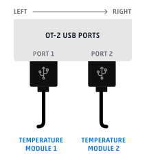

You can use multiple modules of the same type within a single protocol. The exception is the Thermocycler Module, which has only one supported deck location because of its size. Running protocols with multiple modules of the same type requires version 4.3 or newer of the Opentrons App and robot server.

When working with multiple modules of the same type, load them in your protocol according to their USB port number. Deck coordinates are required by the [`ProtocolContext.load_module()`][opentrons.protocol_api.ProtocolContext.load_module] method, but location does not determine which module loads first. Your robot will use the module with the lowest USB port number *before* using a module of the same type that's connected to higher numbered USB port. The USB port number (not deck location) determines module load sequence, starting with the lowest port number first.

Before running your protocol, it's a good idea to use the module controls in the Opentrons App to check that commands are being sent where you expect.

## Multiple modules on Flex

In this example, `temperature_module_1` loads first because it's connected to USB port 2. `temperature_module_2` loads next because it's connected to USB port 6.
```python
from opentrons import protocol_api

requirements = {"robotType": "Flex", "apiLevel": "{{ apiLevel }}"}

def run(protocol: protocol_api.ProtocolContext):
  # Load Temperature Module 1 in deck slot D1 on USB port 2
  temperature_module_1 = protocol.load_module(
    module_name="temperature module gen2",
    location="D1")

  # Load Temperature Module 2 in deck slot C1 on USB port 6
  temperature_module_2 = protocol.load_module(
    module_name="temperature module gen2",
    location="C1")
```
The Temperature Modules are connected as shown here:

<figure markdown style="width: 50%;">

</figure>

## Multiple modules on OT-2

In this example, `temperature_module_1` loads first because it's connected to USB port 1. `temperature_module_2` loads next because it's connected to USB port 2.
```python
from opentrons import protocol_api

metadata = {"apiLevel": "{{ apiLevel }}"}

def run(protocol: protocol_api.ProtocolContext):
    # Load Temperature Module 1 in deck slot C1 on USB port 1
    temperature_module_1 = protocol.load_module(
        module_name="temperature module gen2", location="1"
    )

    # Load Temperature Module 2 in deck slot D3 on USB port 2
    temperature_module_2 = protocol.load_module(
        module_name="temperature module gen2", location="3"
    )
```
The Temperature Modules are connected as shown here:

<figure markdown style="width: 50%;">

</figure>
