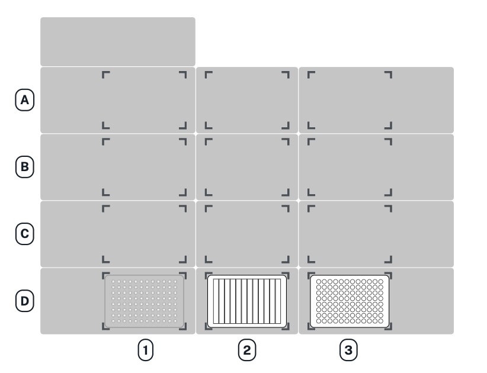
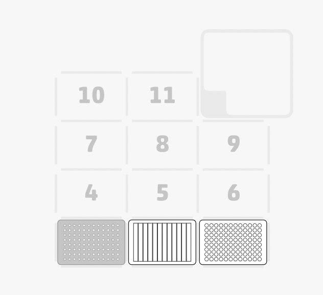
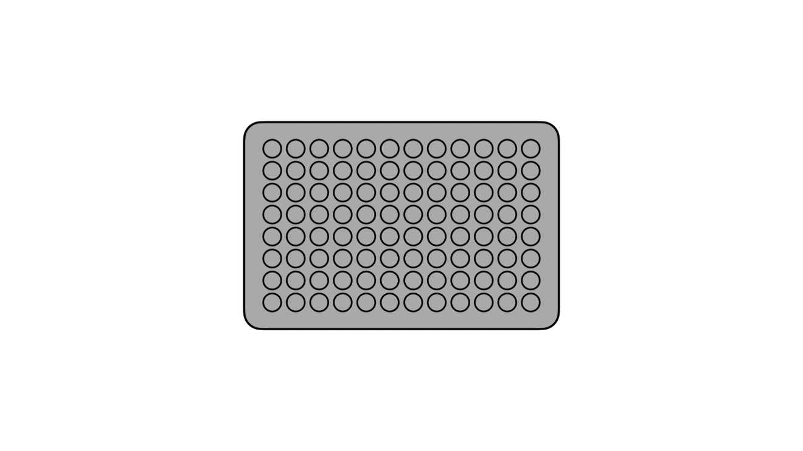
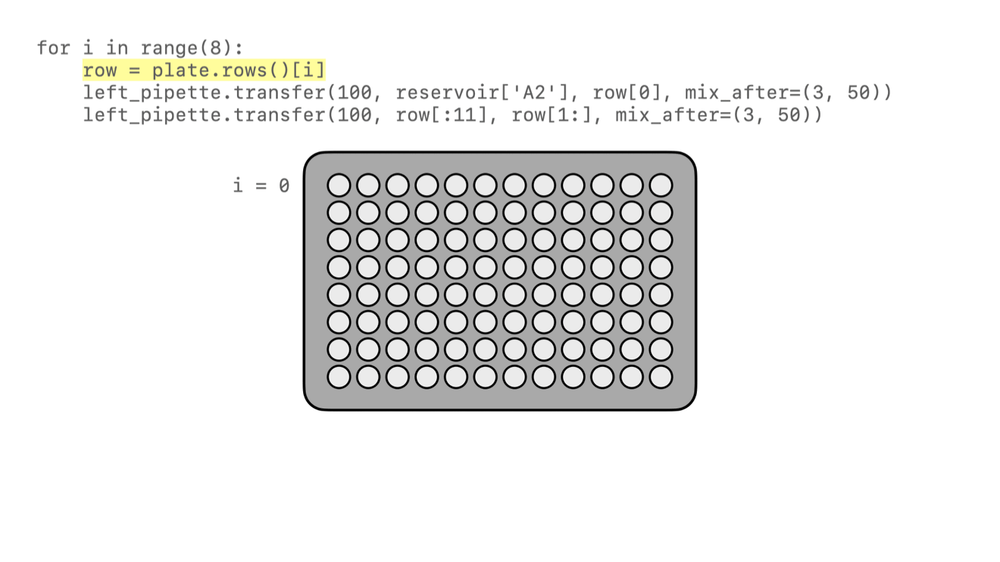
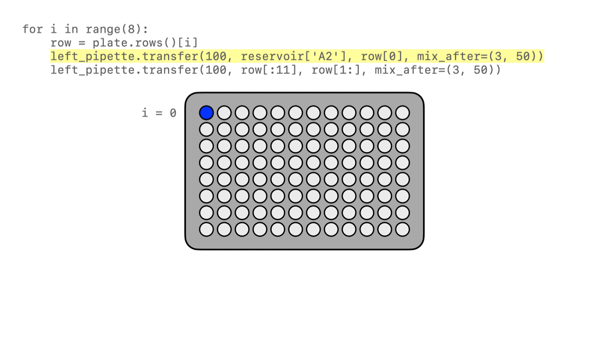
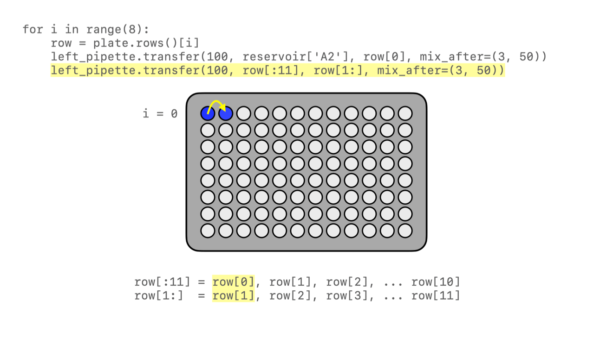
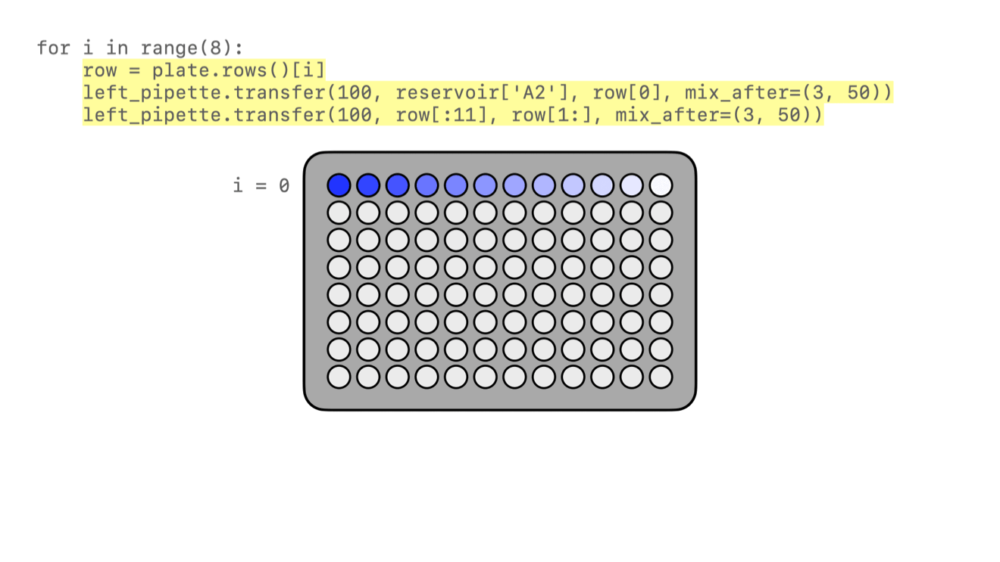
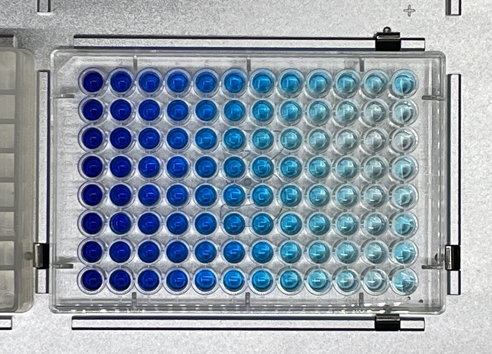

## Introduction

This tutorial will guide you through creating a Python protocol file from scratch. At the end of this process you'll have a complete protocol that can run on a Flex or an OT-2 robot. If you don’t have a Flex or an OT-2 (or if you’re away from your lab, or if your robot is in use), you can use the same file to simulate the protocol on your computer instead.

### What you'll automate

The lab task that you'll automate in this tutorial is *serial dilution*: taking a solution and progressively diluting it by transferring it stepwise across a plate from column 1 to column 12. With just a dozen or so lines of code, you can instruct your robot to perform the hundreds of individual pipetting actions necessary to fill an entire 96-well plate. And all of those liquid transfers will be done automatically, so you’ll have more time to do other work in your lab.

## Before you begin

You're going to write some Python code, but you don't need to be a Python expert to get started writing Opentrons protocols. You should know some basic Python syntax, like how it uses [indentation](https://docs.python.org/3/reference/lexical_analysis.html#indentation) to group blocks of code, dot notation for [calling methods](https://docs.python.org/3/tutorial/classes.html#method-objects), and the format of [lists](https://docs.python.org/3/tutorial/introduction.html#lists) and [dictionaries](https://docs.python.org/3/tutorial/datastructures.html#dictionaries). You’ll also be using [common control structures](https://docs.python.org/3/tutorial/controlflow.html#if-statements) like `if` statements and `for` loops.

You should write your code in your favorite plaintext editor or development environment and save it in a file with a `.py` extension, like `dilution-tutorial.py`.

To simulate your code, you'll need [Python 3.12](https://www.python.org/downloads/) and the [pip package installer](https://pip.pypa.io/en/stable/getting-started/). Newer versions of Python aren't yet supported by the Python Protocol API. If you don't use Python 3.12 as your system Python, we recommend using [pyenv](https://github.com/pyenv/pyenv) to manage multiple Python versions.

## Hardware and labware

Before running a protocol, you’ll want to have the right kind of hardware and labware ready for your Flex or OT-2.

- **Flex users** should review the [Installation and Relocation chapter](../flex/installation/index.md) in the instruction manual. Specifically, see the [pipette installation section](../flex/installation/instruments.md#pipette-installation). You can use either a 1-channel or 8-channel pipette for this tutorial. Most Flex code examples will use a [Flex 1-Channel 1000 µL pipette](https://opentrons.com/products/opentrons-flex-1-channel-pipette).

<!-- TODO: link to mkdocs OT-2 manual when complete -->
- **OT-2 users** should review the robot setup and pipette information on the [Get Started page](https://support.opentrons.com/s/ot2-get-started). Specifically, see [attaching pipettes](https://support.opentrons.com/s/article/Get-started-Attach-pipettes) and [initial calibration](https://support.opentrons.com/s/article/Get-started-Calibrate-the-deck). You can use either a single-channel or 8-channel pipette for this tutorial. Most OT-2 code examples will use a [P300 Single-Channel GEN2](https://opentrons.com/products/single-channel-electronic-pipette-p20) pipette.

The Flex and OT-2 use similar labware for serial dilution. The tutorial code will use the labware listed in the table below, but as long as you have labware of each type you can modify the code to run with your labware.

| Labware type | Labware name | API load name |
|--------------|-------------|---------------|
| Reservoir | NEST 12 Well Reservoir 15 mL | `nest_12_reservoir_15ml` |
| Well plate | NEST 96 Well Plate 200 µL Flat | `nest_96_wellplate_200ul_flat` |
| Flex tip rack | Opentrons Flex Tips, 200 µL | `opentrons_flex_96_tiprack_200ul` |
| OT-2 tip rack | Opentrons 96 Tip Rack | `opentrons_96_tiprack_300ul` |

For the liquids, you can use plain water as the diluent and water dyed with food coloring as the solution.

## Create a protocol file

Let’s start from scratch to create your serial dilution protocol. Open up a new file in your editor and start with:
```python
from opentrons import protocol_api
```
Throughout this documentation, you’ll see protocols that begin with the `import` statement shown above. It identifies your code as an Opentrons protocol. This statement is not required, but including it is a good practice and allows most code editors to provide helpful autocomplete suggestions.

Everything else in the protocol file is required. Next, you’ll specify the version of the API you’re using. Then comes the core of the protocol: defining a single `run()` function that provides the locations of your labware, states which kind of pipettes you’ll use, and finally issues the commands that the robot will perform.

For this tutorial, you’ll write very little Python outside of the `run()` function. But for more complex applications it’s worth remembering that your protocol file *is* a Python script, so any Python code that can run on your robot can be a part of a protocol.

## Metadata

Every protocol needs to have a metadata dictionary with information about the protocol. At minimum, you need to specify what [version of the API](versioning.md) the protocol requires. The scripts for this tutorial were validated against API version 2.16, so specify:
```python
metadata = {"apiLevel": "2.16"}
```
You can include any other information you like in the metadata dictionary. The fields `protocolName`, `description`, and `author` are all displayed in the Opentrons App, so it’s a good idea to expand the dictionary to include them:
```python
metadata = {
    "apiLevel": "2.16",
    "protocolName": "Serial Dilution Tutorial",
    "description": """This protocol is the outcome of following the
        Python Protocol API Tutorial located at
        https://docs.opentrons.com/v2/tutorial.html. It takes a solution
        and progressively dilutes it by transferring it stepwise across a plate.""",
    "author": "New API User"
}
```
If you have a Flex, or are using an OT-2 with API v2.15 (or higher), we recommend adding a `requirements` section to your code. See the Requirements section below.

## Requirements

The `requirements` code block can appear before *or* after the `metadata` code block in a Python protocol. It uses the following syntax and accepts two arguments: `robotType` and `apiLevel`.

Whether you need a `requirements` block depends on your robot model and API version.

- **Flex:** The `requirements` block is always required. And, the API version does not go in the `metadata` section. The API version belongs in the `requirements`. For example:
    ```python
    requirements = {"robotType": "Flex", "apiLevel": "2.16"}
    ```
- **OT-2:** The `requirements` block is optional, but including it is a recommended best practice, particularly if you’re using API version 2.15 or greater. If you do use it, remember to remove the API version from the `metadata`. For example:
    ```python
    requirements = {"robotType": "OT-2", "apiLevel": "2.16"}
    ```

With the metadata and requirements defined, you can move on to creating the `run()` function for your protocol.

## The `run()` function

Now it’s time to actually instruct the Flex or OT-2 how to perform serial dilution. All of this information is contained in a single Python function, which has to be named `run`. This function takes one argument, which is the *protocol context*. Many examples in these docs use the argument name `protocol`, and sometimes they specify the argument’s type:
```python
def run(protocol: protocol_api.ProtocolContext):
```
With the protocol context argument named and typed, you can start calling methods on `protocol` to add labware and hardware.

### Labware
For serial dilution, you need to load a tip rack, reservoir, and 96-well plate on the deck of your Flex or OT-2. Loading labware is done with the [`ProtocolContext.load_labware`][opentrons.protocol_api.ProtocolContext.load_labware] method, which takes two arguments: the standard labware name as defined in the [Opentrons Labware Library](https://labware.opentrons.com/), and the position where you'll place the labware on the robot's deck.

=== "Flex"
    Here’s how to load the labware on a Flex in slots D1, D2, and D3 (repeating the `def` statement from above to show proper indenting):

    ```python
    def run(protocol: protocol_api.ProtocolContext):
        tip_rack = protocol.load_labware("opentrons_flex_96_tiprack_200ul", "D1")
        reservoir = protocol.load_labware("nest_12_reservoir_15ml", "D2")
        plate = protocol.load_labware("nest_96_wellplate_200ul_flat", "D3")
    ```
    
    If you’re using a different model of labware, find its name in the Labware Library and replace it in your code.

    Now the robot will expect to find labware in a configuration that looks like this:

    

=== "OT-2"
    Here’s how to load the labware on an OT-2 in slots 1, 2, and 3 (repeating the `def` statement from above to show proper indenting):
    
    ```python
    def run(protocol: protocol_api.ProtocolContext):
        tip_rack = protocol.load_labware("opentrons_96_tiprack_300ul", 1)
        reservoir = protocol.load_labware("nest_12_reservoir_15ml", 2)
        plate = protocol.load_labware("nest_96_wellplate_200ul_flat", 3)
    ```

    If you’re using a different model of labware, find its name in the Labware Library and replace it in your code.

    Now the robot will expect to find labware in a configuration that looks like this:

    

You may notice that these deck maps don't show where the liquids will be at the start of the protocol. Liquid definitions aren’t required in Python protocols, unlike protocols made in [Protocol Designer](https://designer.opentrons.com/). If you want to identify liquids, see [Labeling Liquids in Labware][labeling-liquids-in-labware]. (Sneak peek: you’ll put the diluent in column 1 of the reservoir and the solution in column 2 of the reservoir.)

### Trash bin
Flex and OT-2 both come with a trash bin for disposing used tip_rack.

The OT-2 trash bin is fixed in slot 12. Since it can't go anywhere else on the deck, you don't need to write any code to tell the API where it is.

Flex lets you put a [trash bin][trash-bin-api] in multiple locations on the deck. You can even have more than one trash bin, or none at all (if you use the [waste chute][waste-chute-api] instead, or if your protocol never trashes any tips). For serial dilution, you'll need to dispose used tips, so you also need to tell the API where the trash container is located on your robot. Loading a trash bin on Flex is done with the [`load_trash_bin()`][opentrons.protocol_api.ProtocolContext.load_trash_bin] method, which takes one argument: its location. Here’s how to load the trash in slot A3:

```python
trash = protocol.load_trash_bin("A3")
```

### Pipettes
Next you’ll specify what pipette to use in the protocol. Loading a pipette is done with the [`load_instrument()`][opentrons.protocol_api.ProtocolContext.load_instrument] method, which takes three arguments: the name of the pipette, the mount it’s installed in, and the tip racks it should use when performing transfers. Load whatever pipette you have installed in your robot by using its [standard pipette name](pipettes/loading.md#api-load-names). Here’s how to load the pipette in the left mount and instantiate it as a variable named `left_pipette`:

#### Flex
```python
left_pipette = protocol.load_instrument("flex_1channel_1000", "left", tip_racks=[tip_rack])
```
#### OT-2
```python
left_pipette = protocol.load_instrument("p300_single_gen2", "left", tip_racks=[tip_rack])
```

!!! note
    You may notice that the value of `tip_racks` is in brackets, indicating that it’s a list. This serial dilution protocol only uses one tip rack, but some protocols require more tips, so you can assign them to a pipette all at once, like `tip_racks=[tip_rack_1, tip_rack_2]`.

## Commands
Finally, all of your labware and hardware is in place, so it’s time to give the robot pipetting commands. The required steps of the serial dilution process break down into three main phases:

1. Measure out equal amounts of diluent from the reservoir to every well on the plate.
2. Measure out equal amounts of solution from the reservoir into wells in the first column of the plate.
3. Move a portion of the combined liquid from column 1 to 2, then from column 2 to 3, and so on all the way to column 12.

Thanks to the flexibility of the API's [`transfer()`][opentrons.protocol_api.InstrumentContext.transfer] method, which combines many [building block commands](building-block-commands/index.md) into one call, each of these phases can be accomplished with a single line of code! You’ll just have to write a few more lines of code to repeat the process for as many rows as you want to fill.

Let’s start with the diluent. This phase takes a larger quantity of liquid and spreads it equally to many wells. `transfer()` can handle this all at once, because it accepts either a single well or a list of wells for its source and destination:
```python
left_pipette.transfer(100, reservoir["A1"], plate.wells())
```

Breaking down these single lines of code shows the power of [complex commands](complex-commands/index.md). The first argument is the amount to transfer to each destination, 100 µL. The second argument is the source, column 1 of the reservoir (which is still specified with grid-style coordinates as `A1` — a reservoir only has an A row). The third argument is the destination. Here, calling the [`wells()`][opentrons.protocol_api.Labware.wells] method of `plate` returns a list of *every well*, and the command will apply to all of them.



In plain English, you've instructed the robot, “For every well on the plate, aspirate 100 µL of fluid from column 1 of the reservoir and dispense it in the well.” That’s how we understand this line of code as scientists, yet the robot will understand and execute it as nearly 200 discrete actions.

Now it’s time to start mixing in the solution. To do this row by row, nest the commands in a `for` loop:
```python
for i in range(8):
    row = plate.rows()[i]
```

Using Python’s built-in [`range`](https://docs.python.org/3/library/stdtypes.html#range) class is an easy way to repeat this block 8 times, once for each row. This also lets you use the repeat index `i` with `plate.rows()` to keep track of the current row.



In each row, you first need to add solution. This will be similar to what you did with the diluent, but putting it only in column 1 of the plate. It’s best to mix the combined solution and diluent thoroughly, so add the optional `mix_after` argument to `transfer()`:

```python
left_pipette.transfer(100, reservoir["A2"], row[0], mix_after=(3, 50))
```

As before, the first argument specifies to transfer 100 µL. The second argument is the source, column 2 of the reservoir. The third argument is the destination, the element at index 0 of the current `row`. Since Python lists are zero-indexed, but columns on labware start numbering at 1, this will be well A1 on the first time through the loop, B1 the second time, and so on. The fourth argument specifies to mix 3 times with 50 µL of fluid each time.



Finally, it’s time to dilute the solution down the row. One approach would be to nest another `for` loop here, but instead let’s use another feature of the `transfer()` method, taking lists as the source and destination arguments:

```python
left_pipette.transfer(100, row[:11], row[1:], mix_after=(3, 50))
```

There’s some Python shorthand here, so let’s unpack it. You can get a range of indices from a list using the colon `:` operator, and omitting it at either end means "from the beginning" or "until the end" of the list. So the source is `row[:11]`, from the beginning of the row until its 11th item. And the destination is `row[1:]`, from index 1 (column 2!) until the end. Since both of these lists have 11 items, `transfer()` will step through them in parallel, and they’re constructed so when the source is 0, the destination is 1; when the source is 1, the destination is 2; and so on. This condenses all of the subsequent transfers down the row into a single line of code.



All that remains is for the loop to repeat these steps, filling each row down the plate.



That’s it! If you’re using a single-channel pipette, you’re ready to try out your protocol.

### 8-channel pipette
If you’re using an 8-channel pipette, you’ll need to make a couple tweaks to the single-channel code from above. Most importantly, whenever you target a well in row A of a plate with an 8-channel pipette, it will move its topmost tip to row A, lining itself up over the entire column.

Thus, when adding the diluent, instead of targeting every well on the plate, you should only target the top row:
```python
left_pipette.transfer(100, reservoir["A1"], plate.rows()[0])
```
And by accessing an entire column at once, the 8-channel pipette effectively implements the `for` loop in hardware, so you’ll need to remove it:
```python
row = plate.rows()[0]
left_pipette.transfer(100, reservoir["A2"], row[0], mix_after=(3, 50))
left_pipette.transfer(100, row[:11], row[1:], mix_after=(3, 50))
```
Instead of tracking the current row in the `row` variable, this code sets it to always be row A (index 0).

## Try your protocol
There are two ways to try out your protocol: simulation on your computer, or a live run on a Flex or OT-2. Even if you plan to run your protocol on a robot, it’s a good idea to check the simulation output first.

If you get any errors in simulation, or you don't get the outcome you expected when running your protocol, you can check your code against these reference protocols on GitHub:

- [Flex: Single-channel serial dilution](https://github.com/Opentrons/opentrons/blob/edge/api/docs/v2/example_protocols/dilution_tutorial_flex.py)
- [Flex: 8-channel serial dilution](https://github.com/Opentrons/opentrons/blob/edge/api/docs/v2/example_protocols/dilution_tutorial_multi_flex.py)
- [OT-2: Single-channel serial dilution](https://github.com/Opentrons/opentrons/blob/edge/api/docs/v2/example_protocols/dilution_tutorial.py)
- [OT-2: 8-channel serial dilution](https://github.com/Opentrons/opentrons/blob/edge/api/docs/v2/example_protocols/dilution_tutorial_multi.py)

### In simulation
Simulation doesn’t require having a robot connected to your computer. You just need to install the [Opentrons Python module](https://pypi.org/project/opentrons/) using pip (`pip install opentrons`). This will give you access to the `opentrons_simulate` command-line utility (`opentrons_simulate.exe` on Windows).

To see a text preview of the steps your Flex or OT-2 will take, use the change directory (`cd`) command to navigate to the location of your saved protocol file and run:
```bash
opentrons_simulate dilution-tutorial.py
```
This should generate a lot of output! As written, the protocol has about 1000 steps. In fact, using a single-channel pipette for serial dilution across the whole plate will take about half an hour — plenty of time to grab a coffee while your robot pipettes for you! ☕️

If that’s too long, you can always cancel your run partway through or modify `for i in range(8)` to loop through fewer rows.

### On a robot
To run your protocol on a Flex or OT-2, use the [Opentrons App](https://opentrons.com/ot-app). When you first launch the Opentrons App, you will see the Protocols screen. (Click **Protocols** in the left sidebar to access it at any other time.) Click **Import** in the top right corner to reveal the Import a Protocol pane. Then click **Choose File** and find your protocol in the system file picker, or drag and drop your protocol file into the well.

You should see “Protocol - Serial Dilution Tutorial” (or whatever `protocolName` you entered in the metadata) in the list of protocols. Click the three-dot menu (⋮) for your protocol and choose **Start setup**.

If you have any remaining calibration tasks to do, you can finish them up here. Below the calibration section is a preview of the initial deck state. Optionally you can run Labware Position Check, or you can go ahead and click **Proceed to Run**.

On the Run tab, you can double-check the Run Preview, which is similar to the command-line simulation output. Make sure all your labware and liquids are in the right place, and then click **Start run**. The run log will update in real time as your robot proceeds through the steps.

When it’s all done, check the results of your serial dilution procedure — you should have a beautiful dye gradient running across the plate!



## Next steps
This tutorial has relied heavily on the `transfer()` method, but there's much more that the Python Protocol API can do. Many advanced applications use [building block commands](building-block-commands/index.md) for finer control over the robot. These commands let you aspirate and dispense separately, add air gaps, blow out excess liquid, move the pipette to any location, and more. For protocols that use [Opentrons hardware modules](modules/index.md), there are methods to control their behavior. And all of the API's classes and methods are catalogued in the [API Reference](reference/protocols.md).
