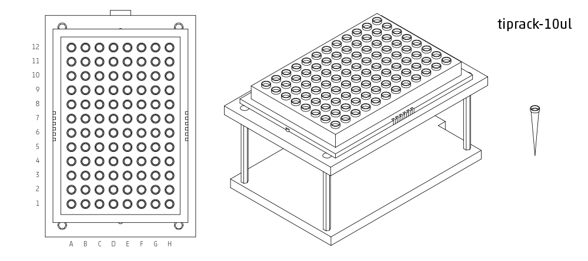

.. _labware_library:

===============
Labware Library
===============

Please refer to this detailed tutorial on :ref:`well_access` to learn the various ways you can access tips, wells, rows, and columns within supported labware.

.. note::

	Note:  All names are case-sensitive, copying and pasting from this list into the protocol editor will ensure no errors are made.

Points
------

point
^^^^^

Use ``point`` when there is only one position per container, such as the trash or a scale.  

You can access the point position as ``container[0]`` or ``container['A1']``.

Tipracks
--------

tiprack-10ul 
^^^^^^^^^^^^

Tip rack for a 10 uL pipette (single or 8-channel)

**Accessing Tips:** *single channel* ``[‘A1’]-[‘H12’]``, *8-channel* ``[‘A1’]-[‘A12’]``

tiprack-10ul-H 
^^^^^^^^^^^^^^

Tip rack for a single channel 10 uL pipette when the pipette is in the center position.  Set initial position to H1, and the pipette will use all the tips on the right hand side (E-H, 1-12)

**Accessing Tips:** *single channel* ``[‘E-H, 1-12’]``

.. image:: img/labware_lib/Tiprack-10ul-H.png

tiprack-200ul
^^^^^^^^^^^^^

Tip rack for a 200 or 300 uL pipette (single or 8-channel)

**Accessing Tips:** *single channel* ``[‘A1’]-[‘H12’]``, *8-channel* ``[‘A1’]-[‘A12’]``

.. image:: img/labware_lib/Tiprack-200ul.png

tiprack-1000ul
^^^^^^^^^^^^^^

Tip rack for a 1000 uL pipette (single or 8-channel)

**Accessing Tips:** *single channel* ``[‘A1’]-[‘H12’]``, *8-channel* ``[‘A1’]-[‘A12’]``

.. image:: img/labware_lib/Tiprack-1000.png

tiprack-1000ul-chem  
^^^^^^^^^^^^^^^^^^^

Tip rack for 1000ul chem (10x10)

**Accessing Tips:** *single channel* ``[0]-[99]``

.. image:: img/labware_lib/Tiprack-1000ul-chem.png

Troughs
-------

trough-12row 
^^^^^^^^^^^^
12 row reservoir

**Accessing Rows:** *single channel* ``[‘A1’]-[‘A12’]``, *8-channel* ``[‘A1’]-[‘A12’]``

.. image:: img/labware_lib/Trough-12row.png

Tube Racks
----------

tube-rack-.75ml 
^^^^^^^^^^^^^^^

4x6 rack that holds .75 mL microcentrifuge tubes
(A1, A1-D6)

**Accessing Tubes:** *single channel* ``[‘A1’]-[‘D6’]``

..image:: img/labware_lib/Tuberack-0.75ml.png

tube-rack-2ml 
^^^^^^^^^^^^^

4x6 rack that holds 1.5 mL microcentrifuge tubes and 2 mL microcentrifuge tubes

**Accessing Tubes:** *single channel* ``[‘A1’]-[‘D6’]``

.. image:: img/labware_lib/Tuberack-2ml.png

tube-rack-15_50ml
^^^^^^^^^^^^^^^^^

rack that holds 6 15 mL tubes and 4 50 mL tubes

**Accessing Tubes:** *single channel* ``[‘A1’]-[‘A3’], [‘B1’]-[‘B3’], [‘C1’]-[‘C2’], [‘D1’]-[‘D2’]``

..image:: img/labware_lib/Tuberack-15-50ml.png

Plates
------

96-deep-well
^^^^^^^^^^^^

See dimensions in diagram below.

**Accessing Wells:** *single channel* ``[‘A1’]-[‘H12’]``, *8-channel* ``[‘A1’]-[‘A12’]``

.. image:: img/labware_lib/96-Deep-Well.png

96-PCR-tall
^^^^^^^^^^^

See dimensions in diagram below.

**Accessing Wells:** *single channel* ``[‘A1’]-[‘H12’]``, *8-channel* ``[‘A1’]-[‘A12’]``

.. image:: img/labware_lib/96-PCR-Tall.png

96-PCR-flat
^^^^^^^^^^^

See dimensions in diagram below.

**Accessing Wells:** *single channel* ``[‘A1’]-[‘H12’]``, *8-channel* ``[‘A1’]-[‘A12’]``

.. image:: img/labware_lib/96-PCR-Flatt.png

PCR-strip-tall
^^^^^^^^^^^^^^

See dimensions in diagram below.

**Accessing Wells:** *single channel* ``[‘A1’]-[‘A8’]``, *8-channel* ``[‘A1’]``

.. image:: img/labware_lib/96-PCR-Strip.png

384-plate
^^^^^^^^^

See dimensions in diagram below.

**Accessing Wells:** *single channel* ``[‘A1’]-[‘P24’]``, *multi-channel* ``[‘A1’]-['A24]``

.. image:: img/labware_lib/384-plate.png

