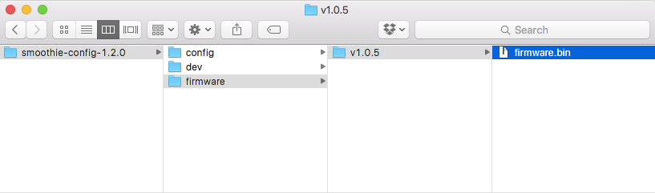

.. _updating_firmware:

=================
Updating Firmware
=================

The motorcontroller inside all Opentrons liquid handlers (called Smoothieboard or just Smoothie) will need it's firmware updated if you are planning to use the Opentrons API and accompanying 2.0 app. The process is simple, and can be done from your computer in under a minute.

To summarize, there are two files on your Smoothie that must be replaced; ``FIRMWARE.CUR`` and ``config``. 

Download Files
----------------------

Download the zipped files from here:

https://github.com/OpenTrons/smoothie-config/archive/1.2.0.zip

After downloading, unpack the zip file to view its contents.

Open the Smoothie's Drive
---------------------------------

.. image:: img/update-firmware/driveIcon.png

Power on and plug in your Opentrons liquid handler, and make sure you do not have the app open. You will notice the Smoothieboard shows up on the computer as a Mass Storage Device, like an external hard drive or flash drive.

.. image:: img/update-firmware/firmware_files.png

Open the Smoothie's storage device to see it's ``FIRMWARE.CUR`` and ``config`` files. There might be other files there, but the two you need to worry about are ``FIRMWARE.CUR`` and ``config``, because these are what we will be replacing.

Copy Over Firmware
--------------------------

From the folder you downloaded from GitHub, find the ``firmware.bin`` file.

Drag ``firmware.bin`` to the Smoothie's drive. Your drive should now look like the following:

.. image:: img/update-firmware/dragFirmwareBin.png

Select Your Model's Config
----------------------------------

Opentrons `come in three models`__, the Standard, Pro, and Hood. Each model requires a unique ``config`` file to go along with it. Find the config file that matches your robot (the folders are named after each model).

__ https://opentrons.com/robots

.. image:: img/update-firmware/SelectConfigFile.png

Drag the ``config`` file from the correct folder onto the Smoothie's drive. You will be overwriting the old ``config`` file, so your computer may ask if you would like to proceed with replacing it.

.. image:: img/update-firmware/replaceConfig.png

Restart
---------------

Unmount the Smoothie's driver from your computer, and power cycle the robot. When the Smoothieboard powers on, it will read the ``firmware.bin`` file, then save it as ``FIRMWARE.CUR``. It will then read the new ``config`` file, and your liquid handler now has updated firmware.
