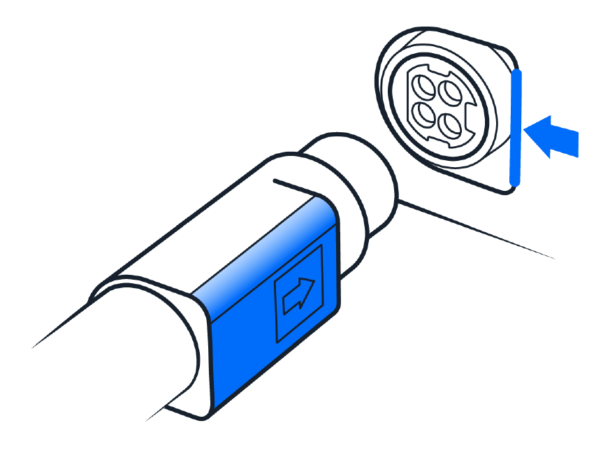
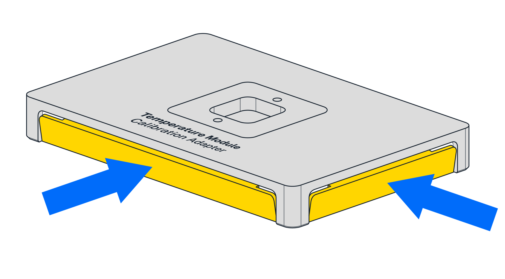

# Flex Installation Steps

Installing the Temperature Module on your robot includes attaching it to the deck and calibrating it for the first time. The instructions here and on the touchscreen will help you get started. The tools you need are included in the User Kit that came with your Flex.

## Attaching the Temperature Module

1. Choose the supported deck slot you want to use for the module. Use the 2.5 mm screwdriver that came with your Flex to remove the deck slot screws.

2. Insert the module into its caddy by aligning the power button on the module with the on/off switch on the caddy.

    !!!tip
        If you’re having trouble inserting the module into its caddy, the module’s power button is probably facing away from the caddy’s on/off switch. Turn the module so the power button faces the on/off switch and try again.

3. Holding the module in the caddy, use the 2.5 mm screwdriver to turn the anchor screws clockwise to tighten the anchors. The module is secure when it doesn’t move while gently pulling on it and rocking it from side to side.

4. Connect the USB cable to the module.

5. Connect the power cable to the module. The Temperature Module has an asymmetrical 4-pin power connector. When connecting the power cable to the module:

    - Match the connector's flat side to the flat side of the module's power port.
    - Aligned cables attach easily; misaligned cables do not.
    - _Do not_ plug the power cable into a wall outlet until instructed to do so.

    <figure class="screenshot" markdown>
    {style="margin-left: 0;"}
    </figure>

6. Insert the caddy into the deck slot and route the power and USB cables through a removable side cover on the Flex.

7. Connect the USB cable to a USB port on the Flex.

8. Connect the power cable to a wall outlet. Gently press the on/off switch to turn the module on.

If the temperature LCD is illuminated, the module is powered on.

When successfully connected, the module appears in the Pipettes and Modules section on your robot’s device detail page in the Opentrons App.

## Calibrating the Temperature Module

When you first install a module on Flex, you need to run automated positional calibration. This process is similar to calibrating instruments like pipettes or the gripper. Module calibration ensures that the Flex moves to the exact correct location for optimal protocol performance. You do not have to recalibrate the module if you remove and reattach it to the same Flex.

When you attach and power on a new module, the Flex automatically starts the calibration workflow on the touchscreen. Instructions on the touchscreen will guide you through the calibration procedure, which is outlined below.

!!!warning
    The gantry and pipette will move during calibration. Keep your hands clear of the working area before tapping an action button on the touchscreen.

1. Tap Start setup on the touchscreen. The robot checks the module’s firmware and updates it automatically, if required.

2. Attach the Temperature Module’s calibration adapter to the module and tap Confirm placement.

    !!!note
        The calibration adapter has two spring-loaded panels along its sides that help secure it to the module. Squeeze these panels as you place the adapter on the module. This gives the adapter enough clearance to fit properly.

    

3. Attach the calibration probe to the pipette.

4. Tap Begin calibration.

5. After the calibration process is complete, remove the calibration adapter from the module and remove the calibration probe from the pipette.

6. Tap Exit.

Your module is now calibrated.
