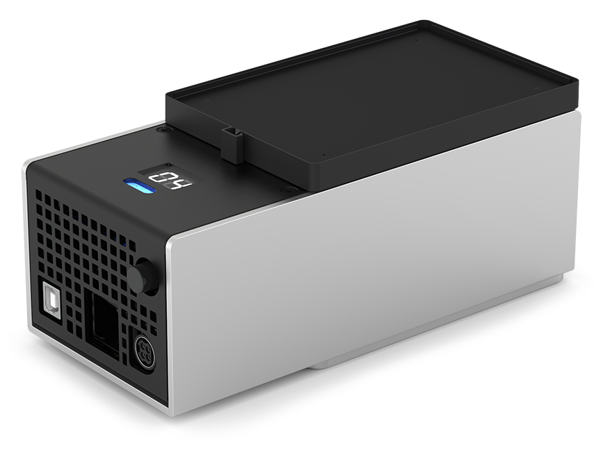

# Temperature Module GEN2 Instruction Manual

{style="width: 60%"}

**Opentrons Labworks Inc.** 
April 2026

## Product Description

The Opentrons Temperature Module GEN2 is a hot and cold plate module. The module can reach and maintain temperatures ranging from 4 °C to 95 °C. It is often used in protocols that require heating, cooling, temperature changes, or for long duration storage of samples and reagents at a specific, constant temperature. The module is compatible with various thermal block adapters and the Opentrons Flex and OT-2 liquid handling robots.
