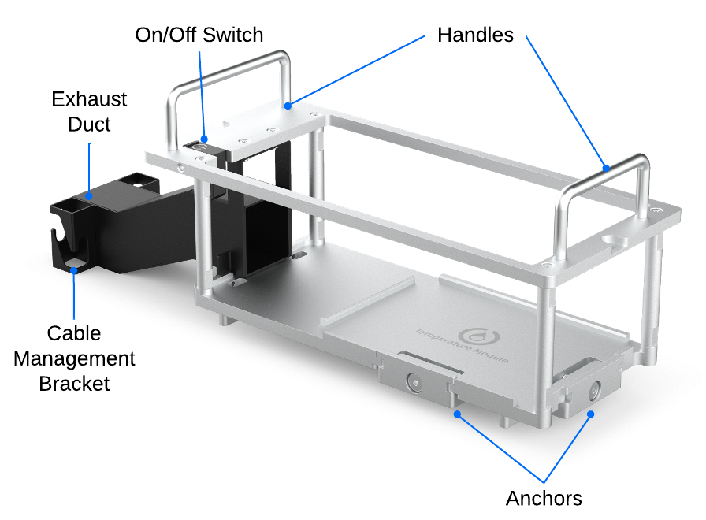
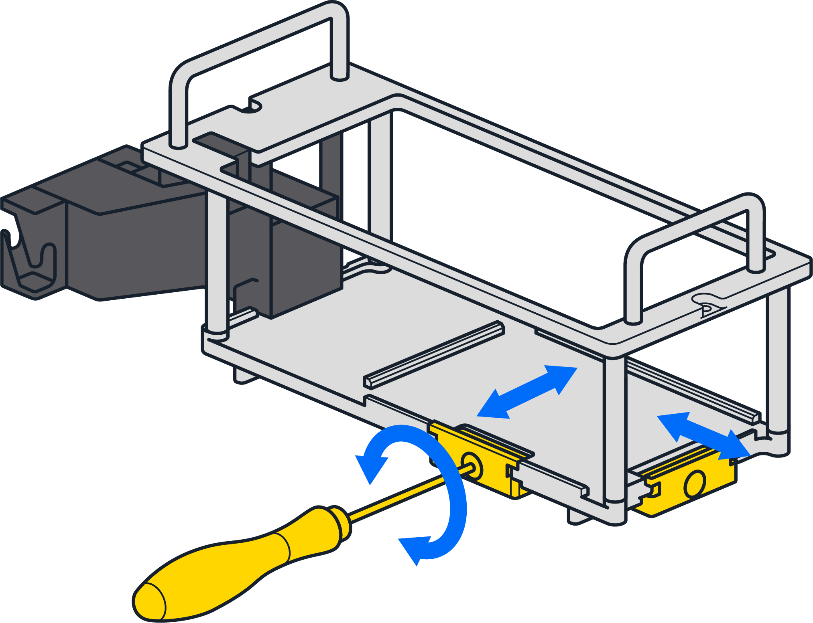

# Before You Begin

Review this section for important information about deck placement, alignment, and anchor adjustments for the Temperature Module.

## Flex Caddies

When used with a Flex robot, the Temperature Module fits into a caddy that occupies space below the deck. The caddy places your labware closer to the deck surface and allows for below-deck cable routing.

The OT-2 does not use caddies. Modules clip directly to the deck.

The Temperature Module caddy is also available for purchase from the Opentrons shop.

## Anchor Adjustments

Anchors are screw-adjustable panels on the Temperature Module caddy. They provide the clamping force that secures the module to its caddy. Use a 2.5 mm screwdriver to adjust the anchors.

- To loosen/extend the anchors, turn the screws counterclockwise.
- To tighten/retract the anchors, turn the screws clockwise.

FIX IMAGE BORDERS, ADD PADDING
   <!-- a crappy, but fast, way to add padding to this image -->

  

Before installation:

- Check the anchors to make sure they’re level with or extend slightly past the base of the caddy.
- If the anchors interfere with installing the module, adjust them until there’s enough clearance to seat it, and then tighten them to hold the module in place.

## Deck Placement and Cable Alignment

The supported deck slot positions for the Temperature Module GEN2 depend on the robot you're using.

IMAGE PLACEHOLDER

| Robot Model | Deck Placement |
|----|----|
| Flex | In any deck slot in column 1 or 3. The module can go in slot A3, but you need to move the trash bin first. |
| OT-2 | In deck slots 1, 3, 4, 6, 7, 9, or 10. |

To properly align the module relative to the robot, make sure its exhaust, power, and USB ports face outward, away from the center of the deck. This keeps the exhaust port clear and helps manage slack in the cables.

!!!warning
    Do not install the Temperature Module with the ports facing in, towards the middle of the deck. This alignment vents air into the enclosure and makes cable routing and access difficult.
