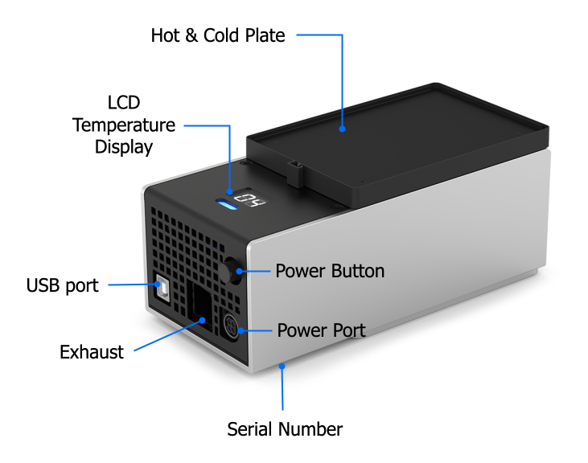
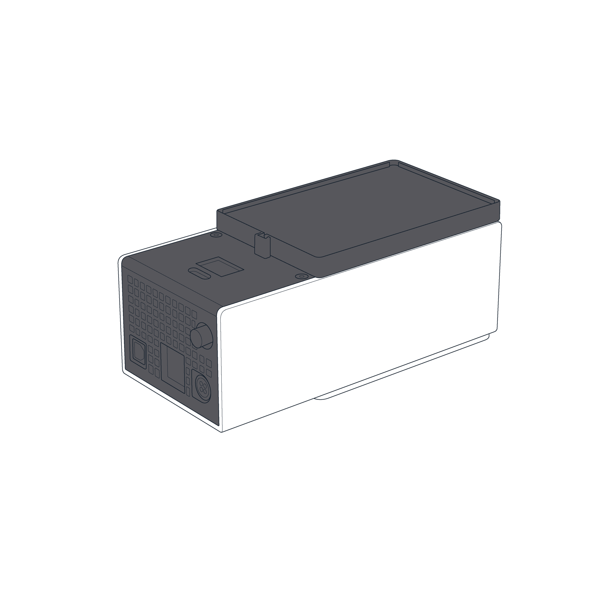
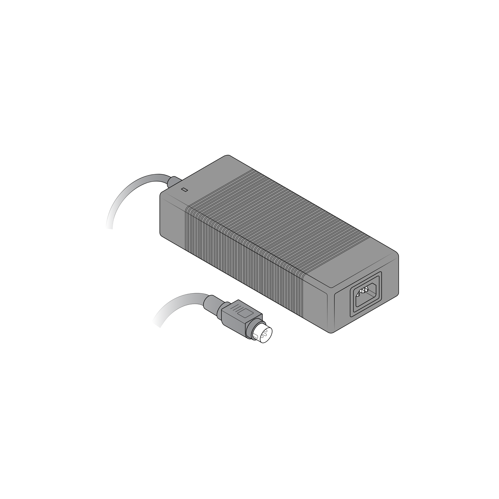
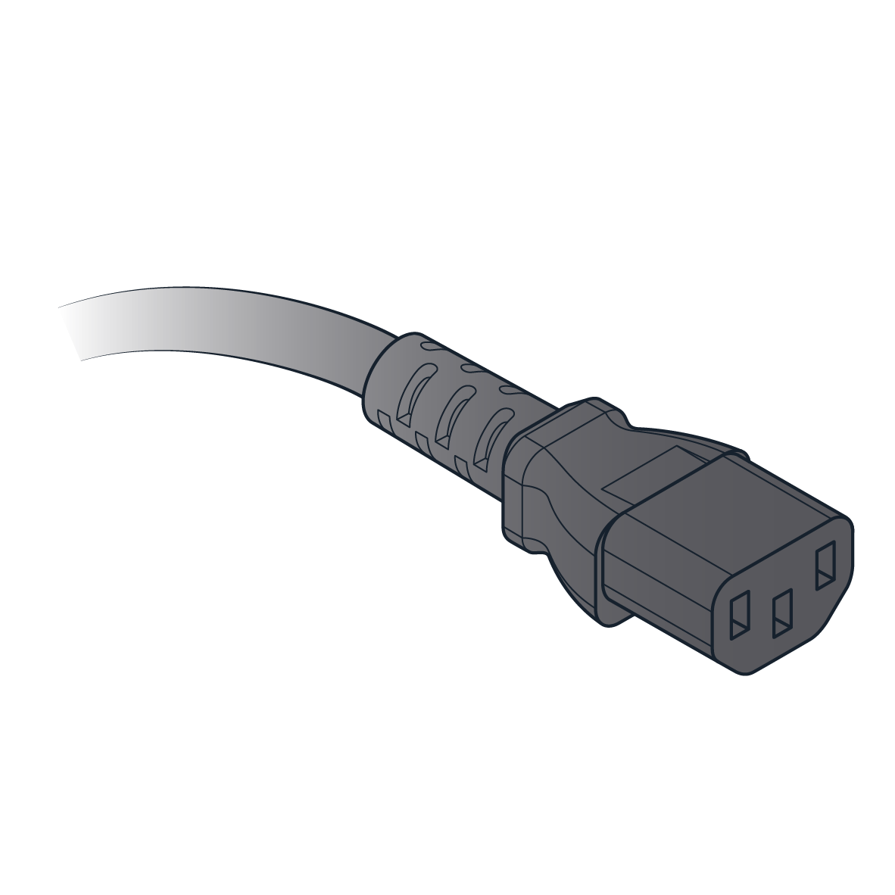
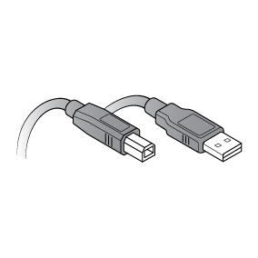
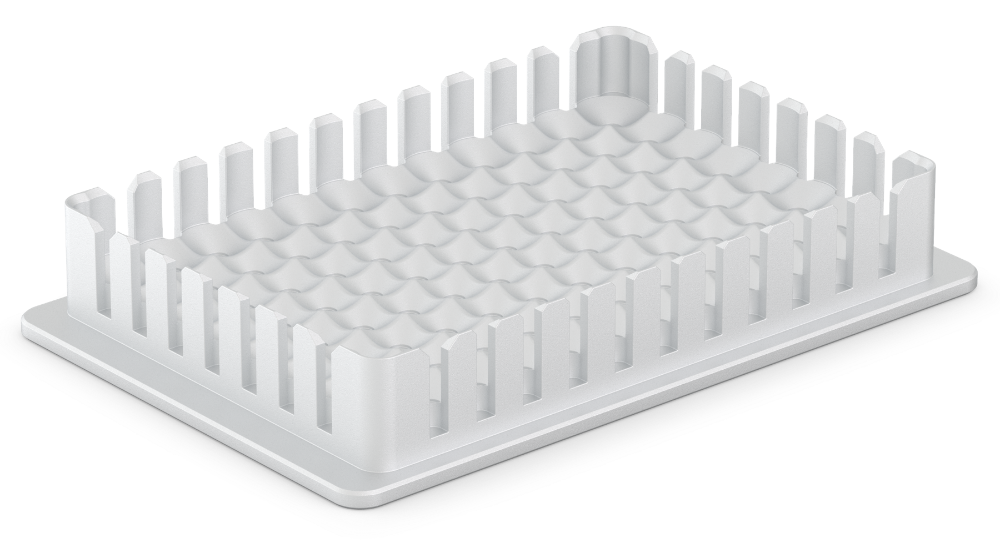
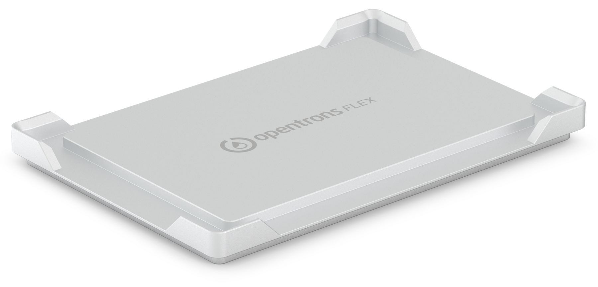

## Included Parts

<figure markdown>
  
  <figcaption>(1) Temperature Module</figcaption>
</figure>

<figure markdown>
  
  <figcaption>(1) Power Supply</figcaption>
</figure>

<figure markdown>
  
  <figcaption>(1) Power Cable</figcaption>
</figure>

<figure markdown>
  
  <figcaption>(1) USB Cable</figcaption>
</figure>

## Physical Specifications

- **Dimensions:** 194 mm L x 90 mm W x 84 mm H
- **Weight:** 1.5 kg

## Temperature Profile

The Temperature Module is designed to achieve and maintain a target temperature on the top plate surface, within its performance specifications. The thermal block, labware, and sample volumes will affect the temperature of the sample, relative to the temperature of the top plate surface. Opentrons recommends testing the temperature within the sample to determine if additional adjustments are needed to meet the requirements of your application. If you have additional questions please contact Opentrons Support.

Additionally, Opentrons has tested the Temperature Module’s temperature profile with both the 24-well and 96-well thermal blocks. The module can generally reach its minimum temperature in 12 to 18 minutes, depending on the block and contents. The module can reach a hot temperature (65 °C) in six minutes. For more details, see the [Temperature Module White Paper](https://insights.opentrons.com/hubfs/Products/Modules/Temperature%20Module%20White%20Paper.pdf).

## Thermal Blocks { #thermal-blocks-temperature }

The Temperature Module uses interchangeable aluminum thermal blocks to help hold labware at temperature.

At the time of purchase, each Temperature Module includes your choice of one (1) thermal block. You can select a 24-well block, a 96-well block, a deep well block, or a flat-bottom block. The blocks hold 1.5 mL and 2.0 mL tubes, 96-well PCR plates, PCR strips, deep well plates, and flat bottom plates.

!!! note "Hardware compatibility"
    All Opentrons thermal blocks are compatible with a Flex or an OT-2. However, the [OT-2 Flat Bottom Block](https://opentrons.com/products/aluminum-block-flat-bottom-ot-2) _is not compatible_ with the Flex Gripper. Flex protocols that require the Gripper should use the [Flex Flat Bottom Block](https://opentrons.com/products/aluminum-block-flat-bottom-flex) instead.

<figure markdown>
  
  <figcaption>24-well block</figcaption>
</figure>

<figure markdown>
  
  <figcaption>96-well block</figcaption>
</figure>

<figure markdown>
  
  <figcaption>Deep well block</figcaption>
</figure>

<figure markdown>
  
  <figcaption>Flat bottom block (Flex)</figcaption>
</figure>

<figure markdown>
  
  <figcaption>Flat bottom block (OT-2)</figcaption>
</figure>

Thermal blocks are available for purchase from the [Modules section](https://opentrons.com/products/categories/modules) of the Opentrons website.

The [Temperature Module caddy](https://opentrons.com/products/opentrons-flex-temperature-module-gen2-caddy-and-calibration-adapter) is available for purchase from Opentrons.