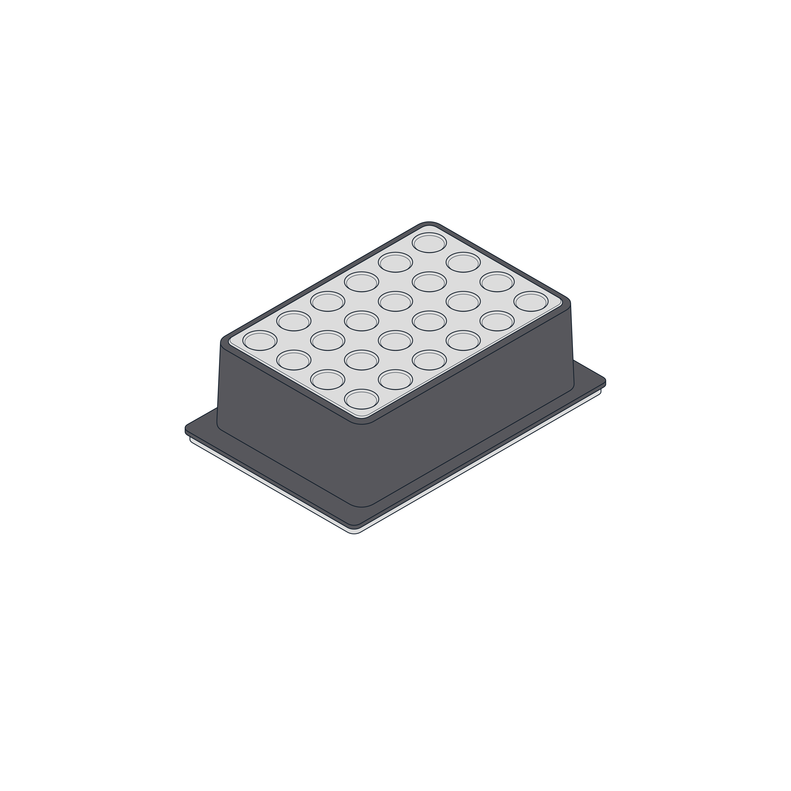
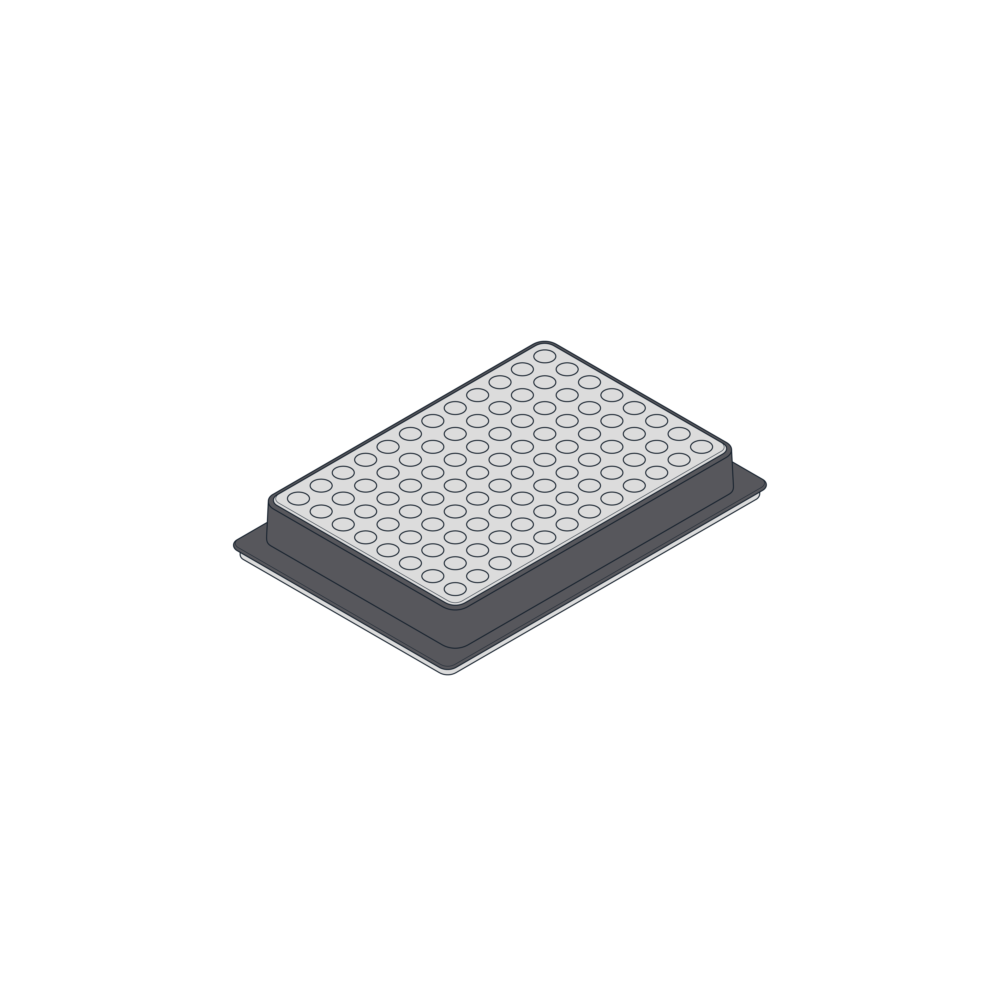
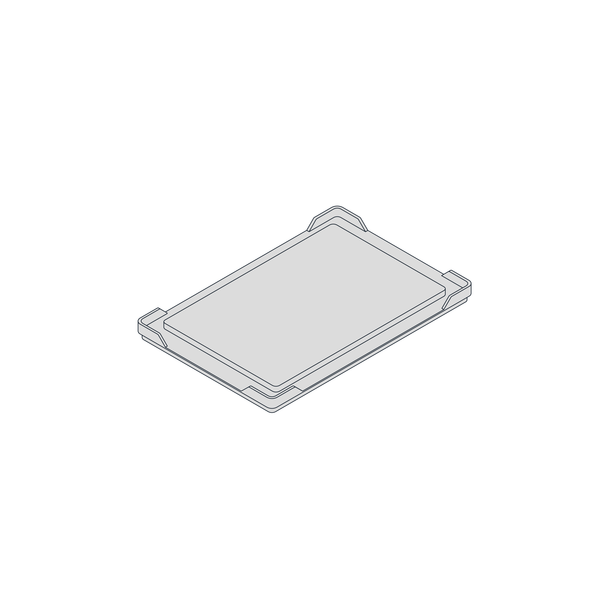

# Product Specifications

## Included Parts

<figure markdown>
  
  <figcaption>(1) Temperature Module</figcaption>
</figure>

<figure markdown>
  
  <figcaption>(1) Power Supply</figcaption>
</figure>

<figure markdown>
  
  <figcaption>(1) Power Cable</figcaption>
</figure>

<figure markdown>
  
  <figcaption>(1) USB Cable</figcaption>
</figure>

<figure markdown>
  
  <figcaption>(1) 24-Well Thermal Block (1.5–2 mL)</figcaption>
</figure>

<figure markdown>
  
  <figcaption>(1) 96-Well PCR Thermal Block</figcaption>
</figure>

<figure markdown>
  
  <figcaption>(1) Flat Bottom Adapter for OT-2</figcaption>
</figure>

## Physical Specifications

<table>
  <tbody>
    <tr>
      <th>Dimensions</th>
      <td>194 mm L x 90 mm W x 84 mm H</td>
    </tr>
    <tr>
      <th>Weight</th>
      <td>1.5 kg</td>
    </tr>
  </tbody>
</table>

## Temperature Profile

The Temperature Module is designed to achieve and maintain a target temperature on the top plate surface, within its performance specifications. The thermal block, labware, and sample volumes will affect the temperature of the sample, relative to the temperature of the top plate surface. Opentrons recommends testing the temperature within the sample to determine if additional adjustments are needed to meet the requirements of your application. If you have additional questions please contact Opentrons Support.

Additionally, Opentrons has tested the Temperature Module’s temperature profile with both the 24-well and 96-well thermal blocks. The module can generally reach its minimum temperature in 12 to 18 minutes, depending on the block and contents. The module can reach a hot temperature (65 °C) in six minutes. For more details, see the [Temperature Module White Paper](https://insights.opentrons.com/hubfs/Products/Modules/Temperature%20Module%20White%20Paper.pdf).

<!-- Is this paper ⬆️ still valid/useful and should we continue to link to it? -->

## Thermal Blocks

The Temperature Module module uses aluminum thermal blocks to hold labware at temperature. The module comes with a 24-well block, a 96-well PCR block, and a flat bottom block. The blocks hold 1.5 mL and 2.0 mL tubes, 96-well PCR plates, PCR strips, deep well plates, and flat bottom plates. You can also buy these aluminum blocks from the Opentrons shop.

<figure markdown>
  
  <figcaption>24-well block</figcaption>
</figure>

<figure markdown>
  
  <figcaption>96-well Block</figcaption>
</figure>

<figure markdown>
  
  <figcaption>Flat Plate Block</figcaption>
</figure>

## Flex Thermal Blocks

For Flex, the Temperature Module caddy comes with a deep well block and a flat bottom block designed for use with the Flex Gripper.

IMAGE PLACEHOLDER

The Flex flat bottom plate is compatible with various ANSI/SLAS standard well plates. It is different from the flat plate that ships with the Temperature Module and the separate three-piece set. The Flex flat plate features a wider working surface and chamfered corner clips. These features help improve the performance of the Opentrons Flex Gripper when moving labware onto or off of the
plate. You can tell which flat bottom plate you have because the one for Flex has the words “Opentrons Flex” on its top surface. The one for OT-2 does not.

## Thermal Block Compatibility

The following table lists the thermal blocks recommended for use with either Flex or an OT-2.

| Thermal Block           | Flex | OT-2                    |
|:------------------------|:-----|:------------------------|
| 24-well                 |      | :material-check-bold: |
| 96-well PCR             |      | :material-check-bold: |
| Deep Well               | :material-check-bold: |                 |
| Flat Bottom for Flex    | :material-check-bold: | :octicons-x-12: |
| Flat Bottom for OT-2    | :octicons-x-12: | :material-check-bold: |
