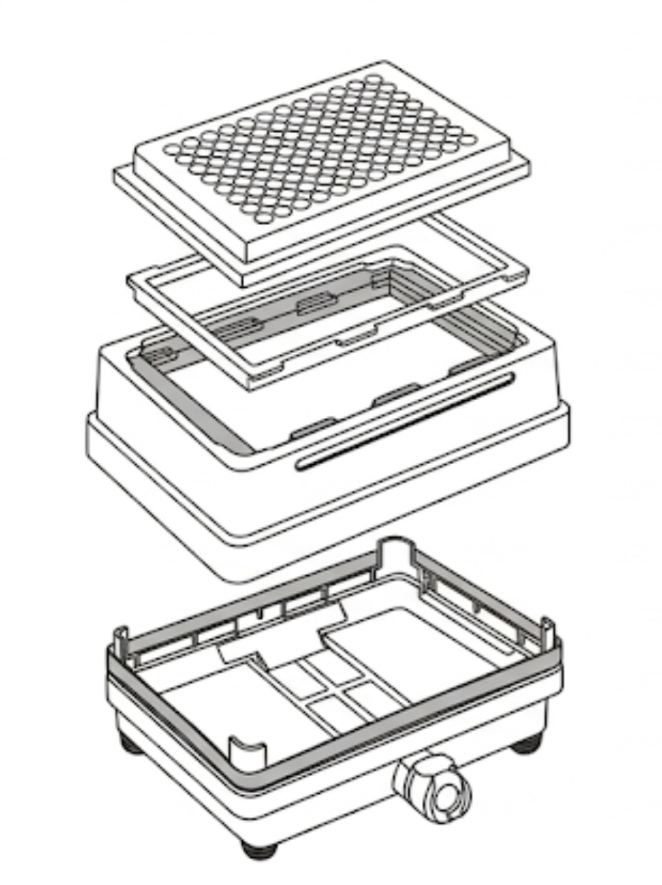
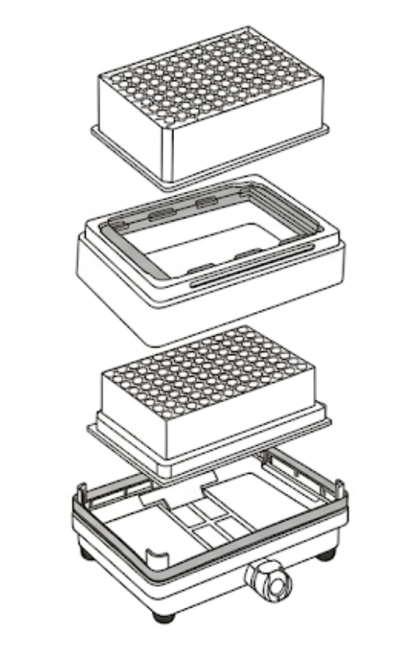

Intro. Lorem ipsum dolor sit amet, consectetur adipiscing elit. Donec luctus hendrerit diam, sed feugiat urna suscipit id. Nulla ut nulla sed arcu pharetra varius. Vestibulum ante ipsum primis in faucibus orci luctus et ultrices posuere cubilia curae; Nullam non malesuada odio. Vestibulum egestas rutrum viverra.

## Deck location

A3—A4

Insert deck map here.

## Module assembly

### Filter to waste

Some text here.

{ width="60%" }

### Filter between plates

Some text here.

{ width="60%" }

## Section placeholder

Cras gravida leo et elit luctus auctor. Aenean molestie dignissim sapien, eu lobortis enim interdum sit amet. Nam eget tellus nunc. Pellentesque bibendum, metus et mattis pulvinar, massa elit elementum neque, porttitor lacinia tellus neque eget odio. Mauris vulputate consectetur odio id gravida.