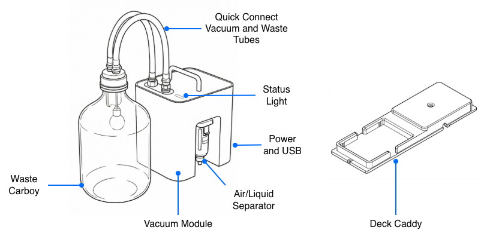
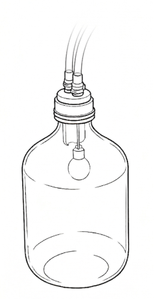
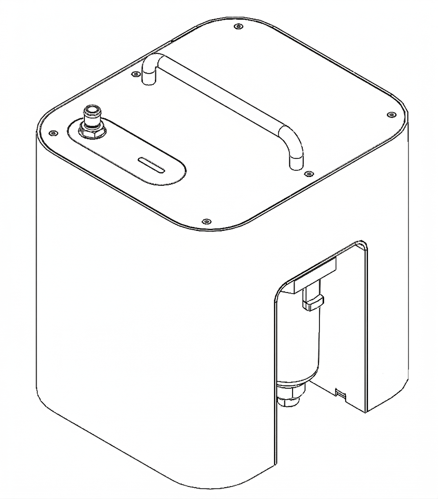
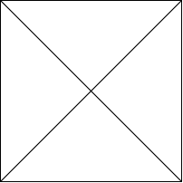
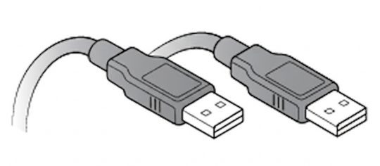
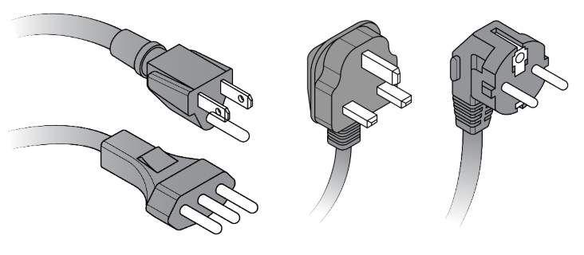

## Included parts

PARTS IMAGES PLACEHOLDERS

<figure markdown>

<figcaption>(1) GL60 collection jar</figcaption>
</figure>

<figure markdown>

<figcaption>(1) Vacuum pump</figcaption>
</figure>

<figure markdown>

<figcaption>(2) Vacuum and waste tubing</figcaption>
</figure>

<figure markdown>

<figcaption>(1) Deck caddy</figcaption>
</figure>

<figure markdown>

<figcaption>( ) M4x10 Deck slot screws</figcaption>
</figure>

<figure markdown>

<figcaption>(1) USB A cable</figcaption>
</figure>

<figure markdown>

<figcaption>(1) Region specific power cable</figcaption>
</figure>

## Physical specifications

| Header | Header |
|----|----|
| Vacuum module | L W H (include handle), weight |
| Maximum pump rate | L/min  |
| Measurement range (absolute) | 0 <emdash> xxx mbar |
| Resolution | x.x mbar |
| Tubing | Diameter, length, composition |
| Relative humidity | xx% at C |
| Temperature | |
| Humidity | |
| Altitude | Sea level to xxxx meters |

## Power supply

The Vacuum Module requires the following power inputs, which are met by its internal power supply.

<table>
  <thead>
    <tr>
      <th>Specification</th>
      <th>Details</th>
    </tr>
  </thead>
  <tbody>
    <tr>
      <td><strong>Manufacturer</strong></td>
      <td>Mean Well</td>
    </tr>
    <tr>
        <td><strong>Model</strong></td>
        <td>
          <ul>
            <li>LOP-200-24</li>
            <li>Low-profile, open-frame internal power supply</li>
          </ul>
        </td>
    </tr>
    <tr>
      <td><strong>Input Power</strong></td>
      <td>
        <ul>
          <li>80–264 VAC</li>
          <li>47–63 Hz</li>
          <li>1A at 230 VAC or 2.5A at 115 VAC</li>
        </ul>
      </td>
    </tr>
    <tr>
      <td><strong>Output Power</strong></td>
      <td>
        <ul>
          <li>24 VDC</li>
          <li>2.7A to 25A (varies by model and cooling method)</li>
          <li>140W maximum with natural convection or 200W maximum with forced-air cooling</li>
        </ul>
      </td>
    </tr>
    <tr>
      <td><strong>Overvoltage</strong></td>
      <td>
        <ul>
          <li>Category III (OVC III)</li>
          <li>Protection Type: Shutdown output voltage; requires re-powering to recover</li>
        </ul>
      </td>
    </tr>
    <tr>
      <td><strong>Mains Fluctuation</strong></td>
      <td>
        <ul>
          <li>Line Regulation: ±0.5%</li>
          <li>Voltage Tolerance: ±1.0% to ±3.0%</li>
        </ul>
      </td>
    </tr>
    <tr>
      <td><strong>Typical and Peak Consumption</strong></td>
      <td>
        <ul>
          <li>No-load Power Consumption: <0.5W </li>
          <li>Peak Load: 150% of rated power for up to 3 seconds</li>
        </ul>
      </td>
    </tr>
  </tbody>
</table>

## LED Status Light

