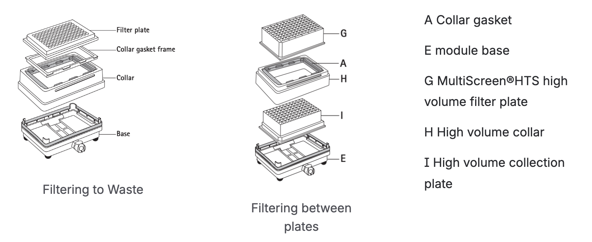

Some kind of basic "how do you use it" concept piece here.

Something [similar to this](https://opentrons.atlassian.net/wiki/spaces/RPDO/pages/4821483521/PRD+-+Opentrons+Automated+Vacuum+Module+Gen+1) (PRD on Confluence) and showing stack-up illustrations.

