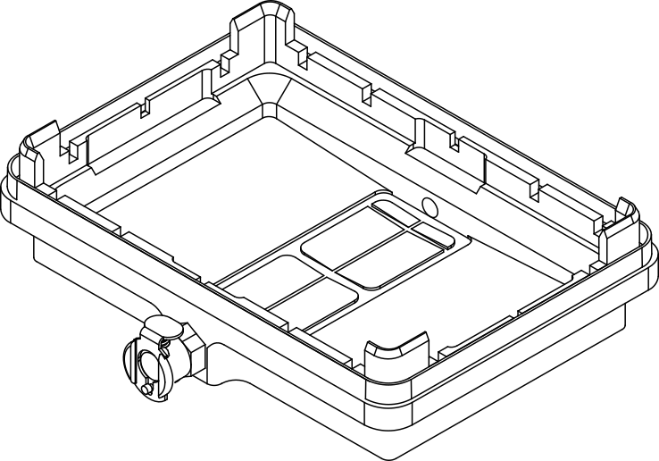
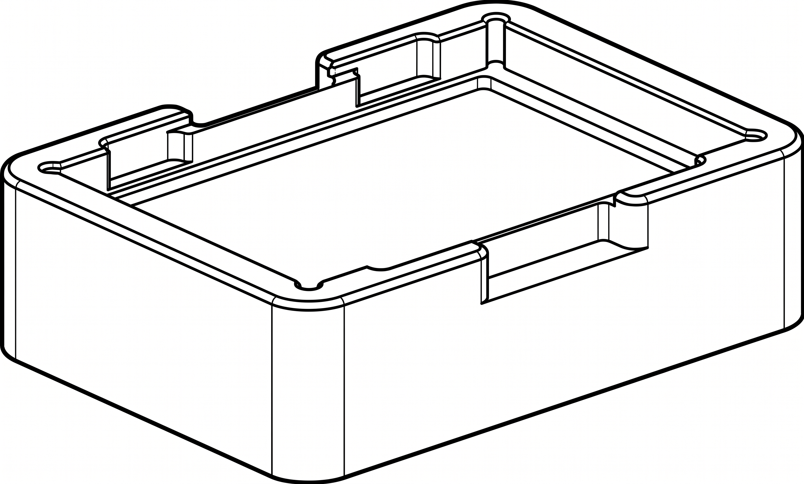
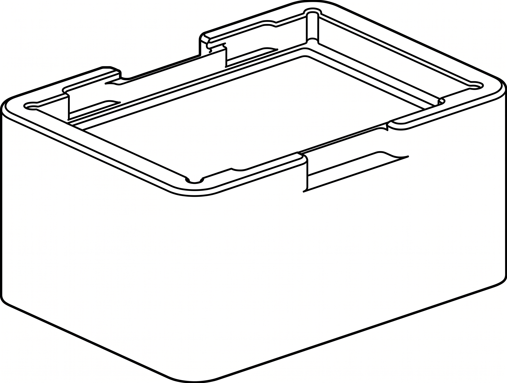
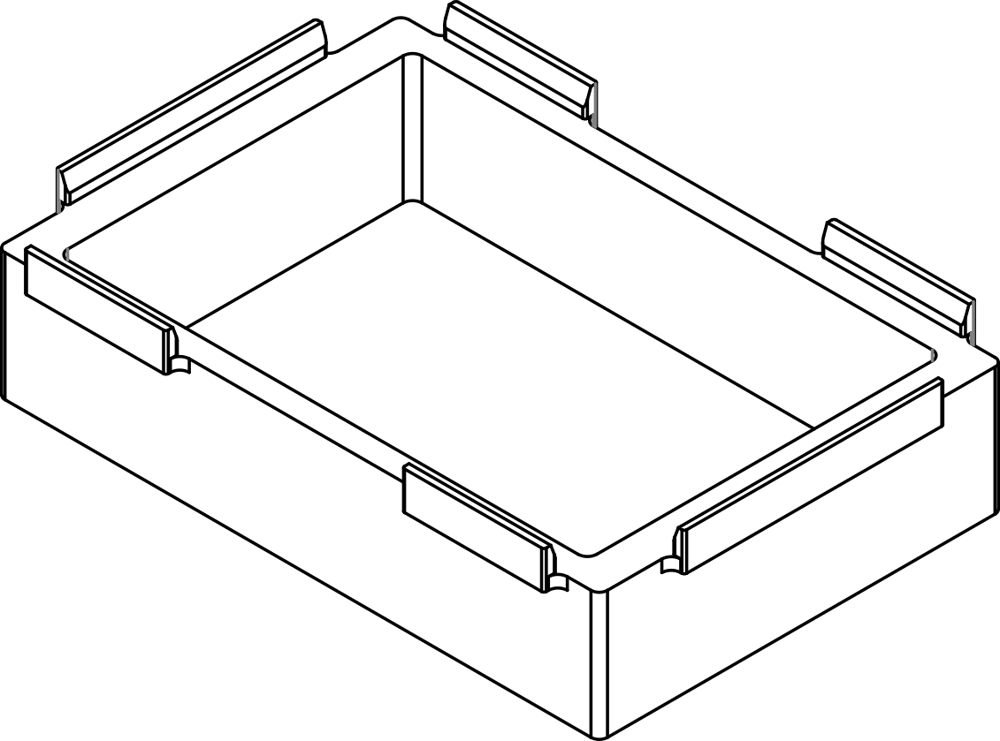
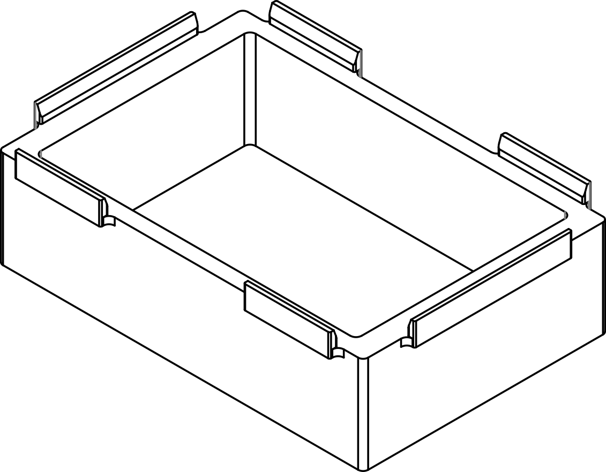

Module deck components consist of a vacuum base, interchangeable collars, and internal spacers. The vacuum base forms the foundation of this on-deck hardware stack. Collars and spacers rest sequentially on the base to control labware stacking heights across various automated filtration protocols, ensuring an airtight seal whether capturing an eluate or discarding waste.

## Vacuum base

The vacuum base sits directly on the deck plate adapter. It serves as the foundation of the module's hardware stack, supporting all internal spacers, collars, and protocol labware.

<figure markdown>
  { width="70%" }
  <figcaption>Vacuum base with quick-connect manifold.</figcaption>
</figure>

When connected to the off-deck waste carboy and Control Box, negative pressure draws liquid down cleanly through the module assembly. The vacuum base collects this fluid, routing it into an internal collection plate or out to the external 2-liter waste jar via the attached 6 mm hose.

## Collars

Collars sit directly on the vacuum base. They support filter plates used during vacuum extraction protocols. Each collar features an integrated gasket that forms an airtight vacuum seal with the well plate, while a secondary gasket on the vacuum base seals it to the collar. The short and tall collars can be paired interchangeably with either spacer. Both collar variations are fully compatible with the Flex Gripper.

The Vacuum Module includes two collars to match different labware profiles:

* **Short Collar (42 mm):** Accommodates standard microliter (μL) filter plates.
* **Tall Collar (72 mm):** Accommodates deep-well filter plates (typically up to 2 mL).

<figure class="side-by-side" markdown>

<figcaption>Short collar (42 mm) and tall collar (72 mm)</figcaption>
</figure>

## Spacers

In a vacuum filtration protocol, spacers reduce the vertical clearance between the source filter plate and the destination collection plate. Minimizing this gap ensures fluid droplets fall cleanly into the receiving wells and prevents vacuum pressure from pulling liquid sideways, eliminating cross-contamination. The short and tall spacers can be paired interchangeably with either collar.

The Vacuum Module includes two spacers to match different labware profiles:

* **Short Spacer:** 27 mm
* **Tall Spacer:** 34 mm

<figure class="side-by-side" markdown>

<figcaption>Short spacer (27 mm) and tall spacer (34 mm)</figcaption>
</figure>

## Typical use cases

### Elution and filtrate collection

This configuration is used when a protocol requires capturing liquid (the eluate or a target filtrate) into a user-supplied collection plate nested inside the vacuum base.

* **Internal Hardware:** Placing a short or tall spacer inside the vacuum base properly positions the collection labware directly beneath the source filter plate.
* **Fluid Routing:** Minimizing the gap between the plates ensures that liquid flows vertically through the filter plate and drips straight into the corresponding collection wells.

<figure markdown>
  { width="60%" }
  <figcaption>Elution and filtrate collection stack</figcaption>
</figure>

### Filter to waste collection

This configuration is used when a protocol does not require capturing liquid from a filter plate. Instead, the fluid drawn through the filter plate is unwanted waste and can be discarded directly.

* **Internal Hardware:** Neither an internal spacer nor a collection plate is required inside the vacuum base. The interior of the base remains completely empty, capped by a short or tall collar and the fluid source well plate.
* **Fluid Routing:** Vacuum pressure draws liquid straight through the filter plate into the vacuum base. From there, the material flows out via the connected vacuum hose to the off-deck waste collection jar.

<strong>EXPLODED DIAGRAM PLACEHOLDER</strong>

<figure markdown>
  
  <figcaption>Stack (top to bottom): source well plate, collar and grid, vacuum base</figcaption>
</figure>