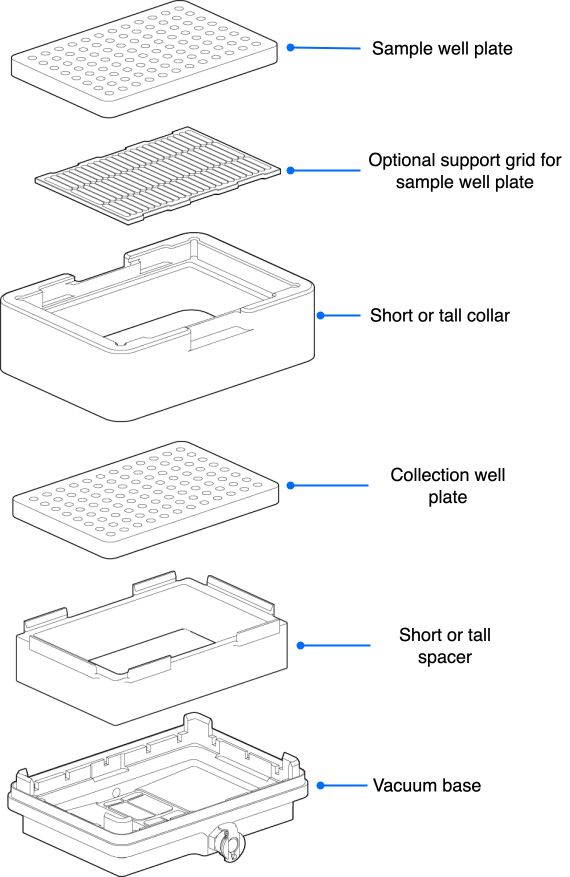

Module deck components consist of a vacuum base, interchangeable collars, and internal spacers. The vacuum base forms the foundation of this on-deck hardware stack. Collars and spacers rest sequentially on the base to control labware stacking heights across various automated filtration protocols, ensuring an airtight seal whether capturing an eluate or discarding waste.

## Vacuum base

The vacuum base sits directly on its own deck plate. The vacuum base serves as the foundation of the module's hardware stack, supporting all internal spacers, collars, and protocol labware.

<figure markdown>
  { width="90%" }
  <figcaption>Vacuum base with quick-connect manifold</figcaption>
</figure>

When connected to the off-deck waste carboy and Control Box, negative pressure draws liquid down cleanly through the module assembly. The vacuum base collects this fluid, routing it into an internal collection plate or out to the external 2-liter waste jar via the attached 6 mm hose.

## Collars

Collars sit directly on the vacuum base. They support filter plates used during vacuum extraction protocols. Each collar features an integrated gasket that forms an airtight vacuum seal with the well plate, while a secondary gasket on the vacuum base seals it to the collar. The short and tall collars can be paired interchangeably with either spacer. Both collar variations are fully compatible with the Flex Gripper.

The Vacuum Module includes two collars to match different labware profiles:

* **Short Collar (42 mm):** Optimized for standard microliter filter plates that typically have working volume ranges between 50 μL and 250 μL.
* **Tall Collar (72 mm):** Optimized for deep-well filter plates that typically have working volumes up to 1.8 mL.

Both collars accommodate standard ANSI/SLAS compliant filter plates across a span of different membrane pore sizes, ranging from very fine (0.22 μm) to coarse (100.0 μm).

<figure class="side-by-side" markdown>

<figcaption>Short collar (42 mm) and tall collar (72 mm)</figcaption>
</figure>

## Spacers

In a vacuum filtration protocol, you can place an internal spacer beneath a sample collection plate to raise it closer to the source filter plate. Elevating the collection plate minimizes the vertical gap between the two well plates, ensuring fluid droplets fall cleanly into the receiving wells. Reducing the space between plates also prevents vacuum pressure from pulling liquid sideways, eliminating cross-contamination and sample loss. The short and tall spacers can be paired interchangeably with either collar.

The Vacuum Module includes two spacers to match different labware profiles:

* **Short Spacer:** 27 mm
* **Tall Spacer:** 34 mm

<figure class="side-by-side" markdown>

<figcaption>Short and tall spacers</figcaption>
</figure>

## Typical use cases

### Elution and filtrate collection

This configuration is used when a protocol requires capturing liquid (the eluate or a target filtrate) into a user-supplied collection plate nested inside the vacuum base.

* **Internal Hardware:** Placing a short or tall spacer inside the vacuum base properly positions the collection labware directly beneath the source filter plate.
* **Fluid Routing:** Minimizing the gap between the plates ensures that liquid flows vertically through the filter plate and drips straight into the corresponding collection wells.

<figure markdown>
  { width="60%" }
  <figcaption>Elution and filtrate collection stack</figcaption>
</figure>

### Filter to waste disposal

This configuration is used when a protocol does not require capturing liquid from a filter plate. Instead, the fluid drawn through the filter plate is unwanted waste and can be discarded directly.

* **Internal Hardware:** Neither an internal spacer nor a collection plate is required inside the vacuum base. The interior of the base remains completely empty, capped by a short or tall collar and the fluid source well plate.
* **Fluid Routing:** Vacuum pressure draws liquid straight through the filter plate into the vacuum base. From there, the material flows out via the connected vacuum hose to the off-deck waste collection jar.

<figure markdown>
  { width="80%" }
  <figcaption>Waste disposal stack</figcaption>
</figure>