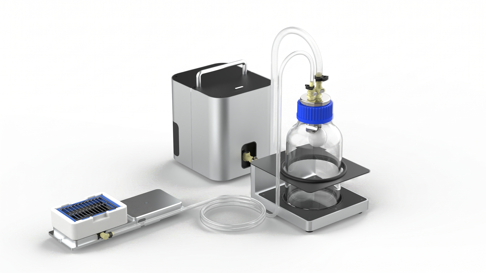

# Opentrons Automated Vacuum Module GEN1 Instruction Manual

**Opentrons Labworks Inc.** 
September 2026

## Product Description

The Opentrons Vacuum Module is a fully automated vacuum filtration system with waste storage, designed for use with the Opentrons Flex. The module ships with all components required to run solid-phase extraction (SPE) protocols to filter, concentrate, or purify samples.

The system consists of an on-deck manifold stack, an off-deck Control Box housing the vacuum pump and electronics, a 2-liter glass carboy in a protective stabilization cradle, and all necessary hoses and adapters. The on-deck components accept ANSI/SLAS compliant vacuum filtration labware and are fully compatible with the Flex Gripper. You can control the Vacuum Module via the Opentrons App, the Flex touchscreen, or the Opentrons Python API.
