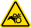

The Vacuum Module ships in three separate boxes containing all the components required for assembly and operation. Read the safety precautions below before following the step-by-step setup instructions.

!!! warning "Installation Safety Precautions"
    - {: style="vertical-align: middle; height: 1.75em;"} **Electrical hazard:** Turn off the power to the Flex before beginning the installation process. This prevents the robot from operating unexpectedly during setup and allows the gantry to move freely.
    - {: style="vertical-align: middle; height: 1.75em;"} **Cable routing:** Route electrical and data cables carefully to avoid extreme bending/kinking and damp or wet locations.
    - {: style="vertical-align: middle; height: 1.75em;"} **Pinch hazard:** Keep fingers clear of deck slot edges when removing deck plates or seating the deck adapter.
    - {: style="vertical-align: middle; height: 1.75em;"} **Hose placement:** When connecting vacuum hoses, avoid sharp bends, kinks, or low dips that allow fluid to accumulate and impede airflow. Maintain a continuous downward slope from the deck module to the waste carboy.
    - {: style="vertical-align: middle; height: 1.75em;"} **Tripping hazard:** Keep hoses secure and clear of walkways to help prevent trip hazards.

## Part 1: Unboxing

1. Open the shipping boxes.

2. Cut open and remove any protective material and padding around the internal boxes that contain the component parts to your module.

3. Remove the inner boxes from the shipping boxes.

    !!! tip
        The vacuum hoses, and attached connectors, ship in the box that holds the waste collection jar. You can find the hoses wrapped around the specially shaped foam padding on the bottom of their box.

## Part 2: Deck hardware assembly

4. Remove any modules and labware from the deck to give yourself room to work. With the robot powered off, you can also gently move the gantry aside if it's in the way.

5. Remove the trash bin (if installed) or any modules, labware, and plates from slots A3–A4.

6. Remove the deck adapter and the small bag of manifold screws from their packaging.

7. Remove the vacuum base from its packaging.

    <figure markdown>
    
    <figcaption>Vacuum Module base piece</figcaption>
    </figure>

8. Place the vacuum base in the recessed slot of the deck adapter with the quick-connect fitting facing toward the back of the deck. When installed, this keeps the vacuum hose clear of the main working area.

    <figure markdown>
    
    <figcaption>Deck adapter and vacuum base. Quick-connect fitting faces rear of robot.</figcaption>
    </figure>

9. Working off-deck, insert the 4 manifold screws from underneath the deck adapter into the vacuum base and hand-tighten them using the supplied 7/64″ L-key.

    !!! note
        - **Pass-through openings:** The clearance openings in the deck adapter are unthreaded. Screws pass through from the bottom of the adapter to thread directly into the vacuum base.
        - **Imperial fasteners:** Unlike other Flex deck modules that use Metric hardware, the vacuum base uses Imperial fasteners requiring the provided 7/64″ L-key.

10. Press the L-shaped 6 mm (&frac14;") quick connect fitting (and its attached hose) into the exhaust manifold. The quick connect fittings lock into place with an audible click.

11. Run the hose from the exhaust manifold through the notch on the side of the deck plate adapter into the space below the deck. This area keeps cables, tubes, hoses, and other module connections from cluttering the deck.

    <figure markdown>
    { width="80%" }
    <figcaption>Adapter notch provides below-deck access for the vacuum hose.</figcaption>
    </figure>

12. Remove a lower cosmetic side panel on the robot and bring the remaining hose section through this opening. From here, you can connect the hose to the waste collection jar.

    <figure class="screenshot" markdown>
    
    <figcaption>Vacuum hose exiting Flex from a lower side panel.</figcaption>
    </figure>

13. Place the assembled piece (deck adapter and attached vacuum base) into slots A3–A4. Align the assembly so vacuum base occupies slot A3 and the raised part of the adapter (the "dock") occupies slot A4.

    <figure markdown>
    
    <figcaption>The Vacuum Module installs in slots A3–A4 only.</figcaption>
    </figure>

14. Using a 2.5 mm screwdriver, fasten the deck adapter to the deck with the original screws or the two deck screws provided with the module.

## Part 3: Carboy and vacuum hose connections

15. Place the Control Box in a safe, stable, and well ventilated location. When choosing a location, be sure to follow any applicable guidelines set by your facility's health/safety or other regulatory teams.

16. Put the carboy in its holder and place it a safe, stable, and well ventilated location. When choosing a location, be sure to follow any applicable guidelines set by your facility's health/safety or other regulatory teams.

    !!! tip
        Opentrons also recommends putting the carboy and holder in a larger, secondary container for added spill containment safety.

17. Place the cap on the waste jar and hand tighten it. Do not over-tighten the cap; this is not a trial of strength.

18. Attach the free end of the 6 mm (&frac14;") quick connect on the vacuum tube into the quick connect fitting on the cap. You can cut the tubing to length if needed.

19. Attach the 9.5 mm (&frac38;") vacuum hose and coupling inserts into the connector on the cap and on the Control Box. You can cut the tubing to length if needed.

## Part 4: Data and power connections

20. Connect the USB cable to the USB port on the Control Box and to an available USB port on the side of your Flex.

21. Connect the power cable to the Control Box power inlet and and into a power outlet.

22. Turn on the power to the Flex. After the robot reboots, then power on the Vacuum Module. The LED status light on the Control Box illuminates <strong>LED STATUS LIGHT CONDITION HERE</strong> when the module is ready for use.

## Post-installation procedures

After attaching and powering on the robot and the Vacuum Module, follow the instructions or animations on the Flex touchscreen or Opentrons App. These will guide you through any final procedures such as updating firmware and mapping the module's deck location.

The Vacuum Module itself does not require calibration. It is ready to use upon installation.