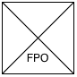

Follow these instructions to install the Vacuum Module.

!!! warning
    Turn off the power to the Flex before beginning the installation process. This prevents the robot from operating unexpectedly during setup.

## Part 1: Deck preparation

1. Clear the deck of all modules and labware to give yourself sufficient room to work.

2. Remove the waste bin (if installed) and any modules, labware, or deck adapters and/or plates from slots A3—A4.

    <figure markdown>
    
    <figcaption>Vacuum Module deck location</figcaption>
    </figure>

3. Install the Vacuum Module deck adapter in slots A3–A4 only. Fasten it to the deck with the original deck screws or use the screws provided with the module.

4. Seat the manifold base plate in slot A3. You can put a collar in slot A4, which is its "home" or default location.

    <figure markdown>
    
    <figcaption>IMAGE TBD</figcaption>
    </figure>

5. Secure one end of the 6 mm (&frac14;") vacuum tube to the manifold base plate, and route the remaining tubing through the opening in the deck plate adapter, under the deck, and to the waste collection area. You can knock out the small side plates on Flex to continue routing the hose.

    <figure markdown>
    
    <figcaption>IMAGE TBD</figcaption>
    </figure>

## Part 2: External components setup

6. Position the carboy cradle and the 2-liter glass carboy on the lab bench at or below the level of the control box.

7. Tighten the cap onto the carboy by hand until it is securely sealed. Do not over-tighten the cap, this is not a trial of strength.

8. Connect the free end of the 6 mm (&frac14;") vacuum tube coming from the manifold base to the carboy inlet port. Measure and cut the tubing to length if necessary.

8. Connect the 9.5 mm (&frac38;") vacuum hose from the carboy outlet port to the inlet port on the control box. Measure and cut the hose to length if necessary.

## Part 3: Data and power connections

10. Connect the USB cable to the data port on the control box and to an available USB port on the Flex.

11. Connect the IEC power cable to the control box power inlet and plug it into a mains power outlet.

12. Turn on the power to the Flex. After the Flex reboots, then power on the Vacuum Module. Verify that the LED status light on the Control Box illuminates <strong>LED STATUS LIGHT CONDITION HERE</strong>.

13. Follow the instructions on the Flex touchscreen to complete the final system setup, map the module deck location, and update the module's firmware if required.

