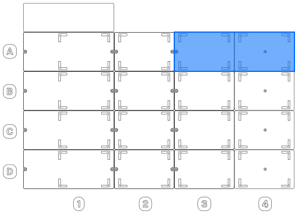

Follow these instructions to install the Vacuum Module.

!!! warning
    Turn off the power to your Flex before you begin. This prevents someone from using the robot during installation.

## Part 1: Deck preparation

1. **Clear the deck:** Remove all modules and labware from the robot to give yourself room to work.

2. **Install the deck plate adapter:** The adapter and other on-deck components must be installed in slots A3—A4 only.

    

3. **Install the manifold:** Seat the base plate and collar firmly into the adapter.

4. **Route tubing:** Secure one end of the 6 mm (&frac14;") vacuum tube to the base plate. Feed the rest of the tube through the deck opening to the area where your collection jar will sit.

## Part 2: External parts setup

5. **Place jar:** Position the waste collection jar on the lab bench. For best results, put it at or below the level of the vacuum pump.

6. **Secure cap:** Hand tighten the GL60 cap to the jar. Do not over-tighten. This is not a trial of strength.

7. **Connect waste tube:** Attach the free end of the 6 mm (&frac14;") tube from the manifold base to the jar inlet. You can measure and cut the tube to length as needed.

8. **Connect vacuum tube:** Attach the 9.5 mm (&frac38;") tube from the jar outlet to the vacuum pump. You can measure and cut the tube to length as needed.

## Part 3: Data and power connections

9. **Data connection:** Connect the USB cable to the pump and to an available USB port on the Flex.

10. **Power connection:** Connect the power cable to the pump and power outlet.

11. **Initialize module:** Turn on power to your robot. After it starts, turn on the power to the vacuum module. The LED light on the vacuum pump <strong>LED STATUS LIGHT CONDITION HERE</strong>.

12. **Touchscreen instructions:** After attaching and powering on the Flex and Vacuum Module, additional instructions on the touchscreen will guide you through any final steps such as updating the module's firmware (if required) and mapping its deck location.

