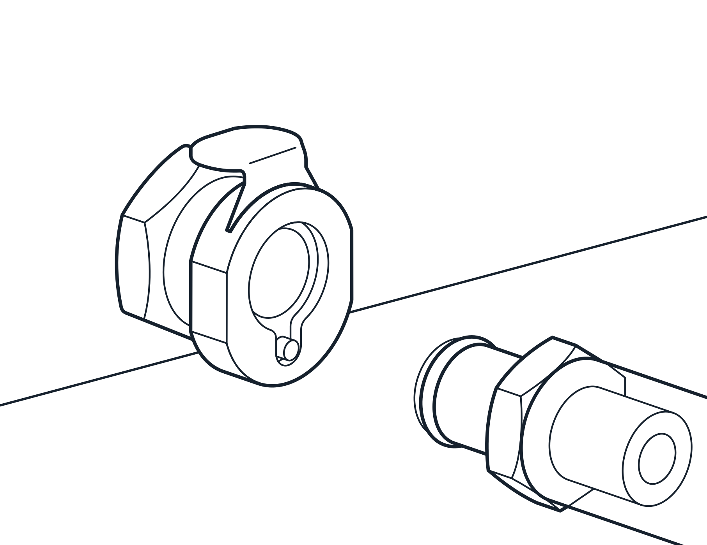
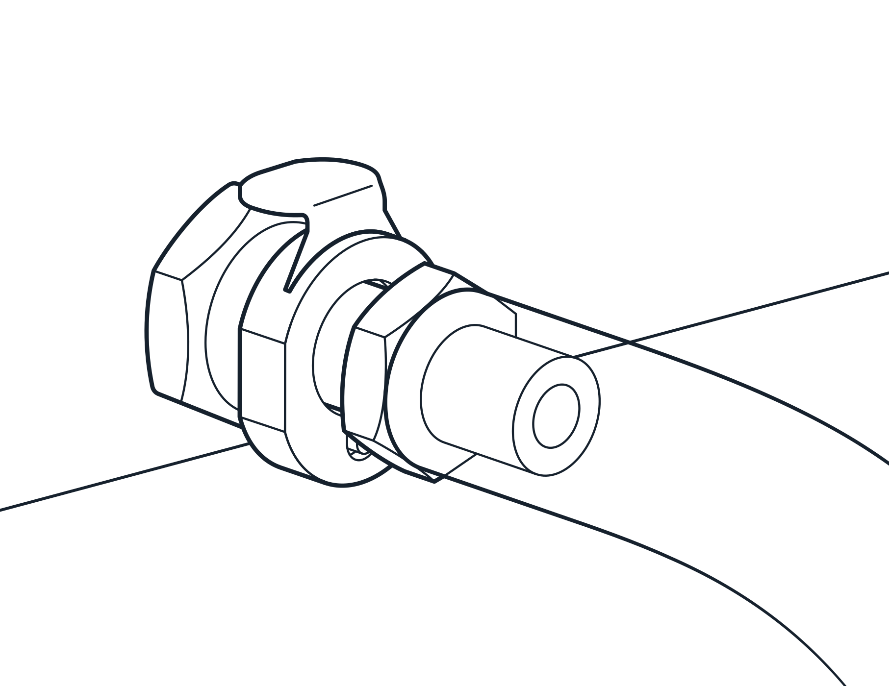
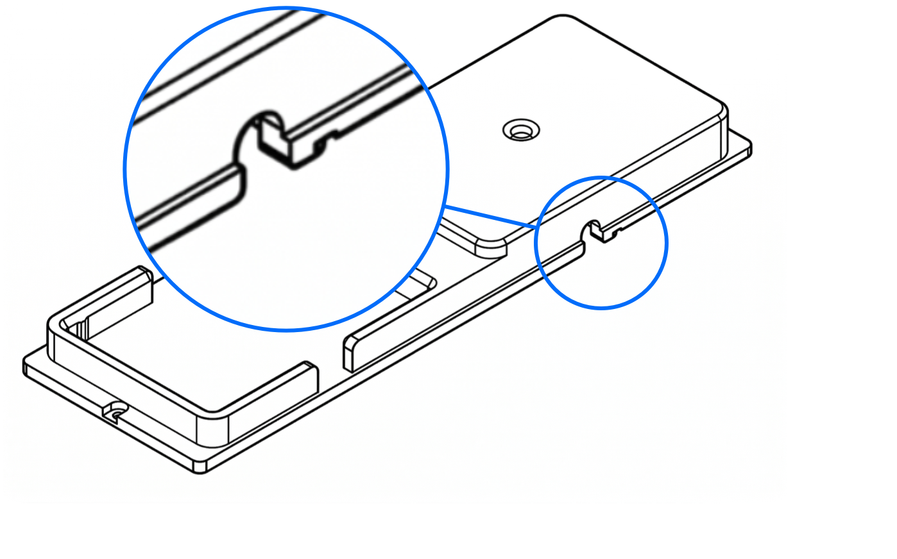

Follow these instructions to install the Vacuum Module.

!!! warning
    Turn off the power to the Flex before beginning the installation process. This prevents the robot from operating unexpectedly during setup.

## Part 1: Deck components

1. Clear the deck of all modules and labware to give yourself sufficient room to work.

2. Remove the waste bin (if installed) and any modules, labware, or deck adapters and/or plates from slots A3–A4.

    <figure markdown>
    
    <figcaption>The Vacuum Module installs in slots A3–A4.</figcaption>
    </figure>

3. Install the Vacuum Module deck adapter in slots A3–A4 only. Fasten the adapter to the deck with the original screws or use the screws provided with the module.

4. Set the vacuum base on the deck adapter in slot A-3.

5. Attach the 6 mm (&frac14;") vacuum hose to the quick connect fitting on the base plate. The quick connect fittings lock into place with an audible click.

<!-- Images won't center or render without left justify?!? -->
<figure class="screenshot side-by-side" markdown>

</figure>

6. Run the hose from the manifold through the notch on the side of the deck plate adapter into the space below the deck. This area keeps cables, tubes, hoses, and other module connections from cluttering the deck.

    <figure markdown>
    { width="80%" }
    <figcaption>Adapter notch provides below-deck access for the vacuum hose.</figcaption>
    </figure>

7.  Remove a lower cosmetic side panel on the robot and bring the remaining hose section through this opening. From here, you can connect the hose to the waste collection jar.

    <figure class="screenshot" markdown>
    
    <figcaption>Vacuum hose exiting Flex from a lower side panel.</figcaption>
    </figure>

## Part 2: Carboy and vacuum hose connections

8. Place the Control Box on or below your workbench.

9. Put the waste jar in the support cradle and place it on the workbench at or below the same level as the Control Box.

10. Place the cap on the waste jar and hand tighten it. Do not over-tighten the cap; this is not a trial of strength.

11. Attach the free end of the 6 mm (&frac14;") vacuum tube into the quick connect fitting on the cap. You can cut the tubing to length as needed.

12. Attach the 9.5 mm (&frac38;") vacuum hose and coupling inserts into the connector on the cap and on the Control Box.  You can cut the tubing to length as needed.

## Part 3: Data and power connections

13. Connect the USB cable to the USB port on the Control Box and to an available USB port on the side of your Flex.

14. Connect the power cable to the Control Box power inlet and plug it into a power outlet.

15. Turn on the power to the Flex. After the robot reboots, then power on the Vacuum Module. The LED status light on the Control Box illuminates <strong>LED STATUS LIGHT CONDITION HERE</strong> when the module is ready for use.

## Post-installation procedures

After attaching and powering on the robot and the Vacuum Module, follow the instructions or animations on the Flex touchscreen or Opentrons App. These will guide you through any final procedures such as updating firmware and mapping the module's deck location.

The Vacuum Module itself does not require calibration. It is ready to use upon installation.