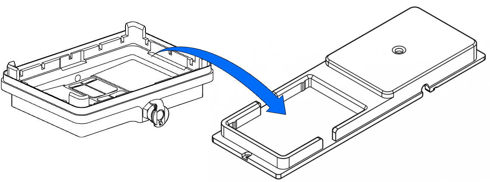
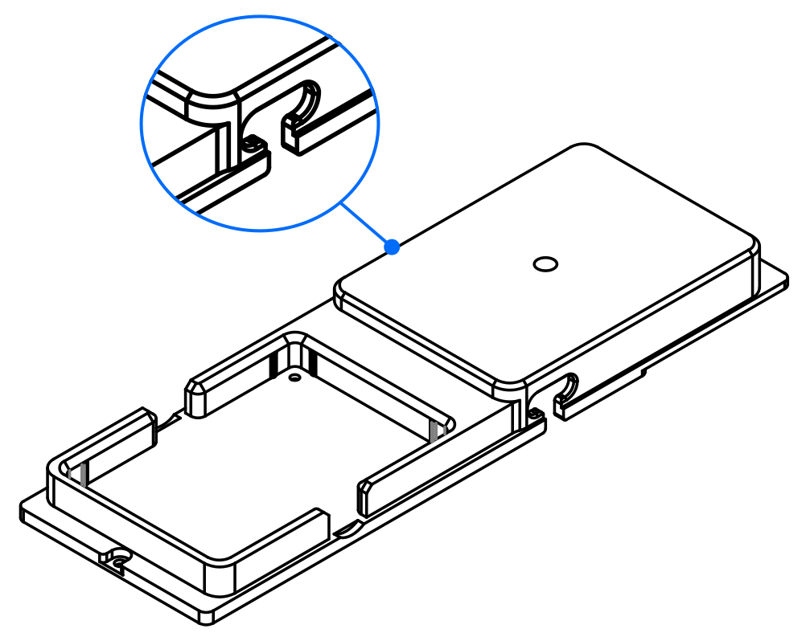
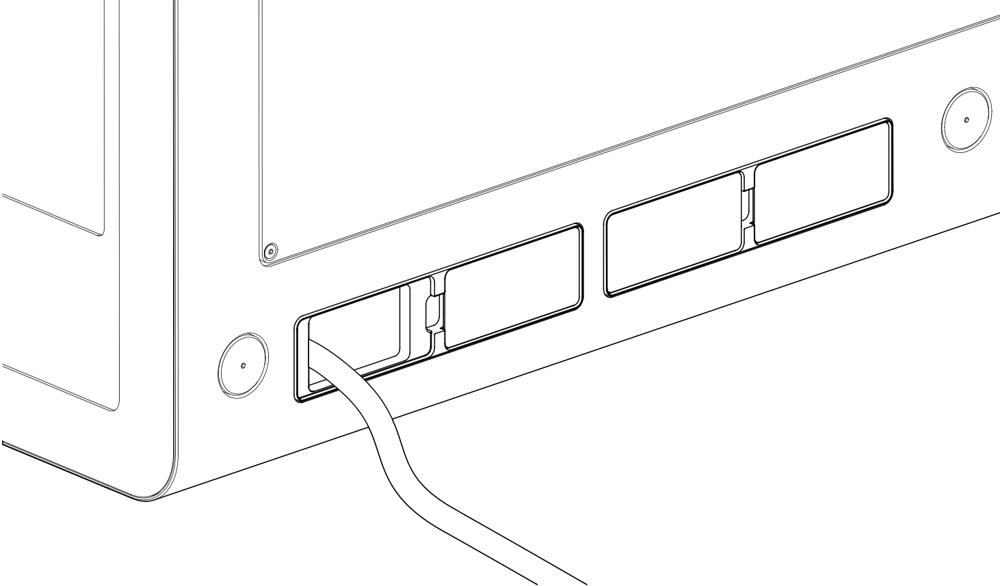
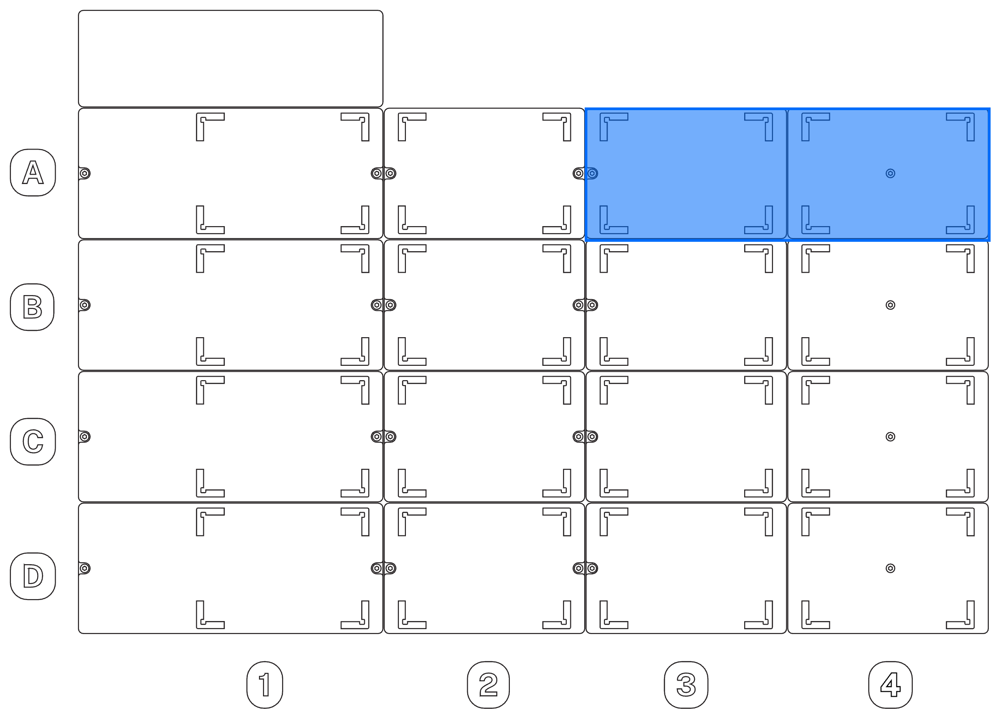

The Vacuum Module ships in three separate boxes containing all the components required for assembly and operation.

!!! warning "Before you begin"
    Turn off the power and unplug Flex before installing the Vacuum Module. This prevents the robot from operating unexpectedly during setup and allows the gantry to move freely.

## Part 1: Unboxing

1. Open the shipping boxes.

2. Cut open and remove any protective material and padding around the internal boxes that contain the different parts of your module.

3. Remove the inner boxes from the shipping boxes.

    !!! info "Vacuum hose location"
        Vacuum hoses are wrapped around the specially shaped foam padding on the bottom of the large shipping box that holds the smaller box with the carboy and its accessories.

## Part 2: Deck hardware assembly

4. Remove any modules and labware from the deck to give yourself room to work. With the robot powered off, you can also gently move the gantry aside if it's in the way.

5. Remove the trash bin (if installed) or any modules, labware, and plates from slots A3–A4.

6. Remove the deck adapter and the small bag of manifold screws from their packaging.

7. Remove the vacuum base from its packaging.

    <figure markdown>
    
    <figcaption>Vacuum Module base piece</figcaption>
    </figure>

8. Place the vacuum base in the recessed slot of the deck adapter. Align the quick-connect fitting facing so it faces away from you.
    <figure markdown>
    
    <figcaption>Vacuum base and deck adapter alignment</figcaption>
    </figure>

9. Insert the 4 manifold screws from underneath the deck adapter into the vacuum base and hand-tighten them using the supplied 7/64″ L-key.

    !!! note
        - **Pass-through openings:** The four holes in the deck adapter are unthreaded. The fasteners pass through these holes from the bottom of the adapter and screw into threaded holes in the vacuum base.
        - **Imperial fasteners:** Unlike other Flex deck modules that use Metric hardware, the vacuum base uses Imperial screws requiring the provided 7/64″ L-key.

10. Press the L-shaped 6 mm (&frac14;") quick connect fitting (and its attached hose) into the exhaust manifold. The quick connect fittings lock into place with an audible click.

11. Run the hose from the exhaust manifold through the notch on the side of the deck adapter into the space below the deck.

    <figure markdown>
    
    <figcaption>A second notch provides below-deck access for the vacuum hose.</figcaption>
    </figure>

12. Remove a lower cosmetic side panel on the robot and bring the remaining hose section through this opening.

    <figure class="screenshot" markdown>
    
    <figcaption>Vacuum hose exiting Flex from a lower side panel.</figcaption>
    </figure>

13. Place the assembled piece (deck adapter and attached vacuum base) into slots A3–A4. Align the assembly so vacuum base occupies slot A3 and the raised part of the adapter (the "dock") occupies slot A4. The vacuum base exhaust coupling and vacuum hose should be facing towards the back of the robot.

    <figure markdown>
    
    <figcaption>The Vacuum Module installs in slots A3–A4 only.</figcaption>
    </figure>

14. Using a 2.5 mm screwdriver, fasten the deck adapter to the deck with the original screws or the two deck screws provided with the module.

## Part 3: Carboy and vacuum hose connections

15. Place the Control Box in a safe, stable, and well ventilated location.

16. Remove the carboy from its box and put it in the holder.

17. Place the carboy in a suitable location below the level of the robot.

    !!! tip
        For added spill containment, place the carboy and holder in a larger, secondary basin or on a tray.

18. Place the cap on the waste jar and hand tighten it. Do not over-tighten the cap; this is not a trial of strength.

19. Attach the free end of the 6 mm (&frac14;") vacuum hose coupling to the quick connect fitting on the cap.

    !!! tip
        When routing the 6 mm vacuum hose, try to maintain a continuous downward slope from the robot to the carboy. Avoid sharp bends, kinks, or low dips that could allow fluid to accumulate in the hose and restrict airflow.

20. Attach the 9.5 mm (&frac38;") vacuum hose coupling into the connector on the cap and on the Control Box.

    !!! note
        With all hoses connected, check to make sure they're secure and clear of walkways to help prevent trip hazards.

## Part 4: Data and power connections

21. Connect the USB cable to the USB port on the Control Box and to an available USB port on the side of your Flex.

22. Connect the power cable to the Control Box power inlet and and into a power outlet.

    !!! warning
        Connect the Vacuum Module to a grounded/earthed (⏚) electrical outlet only.

23. Turn on the power to the Flex. After the robot reboots, then power on the Vacuum Module. The LED status light on the Control Box illuminates solid white when the module is ready for use.

## Post-installation procedures

After attaching and powering on the robot and the Vacuum Module, follow the instructions or animations on the Flex touchscreen or Opentrons App. These will guide you through any final procedures such as updating firmware and mapping the module's deck location.