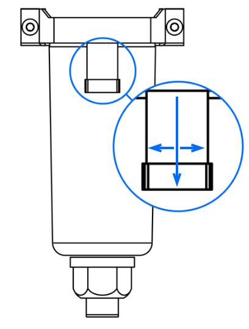

## Maintenance

You should not attempt to service or repair the vacuum module. If you have concerns about the module’s performance, contact Opentrons Support at <support@opentrons.com>.

## Cleaning

Turn off and unplug the module from the wall outlet before cleaning it.

The following table lists the chemicals you can use to clean the exterior of the vacuum pump and waste collection jug. Diluted alcohol and distilled water are our recommended cleaning products. You can also refer to the table below for other compatible options. For cleaning or decontaminating vacuum tubes or the waste collection jug, refer to your lab's procedures for handling biohazardous and other chemically hazardous waste.

| Solution | Recommendations |
|----|----|
| Alcohol | Includes ethyl/ethanol, isopropyl, and methanol. Dilute to 70% for cleaning. Do not use 100% alcohol. |
| Bleach | Dilute to 10% (1:10 bleach/water ratio) for cleaning. Do not use 100% bleach. |
| Distilled water | You can use distilled water to clean or rinse your vacuum module. |

!!! Warning
    - Do not put the vacuum module in an autoclave.
    - Do not clean the vacuum module with acetone.
    - Do not disassemble the vacuum module for cleaning or attempt to clean its internal electronic components or mechanical parts.

## Emptying the air-liquid separator

The Control Box houses an air-liquid separator. This device is recessed in a niche on the side of the Control Box. It traps liquid droplets in a clear, removable filter bowl while allowing dry air to pass into the vacuum pump. You should regularly clean condensate from the bowl or whenever any accumulated liquid reaches the max fill line.

<figure markdown>
{ width="50%" }
<figcaption>Separator filter bowl. Pull tab down and twist bowl to remove.</figcaption>
</figure>

### Detach the bowl

To remove the separator bowl:

1. Turn off the power and disconnect the power cable.

2. Disconnect the vacuum hose from the manifold base or another convenient fitting to remove any residual vacuum and restore the system to atmospheric pressure.

3. Pull down on the separator bowl locking tab.

4. Twist the bowl slightly to the right or left to disengage the retaining lugs.

5. Pull down gently on the bowl to remove it.

6. Safely dispose of any accumulated material and clean the bowl with a soft, dry cloth.

### Reattach the bowl

To reattach the separator bowl:

1. With the bowl locking tab slightly offset to the left or right, insert it into the housing.

2. Push up firmly on the bowl while pulling down on the locking tab.

3. Twist the bowl to engage the retaining lugs and restore the locking tab to its original position.

4. Release the locking tab when the bowl snaps into place.

6. Reattach the power cable and turn the power back on.

