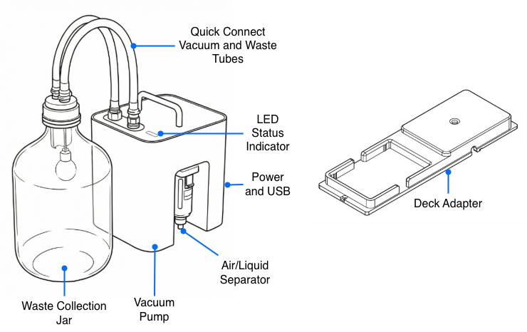
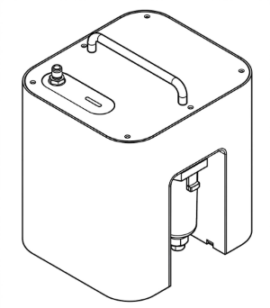
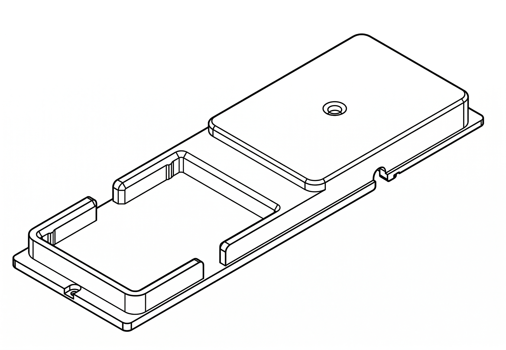
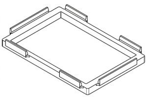

## Vacuum Module box parts

The Vacuum Module ships in three separate boxes.

### Box 1: labware components

This box includes manifold components that sit on the deck and hold ANSI/SLAS compliant vacuum filtration labware.

(1) Short vacuum collar  
(1) Tall vacuum collar  
(1) Vacuum manifold base  
(3) Spacers

### Box 2: module components

(1) Vacuum module (pump and electronics)  
(1) Deck adapter  
(2) Deck plate screws (M4 x 10)

### Box 3: accessories

<figure markdown>

<figcaption>(1) Vacuum pump</figcaption>
</figure>

<figure markdown>

<figcaption>(1) Waste collection jar</figcaption>
</figure>

<figure markdown>

<figcaption>(1) Deck adapter</figcaption>
</figure>

<figure markdown>

<figcaption>(3) well plate spacers</figcaption>
</figure>

<figure markdown>

<figcaption>(1 each) 6 mm and 9.5 mm vacuum hoses</figcaption>
</figure>

<figure markdown>

<figcaption>(1) USB A—B cable</figcaption>
</figure>

<figure markdown>

<figcaption>(1) Region specific power cable</figcaption>
</figure>

<figure markdown>

<figcaption>(2) M4x10 Deck slot screws</figcaption>
</figure>

See <strong>section TBD for descriptions of selected parts.</strong>

## Physical specifications

<table>
  <thead>
    <tr>
      <th>Specification</th>
      <th>Description</th>
    </tr>
  </thead>
  <tbody>
    <tr>
      <td><strong>Pump dimensions</strong></td>
      <td>L x W x H, weight</td>
    </tr>
    <tr>
      <td><strong>Maximum pump rate</strong></td>
      <td>L/min</td>
    </tr>
    <tr>
      <td><strong>Vacuum range (absolute)</strong></td>
      <td>1,013 mbar (sea level ambient) to 400 mbar (max)</td>
    </tr>
    <tr>
      <td><strong>Hoses</strong></td>
      <td>The module includes a set of polypropylene vacuum hoses:
        <ul>
          <li>6 mm (&frac14;") diameter, _XX_ cm (inches) length</li>
          <li>9.5 mm (&frac38;") diameter, _XX_ cm (inches) length</li>
        </ul>
      </td>
    </tr>
  </tbody>
</table>

## Environmental specifications

- Temperature range
- Humidity
- Altitude

## Power supply

The Vacuum Module requires the following power inputs, which are met by its internal power supply.

<table>
  <thead>
    <tr>
      <th>Specification</th>
      <th>Details</th>
    </tr>
  </thead>
  <tbody>
    <tr>
      <td><strong>Manufacturer and model</strong></td>
        <td>The module is powered by a <a href="https://www.meanwell.com/index.aspx">Mean Well</a> LOP-200 series low-profile, open-frame internal power supply.
        </td>
    </tr>
    <tr>
      <td><strong>Input Power</strong></td>
      <td>
        <ul>
          <li>80—264 VAC</li>
          <li>47—63 Hz</li>
          <li>1 A at 230 VAC or 2.5 A at 115 VAC</li>
        </ul>
      </td>
    </tr>
    <tr>
      <td><strong>Output Power</strong></td>
      <td>
        <ul>
          <li>24 VDC</li>
          <li>2.7 A to 25 A (varies by model and cooling method)</li>
          <li>140 W (maximum, with convection cooling)</li>
        </ul>
      </td>
    </tr>
    <tr>
      <td><strong>Over-voltage</strong></td>
      <td>
        <ul>
          <li>Category III (OVC III)</li>
          <li>Protection Type: Shutdown output voltage; requires re-powering to recover</li>
        </ul>
      </td>
    </tr>
    <tr>
      <td><strong>Mains Fluctuation</strong></td>
      <td>
        <ul>
          <li>Line Regulation: ±0.5%</li>
          <li>Voltage Tolerance: ±1.0% to ±3.0%</li>
        </ul>
      </td>
    </tr>
    <tr>
      <td><strong>Typical and Peak Consumption</strong></td>
      <td>
        <ul>
          <li>No-load Power Consumption: < 0.5 W </li>
          <li>Peak Load: 150% of rated power for up to 3 seconds</li>
        </ul>
      </td>
    </tr>
  </tbody>
</table>

## LED Status Lights

Status lights on the vacuum pump unit provide at-a-glance information about its operations. The colors and illumination patterns listed below indicate the different operating states.

<table>
    <tr>
        <th>LED color</th>
        <th>Module status</th>
    </tr>
<tr>
    <td>
        
 <!-- prevent line breaks in col 1 -->
             White
        

    </td>
    <td>A white light indicates a neutral operation state. For example:
      <ul>
        <li>Solid white: idle.</li>
        <li>Pulsing white: busy (e.g., starting, updating, or canceling an operation).</li>
            </ul>
      </td>
</tr>
    <tr>
        <td> Green</td>
        <td>A solid green light indicates a protocol is running.</td>
    </tr>
    <tr>
        <td> Blue</td>
        <td>A pulsing blue light indicates the module requires attention.</td>
    </tr>
    <tr>
        <td> Red</td>
        <td>A pulsing red light indicates an error condition.</td>
    </tr>
</table>