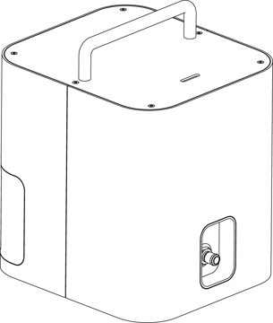
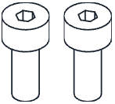
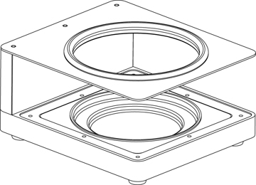
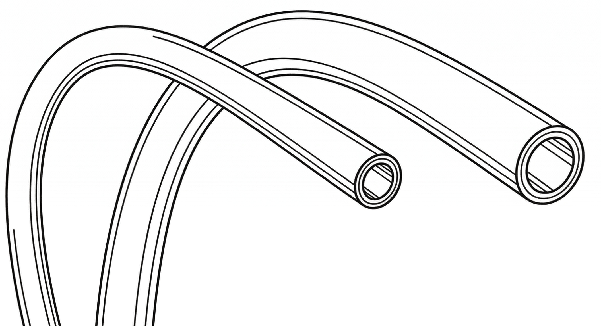
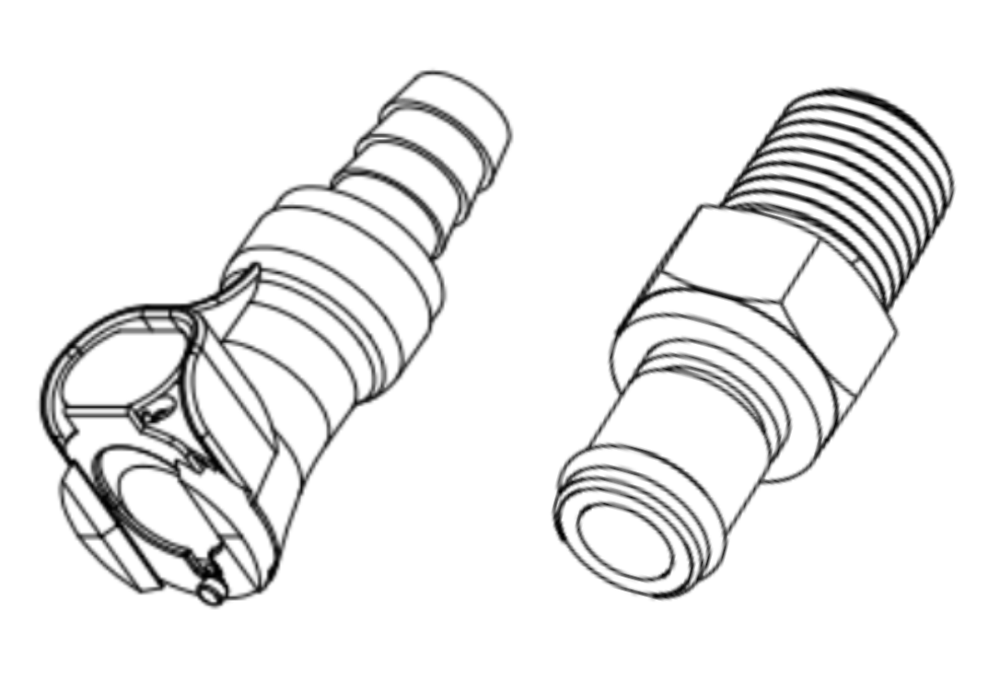

## Vacuum Module parts

The Vacuum Module ships in three separate boxes.

### Unnamed box 1

Unnamed box 1 includes deck components that hold labware and other components for vacuum-rated applications.

<figure markdown>
  
<figcaption>(1) Short collar, 42 mm </figcaption>
</figure>

<figure markdown>

<figcaption>(1) Tall collar, 72 mm</figcaption>
</figure>

<figure markdown>

<figcaption>(1) Short spacer, 27 mm</figcaption>
</figure>

<figure markdown>

<figcaption>(1) Tall spacer, 34 mm</figcaption>
</figure>

<figure markdown>

<figcaption>(1) Vacuum base</figcaption>
</figure>

### Unnamed box 2

Unnamed box 2 includes the vacuum pump, deck adapter hardware, and power and data cables.

<figure markdown>

<figcaption>(1) Control Box</figcaption>
</figure>

<figure markdown>

<figcaption>(1) USB A-B cable</figcaption>
</figure>

<figure markdown>

<figcaption>(1) IEC power cable</figcaption>
</figure>

<figure markdown>

<figcaption>(1) Deck adapter</figcaption>
</figure>

<figure markdown>
{ width="50%" }
<figcaption>(2) Deck adapter screws, M4x10</figcaption>
</figure>

### Unnamed box 3

Unnamed box 3 includes items that connect the manifold to the waste collection carboy.

<figure markdown>
{ width="70%" }
<figcaption>(1) Carboy and cap, 2 liter</figcaption>
</figure>

<figure markdown>

<figcaption>(1) Carboy cradle</figcaption>
</figure>

<figure markdown>

<figcaption>(2) Vacuum hoses, 6 mm and 9.5 mm</figcaption>
</figure>

<figure markdown>

<figcaption>(8) Quick connectors</figcaption>
</figure>

## Physical specifications

### Control Box

The Control Box includes the vacuum pump, air/water separator, electronics, and power supply.

<table>
  <thead>
    <tr>
      <th>Specification</th>
      <th>Description</th>
    </tr>
  </thead>
  <tbody>
    <tr>
      <td><strong>Dimensions</strong></td>
      <td>225 mm L x 200 mm W x 278 mm H (&asymp; 9" L x 8" W x 11" H)</td>
    </tr>
    <tr>
      <td><strong>Weight</strong></td>
      <td><strong>TBD</strong> kg</td>
    </tr>
      <td><strong>Maximum pump rate</strong></td>
      <td><strong>TBD</strong> L/min</td>
    </tr>
    <tr>
      <td><strong>Vacuum range (absolute)</strong></td>
      <td>1,013 mbar (sea level ambient) to 200 mbar (max)</td>
    </tr>
  </tbody>
</table>

### Vacuum hoses

The Vacuum Module ships with two vacuum hoses and factory installed quick connect/disconnect fittings.

<table>
  <thead>
    <tr>
      <th>Specification</th>
      <th>Description</th>
    </tr>
  </thead>
  <tbody>
    <tr>
      <td><strong>Hose dimensions</strong></td>
      <td>
        <ul>
          <li>6 mm (&frac14;") ID, 2 m L (&asymp; 79")</li>
          <li>9.5 mm (&frac38;") ID, 2 m L (&asymp; 79")</li>
        </ul>
      </td>
    </tr>
    <tr>
      <td><strong>Material composition</strong></td>
      <td>Perfluoroalkoxy (PFA)</td>
    </tr>
  </tbody>
</table>

### Carboy

The Vacuum Module ships with glass carboy for waste collection and a safety cradle to help keep the carboy secure on the workbench and prevent tip-overs.

<table>
  <thead>
    <tr>
      <th>Specification</th>
      <th>Description</th>
    </tr>
  </thead>
  <tbody>
    <tr>
      <td><strong>Carboy</strong></td>
      <td> <ul>
          <li>Composition: clear glass</li>
          <li>Capacity: 2 liters</li>
          <li>Opening: wide-mouth, screw top</li>
        </ul>
      </td>
    </tr>
    <tr>
      <td><strong>Cap</strong></td>
      <td>
        <ul>
          <li>Type: GL80 (blue)</li>
          <li>Insert: Stainless steel, ported and threaded for hose connectors</li>
          <li>Seal: integral lip seal (polypropylene)</li>
          <li>Backflow preventer: float ball and valve (polypropylene)</li>
      </td>
    </tr>
  </tbody>
</table>

## Power supply

The Vacuum Module requires the following power inputs, which are met by its internal power supply.

<table>
  <thead>
    <tr>
      <th>Specification</th>
      <th>Details</th>
    </tr>
  </thead>
  <tbody>
    <tr>
      <td><strong>Manufacturer and model</strong></td>
        <td>The module is powered by a <a href="https://www.meanwell.com/index.aspx">Mean Well</a> LOP-200-24 series low-profile, open-frame internal power supply.
        </td>
    </tr>
    <tr>
      <td><strong>Input Power</strong></td>
      <td>
        <ul>
          <li>80—264 VAC</li>
          <li>47—63 Hz</li>
          <li>1 A at 230 VAC or 2.5 A at 115 VAC</li>
        </ul>
      </td>
    </tr>
    <tr>
      <td><strong>Output Power</strong></td>
      <td>
        <ul>
          <li>24 VDC</li>
          <li>Up to 5.9 A</li>
          <li>140 W (maximum, with convection cooling)</li>
        </ul>
      </td>
    </tr>
    <tr>
      <td><strong>Over-voltage</strong></td>
      <td>
        <ul>
          <li>Category III (OVC III)</li>
          <li>Protection Type: Shutdown output voltage; requires re-powering to recover.</li>
        </ul>
      </td>
    </tr>
    <tr>
      <td><strong>Mains Fluctuation</strong></td>
      <td>
        <ul>
          <li>Line Regulation: ±0.5%</li>
          <li>Voltage Tolerance: ±2%</li>
        </ul>
      </td>
    </tr>
    <tr>
      <td><strong>Typical and Peak Consumption</strong></td>
      <td>
        <ul>
          <li>No-load Power Consumption: < 0.5 W </li>
          <li>Peak Load: 150% of rated power for up to 3 seconds</li>
        </ul>
      </td>
    </tr>
  </tbody>
</table>

## Environmental conditions
<!-- Using Flex specs as placeholder -->

Environmental conditions for recommended use, acceptable use, and storage vary.

|                 | Recommended for system operation | Acceptable for system operation | Storage and transportation |
| :---------------------- | :----------------------------------- | :---------------------------------- | :----------------------------- |
| **Ambient temperature** | +20 to +25 °C                        | +2 to +40 °C                        | −10 to +60 °C                  |
| **Relative humidity** | 40–60%, non-condensing            | 30–80%, non-condensing (below 30 °C) | 10–85%, non-condensing (below 30 °C) |
| **Altitude** | Approximately 500 m above sea level | Up to 2000 m above sea level    | Up to 2000 m above sea level |

Opentrons has validated the performance of the Vacuum Module in the conditions recommended for system operation, and operation in those conditions should provide optimal results. The module is safe to use in conditions acceptable for system operation, but results may vary. Do not power on or use the Vacuum Module in conditions outside of those bounds. The storage and transportation conditions only apply when the module is completely disconnected from power and other equipment.

## LED Status Lights

Status lights on the control box provide at-a-glance information about its operations. The colors and illumination patterns listed below indicate the different operating states.

<table>
    <thead>
        <tr>
            <th>LED color</th>
            <th>Module status</th>
        </tr>
    </thead>
    <tbody>
        <tr>
            <td>
                
 <!-- prevent line breaks in col 1 -->
                     White
                

            </td>
            <td>A white light indicates a neutral operation state. For example:
              <ul>
                <li>Solid white: idle.</li>
                <li>Pulsing white: busy (e.g., starting, updating, or canceling an operation).</li>
              </ul>
            </td>
        </tr>
        <tr>
            <td> Green</td>
            <td>A solid green light indicates a protocol is running.</td>
        </tr>
        <tr>
            <td> Blue</td>
            <td>A pulsing blue light indicates the module requires attention.</td>
        </tr>
        <tr>
            <td> Red</td>
            <td>A pulsing red light indicates an error condition.</td>
        </tr>
    </tbody>
</table>