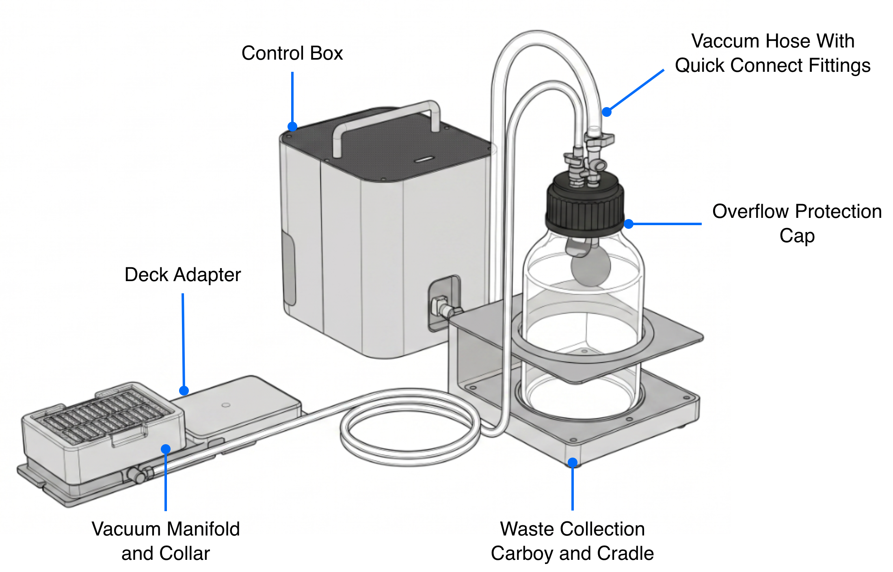

## Vacuum Module parts

The Vacuum Module ships in 3 separate boxes.

### Box 1: deck components

Box 1 includes support grids, collars and spacers, and the vacuum manifold base. These pieces stack and hold well plates used in vacuum-rated protocols.

<figure markdown>
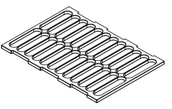
<figcaption>(1) Support grid, 96 well filter plate</figcaption>
</figure>

<figure markdown>
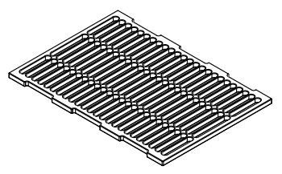
<figcaption>(1) Support grid, 384 well filter plate</figcaption>
</figure>

<figure markdown>

<figcaption>(1) Short collar, 42 mm </figcaption>
</figure>

<figure markdown>

<figcaption>(1) Tall collar, 72 mm</figcaption>
</figure>

<figure markdown>

<figcaption>(1) Short spacer, 27 mm</figcaption>
</figure>

<figure markdown>

<figcaption>(1) Tall spacer, 34 mm</figcaption>
</figure>

<figure markdown>

<figcaption>(1) Vacuum manifold base</figcaption>
</figure>

### Box 2: pump components

Box 2 includes the Control Box (vacuum pump and electronics), a deck adapter (and screws), an IEC power cable, a USB A-B data cable, and assorted fasteners.

<figure markdown>

<figcaption>(1) Control Box</figcaption>
</figure>

<figure markdown>

<figcaption>(1) Deck plate</figcaption>
</figure>

<figure markdown>
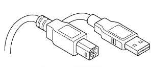
<figcaption>(1) USB A-B cable</figcaption>
</figure>

<figure markdown>
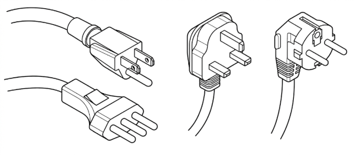
<figcaption>(1) Region-specific IEC power cable</figcaption>
</figure>

<figure markdown>
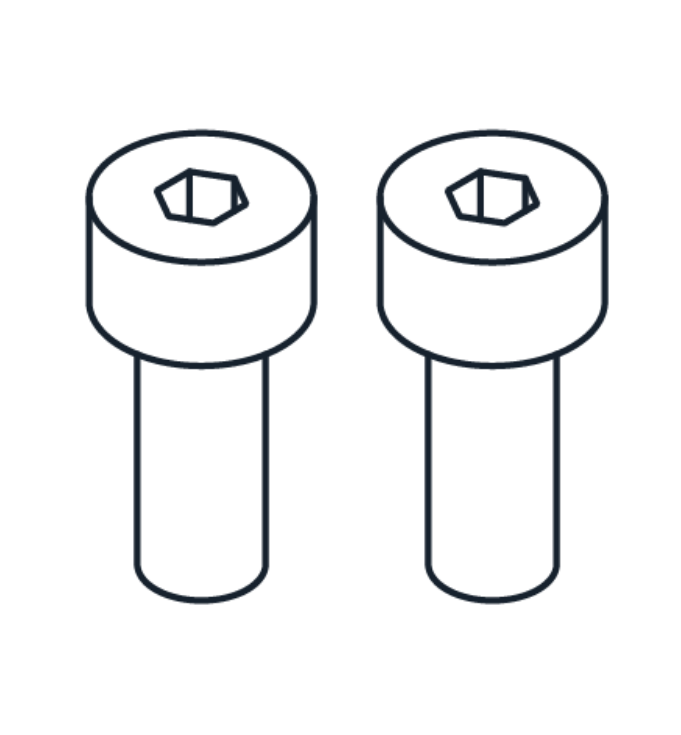{ width="70%" }
<figcaption>(2) Deck plate screws, M4x10 metric thread</figcaption>
</figure>

<figure markdown>
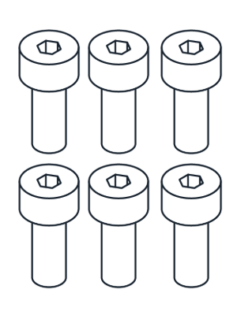{ width="80%" }
<figcaption>(6) Manifold screws, 7/64" Imperial thread</figcaption>
</figure>

### Box 3: waste collection components

Box 3 includes the waste collection carboy and cap, a carboy holder (to help prevent tip-overs), vacuum hoses, hose clamps, along with extra quick connect/disconnect fittings and clamps (not shown here).

* The carboy, cap, and hoses ship with quick connector fittings already installed at the factory.
* The hoses are wrapped around the shaped foam padding in the bottom of the box.
* You can use extra hardware (fittings and clamps) to create your own, customized set of vacuum hoses.

<figure markdown>
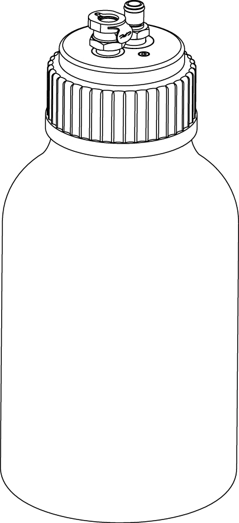{ width="70%" }
<figcaption>(1) Waste carboy and cap, 2 L </figcaption>
</figure>

<figure markdown>
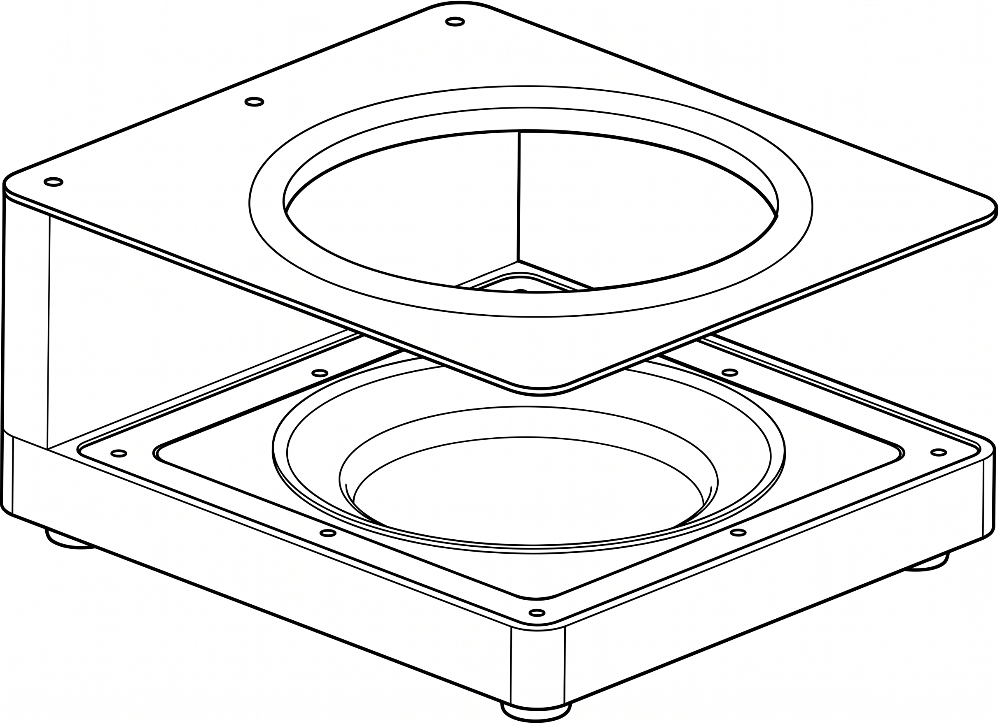
<figcaption>(1) Carboy holder</figcaption>
</figure>

<figure markdown>
<figcaption>(1) 6 mm diameter hose, 2 m</figcaption>
</figure>

<figure markdown>
<figcaption>(1) 9 mm diameter hose, 2 m</figcaption>
</figure>

## Physical specifications

### Control Box

The Control Box includes the vacuum pump, air/water separator, electronics, and power supply.

<table>
  <thead>
    <tr>
      <th>Specification</th>
      <th>Description</th>
    </tr>
  </thead>
  <tbody>
    <tr>
      <td><strong>Dimensions</strong></td>
      <td>225 mm L x 200 mm W x 278 mm H (&asymp; 9" L x 8" W x 11" H)</td>
    </tr>
    <tr>
      <td><strong>Weight</strong></td>
      <td><strong>TBD</strong> kg</td>
    </tr>
      <td><strong>Maximum pump rate</strong></td>
      <td><strong>TBD</strong> L/min</td>
    </tr>
    <tr>
      <td><strong>Vacuum range (absolute)</strong></td>
      <td>1,013 mbar (sea level ambient) to 200 mbar (max)</td>
    </tr>
  </tbody>
</table>

### Vacuum hoses

The Vacuum Module ships with two vacuum hoses and factory installed quick connect/disconnect fittings.

<table>
  <thead>
    <tr>
      <th>Specification</th>
      <th>Description</th>
    </tr>
  </thead>
  <tbody>
    <tr>
      <td><strong>Hose dimensions</strong></td>
      <td>
        <ul>
          <li>6 mm (&frac14;") ID, 2 m length (&asymp; 79")</li>
          <li>9.5 mm (&frac38;") ID, 2 m length (&asymp; 79")</li>
        </ul>
      </td>
    </tr>
    <tr>
      <td><strong>Material composition</strong></td>
      <td>Tygon® 2375</td>
    </tr>
  </tbody>
</table>

### Carboy

The Vacuum Module ships with glass waste collection carboy, cap, cap wrench, and holder. The holder helps keep the carboy upright and prevents tip-overs. The wrench helps you remove the cap after returning the module system to atmospheric pressure.

<table>
  <thead>
    <tr>
      <th>Specification</th>
      <th>Description</th>
    </tr>
  </thead>
  <tbody>
    <tr>
      <td><strong>Waste jar</strong></td>
      <td> <ul>
          <li>Composition: clear glass</li>
          <li>Capacity: 2 liters</li>
          <li>Opening: wide-mouth, screw top</li>
        </ul>
      </td>
    </tr>
    <tr>
      <td><strong>Cap</strong></td>
      <td>
        <ul>
          <li>Type: GL80 (blue)</li>
          <li>Insert: Stainless steel, ported and threaded for hose connectors</li>
          <li>Seal: integral lip seal</li>
          <li>Backflow preventer: float ball and valve</li>
      </td>
    </tr>
  </tbody>
</table>

## Power supply

The Vacuum Module requires the following power inputs, which are met by its internal power supply.

<table>
  <thead>
    <tr>
      <th>Specification</th>
      <th>Details</th>
    </tr>
  </thead>
  <tbody>
    <tr>
      <td><strong>Manufacturer and model</strong></td>
        <td>The module is powered by a Mean Well LOP-200-24 series low-profile, open-frame internal power supply.
        </td>
    </tr>
    <tr>
      <td><strong>Input Power</strong></td>
      <td>
        <ul>
          <li>110&ndash;240 VAC</li>
          <li>50&ndash;60 Hz</li>
        </ul>
      </td>
    </tr>
    <tr>
      <td><strong>Output Power</strong></td>
      <td>
        <ul>
          <li>24 VDC</li>
          <li>Up to 5.9 A</li>
          <li>140 W (maximum, with convection cooling)</li>
        </ul>
      </td>
    </tr>
    <tr>
      <td><strong>Over-voltage</strong></td>
      <td>
        <ul>
          <li>Category III (OVC III)</li>
          <li>Protection Type: Shutdown output voltage; requires re-powering to recover.</li>
        </ul>
      </td>
    </tr>
    <tr>
      <td><strong>Mains Fluctuation</strong></td>
      <td>
        <ul>
          <li>Line Regulation: ±0.5%</li>
          <li>Voltage Tolerance: ±2%</li>
        </ul>
      </td>
    </tr>
    <tr>
      <td><strong>Typical and Peak Consumption</strong></td>
      <td>
        <ul>
          <li>No-load Power Consumption: < 0.5 W </li>
          <li>Peak Load: 150% of rated power for up to 3 seconds</li>
        </ul>
      </td>
    </tr>
  </tbody>
</table>

## Environmental conditions
<!-- Using Flex specs as placeholder -->

Environmental conditions for recommended use, acceptable use, and storage vary.

|                 | Recommended for system operation | Acceptable for system operation | Storage and transportation |
| :---------------------- | :----------------------------------- | :---------------------------------- | :----------------------------- |
| **Ambient temperature** | +20 to +25 °C                        | +2 to +40 °C                        | −10 to +60 °C                  |
| **Relative humidity** | 40–60%, non-condensing            | 30–80%, non-condensing (below 30 °C) | 10–85%, non-condensing (below 30 °C) |
| **Altitude** | Approximately 500 m above sea level | Up to 2000 m above sea level    | Up to 2000 m above sea level |

Opentrons has validated the performance of the Vacuum Module in the conditions recommended for system operation, and operation in those conditions should provide optimal results. The module is safe to use in conditions acceptable for system operation, but results may vary. Do not power on or use the Vacuum Module in conditions outside of those bounds. The storage and transportation conditions only apply when the module is completely disconnected from power and other equipment.

## LED Status Lights

Status lights on the control box provide at-a-glance information about its operations. The colors and illumination patterns listed below indicate the different operating states.

<table>
    <thead>
        <tr>
            <th>LED color</th>
            <th>Module status</th>
        </tr>
    </thead>
    <tbody>
        <tr>
            <td>
                
 <!-- prevent line breaks in col 1 -->
                     White
                

            </td>
            <td>A white light indicates a neutral operation state. For example:
              <ul>
                <li>Solid white: idle.</li>
                <li>Pulsing white: busy (e.g., starting, updating, or canceling an operation).</li>
              </ul>
            </td>
        </tr>
        <tr>
            <td> Green</td>
            <td>A solid green light indicates a protocol is running.</td>
        </tr>
        <tr>
            <td> Blue</td>
            <td>A pulsing blue light indicates the module requires attention.</td>
        </tr>
        <tr>
            <td> Red</td>
            <td>A pulsing red light indicates an error condition.</td>
        </tr>
    </tbody>
</table>