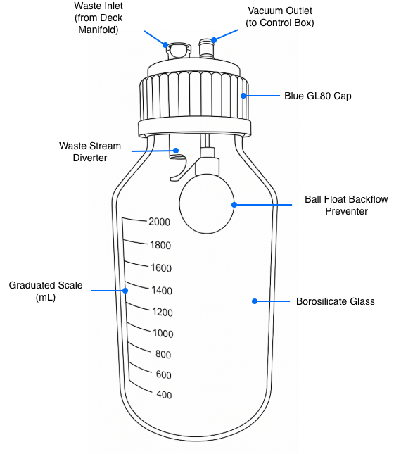

The Vacuum Module ships with a glass carboy, cap, cap wrench, carboy holder, and a vacuum hose clip.

## Carboy features

The Vacuum Module includes a 2 L borosilicate 3.3 glass carboy for liquid waste collection. The carboy features a graduated scale that ranges from 400 mL to 2,000 mL and an etched marking square for labeling.

!!! note
    Inspect the glass carboy for damage during unpacking, installation, and use. Replace if chipped or cracked.

The carboy cap is a blue polypropylene (PP) cap with GL80 wide-mouth threads. The cap is ported and threaded for CPC quick-connect couplings.

<figure markdown>

<figcaption>Carboy features</figcaption>
</figure>

The cap assembly features a waste diverter and mechanical float. The diverter directs incoming fluid away from the float. The float acts as a mechanical backflow preventer. As liquid fills the carboy, the float rises to seal the vacuum port which protects the Control Box and pump from contact with waste liquid. After the port closes, the pump will detect a pressure change and shut down.

## Specifications

<table>
  <thead>
    <tr>
      <th>Specification</th>
      <th>Description</th>
    </tr>
  </thead>
  <tbody>
    <tr>
      <td><strong>Carboy</strong></td>
      <td> <ul>
          <li>Composition: Borosilicate 3.3, clear glass</li>
          <li>Capacity: 2 L</li>
          <li>Graduations: 400–2,000 mL (200 mL increments)
          <li>Opening: wide-mouth, screw top</li>
        </ul>
      </td>
    </tr>
    <tr>
      <td><strong>Cap</strong></td>
      <td>
        <ul>
          <li>Type: Blue GL80 (PP)</li>
          <li>Insert: Stainless steel, ported and threaded for hose couplings</li>
          <li>Seal: integral lip seal</li>
          <li>Backflow preventer: float ball and valve</li>
      </td>
    </tr>
  </tbody>
</table>

## Chemical compatibility

The waste carboy is made of Borosilicate 3.3 glass. This material is resistant to water, steam, acids, salt solutions, halogens, and organic solvents. Its low coefficient of thermal expansion provides high resistance to thermal shock. Although Borosilicate 3.3 is durable, this material provides only moderate resistance to strong alkaline solutions.

!!! warning
    Exposure to hot, concentrated phosphoric acid or hydrofluoric acid will cause surface etching or complete dissolution.

See [Chemical Compatibility](compatibility.md) for the ratings of individual carboy pieces and materials.

## Accessories

### Cap wrench

A large cap wrench (or ring spanner) is included with the carboy. This tool slips over the carboy cap to help you loosen it after it's been under vacuum pressure.

<figure markdown>
{ width="70%" }
<figcaption>Carboy cap wrench</figcaption>
</figure>

### Hose clip

The magnetic hose clip mounts to the top of the Control Box. It's designed to keep the end of a disconnected hose upright so trapped liquid does not drip onto workspace surfaces. Two circular cutouts on one end of the clip are sized for 6 mm and 9 mm vacuum hoses. To use the clip, press the free end of a vacuum hose into its corresponding cutout.

<strong>IMAGE PLACEHOLDER</strong>