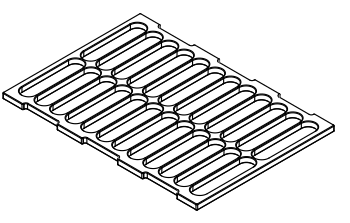
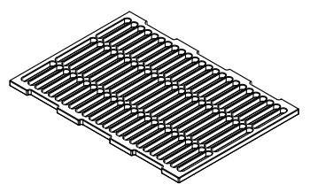

Module deck components consist of a vacuum base, interchangeable collars, internal spacers, and well plate support grids. The vacuum base forms the foundation of this on-deck hardware stack. Collars and spacers rest sequentially on the base to control labware stacking heights between well plates and help ensure an airtight seal. At the top of the stack, a wide or narrow aperture metal grid provides extra support for a filter plate when placed under vacuum.

## Vacuum base

The vacuum base sits directly on its own deck plate. It serves as the foundation of the module's hardware stack, supporting all internal spacers, collars, and protocol labware.

<figure markdown>
  { width="90%" }
  <figcaption>Vacuum base with quick-connect manifold</figcaption>
</figure>

When connected to the waste carboy, negative pressure from the vacuum pump draws liquid down cleanly through the module assembly. The vacuum base collects this fluid, routing it into an internal collection plate or out to the external carboy via the attached 6 mm hose.

## Collars

Collars sit directly on the vacuum base. They support filter plates used during vacuum extraction protocols. Each collar features an integrated gasket that forms an airtight vacuum seal with the well plate, while a secondary gasket on the vacuum base seals it to the collar. The short and tall collars are fully compatible with the Flex Gripper.

The Vacuum Module includes two collars to match different labware profiles:

* **Short Collar (42 mm):** Optimized for filter plates that typically have working volume ranges between 50 μL and 250 μL.
* **Tall Collar (72 mm):** Optimized for deep-well filter plates that typically have working volumes up to 1.8 mL.

Both collars accommodate standard ANSI/SLAS compliant filter plates across a span of different membrane pore sizes, ranging from very fine (0.22 μm) to coarse (100.0 μm).

<figure class="side-by-side" markdown>

<figcaption>Short collar (42 mm) and tall collar (72 mm)</figcaption>
</figure>

## Support grids

Support grids hold filter plates on top of the short or tall collars. These grids are made of metal and provide a rigid foundation that supports filter plates when placed under strong vacuum pressure.

The Vacuum Module includes two support grids with perforations that match different well plate profiles:

- **Wide grid:** Features large apertures to support 96-well filter plates.
- **Narrow grid:** Features small apertures to support 384-well filter plates.

<figure class="side-by-side" markdown>

<figcaption>Wide and narrow support grids</figcaption>
</figure>

DO WE NEED A NEW PAGE FOR SPACERS ONLY?

## Spacers

Spacers (shims) sit directly inside the vacuum manifold base to raise a collection plate closer to the filter plate above it. Minimizing the gap between plates ensures fluid droplets fall cleanly into receiving wells rather than being pulled sideways into adjacent wells.

!!! note
    Spacers are not gripper-compatible. You must place them into and remove them from the vacuum base manually.

### Available heights

The system includes three flat spacers (3.2 mm, 5.2 mm, and 7.25 mm) and a 12.8 mm spacer. The taller 12.8 mm spacer is equipped with locating clips that hold a standard ANSI/SLAS 96-well filter plate.

<figure markdown>

<figcaption>3.2 mm spacer</figcaption>
</figure>

<figure markdown>

<figcaption>5.2 mm spacer</figcaption>
</figure>

<figure markdown>

<figcaption>7.25 mm spacer</figcaption>
</figure>

<figure markdown>

<figcaption>12.8 mm spacer</figcaption>
</figure>

### Display and load names

Spacers are defined in software and the robot by their JSON labware definitions. These definitions govern the display names that appear in the Opentrons App, in Protocol Designer, and on the Flex touchscreen, as well as the API `loadName` strings.

| Spacer height | Display and API load name |
| :--- | :--- |
| **3.2 mm** | Opentrons Vacuum Manifold Spacer 3.2 mm `opentrons_vacuum_manifold_spacer_3.2mm` |
| **5.2 mm** | Opentrons Vacuum Manifold Spacer 5.2 mm `opentrons_vacuum_manifold_spacer_5.2mm` |
| **7.25 mm** | Opentrons Vacuum Manifold Spacer 7.25 mm `opentrons_vacuum_manifold_spacer_7.25mm` |
| **12.8 mm** | Opentrons Vacuum Manifold Spacer 12.8 mm `opentrons_vacuum_manifold_spacer_12.8mm` |

### Stacking rules

* **Maximum stack height:** A stack may contain up to three spacers total.
* **No stack duplicates:** Use only one spacer of each height per stack.
* **Hierarchy:** Flat spacers (3.2 mm, 5.2 mm, and 7.25 mm) stack directly on the vacuum base or atop one another in any sequence.
* **Topmost spacer:** When used, the 12.8 mm spacer must always sit at the very top of a spacer stack because it has the locating clips and recessed pocket to hold a well plate. You cannot place the other spacers on top of the 12.8 mm spacer.

The following table lists the supported lower surfaces or spacers each spacer can rest on.

| Top spacer | Lower spacer or surface |
|----|----|
| **12.8 mm** | Vacuum base, 3.2 mm, 5.2 mm, 7.25 mm |
| **7.25 mm** | Vacuum base, 3.2 mm, 5.2 mm |
| **5.2 mm** | Vacuum base, 3.2 mm, 7.25 mm |
| **3.2 mm** | Vacuum base, 5.2 mm, 7.25 mm |
