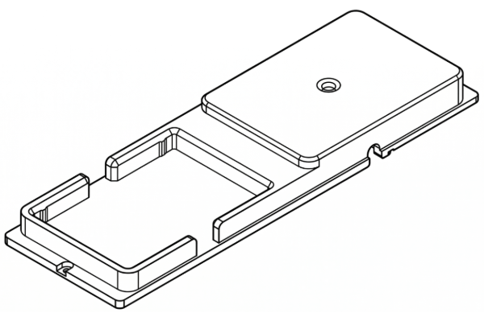
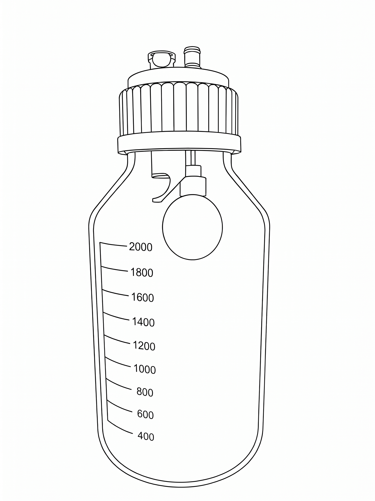
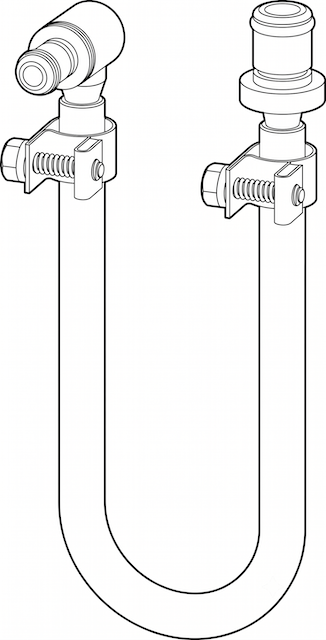
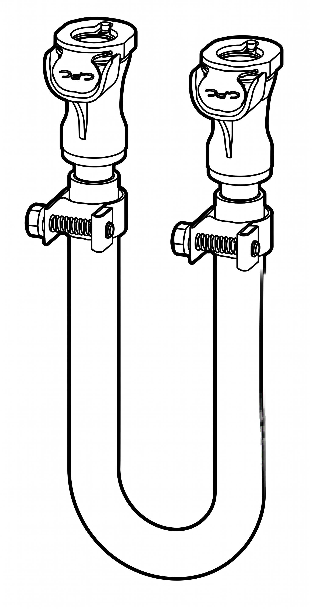

## Vacuum Module parts

The Vacuum Module ships in separate boxes that contain all the components and hardware shown below.

### Deck components

Deck components install directly onto the Flex deck to support labware and different vacuum protocol profiles. These include the vacuum manifold base, collars, internal spacers, and plate support grids.

<figure markdown>

<figcaption>(1) Support grid, 96 well filter plate</figcaption>
</figure>

<figure markdown>

<figcaption>(1) Support grid, 384 well filter plate</figcaption>
</figure>

<figure markdown>

<figcaption>(1) Short collar, 42 mm</figcaption>
</figure>

<figure markdown>

<figcaption>(1) Tall collar, 72 mm</figcaption>
</figure>

<figure markdown>

<figcaption>(1) Short spacer, 27 mm</figcaption>
</figure>

<figure markdown>

<figcaption>(1) Tall spacer, 34 mm</figcaption>
</figure>

<figure markdown>

<figcaption>(1) Vacuum manifold base</figcaption>
</figure>

### Module components

Module components provide the external power, vacuum, data communication, and mechanical items required to run the module. These include the Control Box (vacuum pump and electronics), carboy holder, deck adapter plate, cables, fasteners, and hex keys.

<figure markdown>

<figcaption>(1) Control Box</figcaption>
</figure>

<figure markdown>

<figcaption>(1) Carboy holder</figcaption>
</figure>

<figure markdown>

<figcaption>(1) Deck adapter</figcaption>
</figure>

<figure markdown>

<figcaption>(1) USB A-B cable</figcaption>
</figure>

<figure markdown>

<figcaption>(1) Region-specific IEC power cable</figcaption>
</figure>

<figure markdown>
{ width="50%" }
<figcaption>(2) Deck adapter screws, M4x10 metric thread</figcaption>
</figure>

<figure markdown>
{ width="60%" }
<figcaption>(6) Manifold screws, 7/64" Imperial thread</figcaption>
</figure>

### Waste collection components

Waste collection components connect directly to the manifold base and provide an enclosed liquid routing and storage system. These include the glass carboy, GL80 sealing cap, cap wrench, and vacuum tubing.

* The carboy, cap, and hoses ship with quick-connect fittings installed at the factory.
* Extra fittings and hose clamps are provided to assemble custom vacuum line lengths if needed.

<figure markdown>
{ width="70%" }
<figcaption>(1) Carboy, 2L</figcaption>
</figure>

<figure markdown>
{ width="90%" }
<figcaption>(1) Carboy cap, GL80</figcaption>
</figure>

<figure markdown>

<figcaption>(1) Cap wrench</figcaption>
</figure>

<figure markdown>
{ width="70%" }
<figcaption>(1) 6 mm diameter hose, 2 m</figcaption>
</figure>

<figure markdown>
{ width="70%" }
<figcaption>(1) 9 mm diameter hose, 2 m</figcaption>
</figure>

## Physical specifications

### Control Box

The Control Box houses the vacuum pump, air/water separator, electronics, and power supply.

<table>
  <thead>
    <tr>
      <th>Specification</th>
      <th>Description</th>
    </tr>
  </thead>
  <tbody>
    <tr>
      <td><strong>Dimensions</strong></td>
      <td>225 mm L x 200 mm W x 278 mm H (&asymp; 9" L x 8" W x 11" H)</td>
    </tr>
    <tr>
      <td><strong>Weight</strong></td>
      <td>10 kg (22 lbs)</td>
    </tr>
    <tr>
 <tr>
      <td><strong>Pump type</strong></td>
      <td>Piston-driven</td>
   </tr>
   <tr>
      <td><strong>Flow rate</strong></td>
      <td>50.1 L/min (gas) 
      
<strong>Note:</strong> Pump values reflect published hardware specifications. Operational performance is controlled by Opentrons Vacuum Module software.

      </td>
    </tr>
   <tr>
      <td><strong>Vacuum range<strong></td>
      <td>
        <ul>
          <li>Gauge pressure: 0 mbar (ambient atmospheric) to -881.31 mbar (maximum pump rating).</li>
          <li>Absolute pressure: 1,013 mbar (sea level ambient) to ~132 mbar.</li>
      </td>
    </tr>
  </tbody>
</table>

### Vacuum hoses

The Vacuum Module ships with two vacuum hoses, factory installed quick connect/disconnect fittings, and spare fittings.

<table>
  <thead>
    <tr>
      <th>Specification</th>
      <th>Description</th>
    </tr>
  </thead>
  <tbody>
    <tr>
      <td><strong>Dimensions</strong></td>
      <td>
        <ul>
          <li>6 mm (&frac14;") ID, 2 m length (&asymp; 79")</li>
          <li>9.5 mm (&frac38;") ID, 2 m length (&asymp; 79")</li>
        </ul>
      </td>
    </tr>
    <tr>
      <td><strong>Material</strong></td>
      <td>Tygon® 2375</td>
    </tr>
    <tr>
      <td><strong>Fittings</strong></td>
      <td>The Vacuum Manifold uses CPC quick connect/disconnect fittings. These fittings come attached to the hoses from the factory. You also get extra fittings (and hose clamps) to make your own,custom hose connections. Dimensions are given below:
        <ul>
          <li>L-shaped fitting: 3.2 mm (⅛")</li>
          <li>All other fittings: 6.4 mm (&frac14;")</li>
        </ul>
      </td>
    </tr>
  </tbody>
</table>

## Power supply

The Vacuum Module requires the following power inputs, which are met by its internal power supply.

<table>
  <thead>
    <tr>
      <th>Specification</th>
      <th>Details</th>
    </tr>
  </thead>
  <tbody>
    <tr>
      <td><strong>Manufacturer and model</strong></td>
        <td>The module is powered by a Mean Well LOP-200-24 series low-profile, open-frame internal power supply.
        </td>
    </tr>
    <tr>
      <td><strong>Input Power</strong></td>
      <td>
        <ul>
          <li>100&ndash;240 VAC</li>
          <li>50&ndash;60 Hz</li>
        </ul>
      </td>
    </tr>
    <tr>
      <td><strong>Output Power</strong></td>
      <td>
        <ul>
          <li>24 VDC</li>
          <li>Up to 5.9 A</li>
          <li>140 W (maximum, with convection cooling)</li>
        </ul>
      </td>
    </tr>
    <tr>
      <td><strong>Fuse</strong></td>
      <td>
        <ul>
          <li>Slow-blow (time-delay)</li>
          <li>8 A, 250 V</li>
        </ul>
          <strong>Warning:</strong> Do not attempt to replace the fuse unless at the direction of Opentrons Support.
      </td>
    </tr>
    <tr>
      <td><strong>Power cable</strong></td>
      <td>The module ships with a region-specific, AC power cable that meets International Electrotechnical Commission (IEC) standards for electronic and technical devices. 
        

        <strong>Warning:</strong>
          <ul>
            <li>Do not replace the AC power cable unless directed by Opentrons Support.</li>
            <li>Do not use the AC power cable if it is frayed or damaged. The use of damaged power cords can cause an electric shock hazard resulting in injury or damage to the Vacuum Module.</li>
          </ul>
        

      </td
    </tr>
    <tr>
      <td><strong>Over-voltage</strong></td>
      <td>
        <ul>
          <li>Category III (OVC III)</li>
          <li>Protection Type: Shutdown output voltage; requires re-powering to recover.</li>
        </ul>
      </td>
    </tr>
    <tr>
      <td><strong>Mains Fluctuation</strong></td>
      <td>
        <ul>
          <li>Line Regulation: ±0.5%</li>
          <li>Voltage Tolerance: ±2%</li>
        </ul>
      </td>
    </tr>
    <tr>
      <td><strong>Typical and Peak Consumption</strong></td>
      <td>
        <ul>
          <li>No-load Power Consumption: < 0.5 W </li>
          <li>Peak Load: 150% of rated power for up to 3 seconds</li>
        </ul>
      </td>
    </tr>
  </tbody>
</table>

## Environmental conditions

Environmental conditions for recommended use, acceptable use, and storage vary.

| | Recommended for system operation | Acceptable for system operation | Storage and transportation |
| :---- | :---- | :---- | :---- |
| **Ambient temperature** | +20 to +25 °C | +2 to +40 °C | −10 to +60 °C |
| **Relative humidity** | 40–60%, non-condensing | 30–80%, non-condensing (below 30 °C) | 10–85%, non-condensing (below 30 °C) |
| **Altitude** | Approximately 500 m above sea level  | Up to 2000 m above sea level | Up to 2000 m above sea level |

Operating the vacuum module within the recommended conditions provides optimal performance. The module is safe to use within acceptable conditions, but results may vary. Do not power on or run the Vacuum Module outside of acceptable operating conditions. The storage and transportation conditions only apply when the module is completely disconnected from power and other equipment.

## LED Status Lights

Status lights on the control box provide at-a-glance information about its operations. The colors and illumination patterns listed below indicate the different operating states.

<table>
    <thead>
        <tr>
            <th>LED color</th>
            <th>Module status</th>
        </tr>
    </thead>
    <tbody>
        <tr>
            <td>
                
 <!-- prevent line breaks in col 1 -->
                     White
                

            </td>
            <td>A white light indicates a neutral operation state. For example:
              <ul>
                <li>Solid white: idle.</li>
                <li>Pulsing white: busy (e.g., starting, updating, or canceling an operation).</li>
              </ul>
            </td>
        </tr>
        <tr>
            <td> Green</td>
            <td>A solid green light indicates a protocol is running.</td>
        </tr>
        <tr>
            <td> Blue</td>
            <td>A pulsing blue light indicates the module requires attention.</td>
        </tr>
        <tr>
            <td> Red</td>
            <td>A pulsing red light indicates an error condition.</td>
        </tr>
    </tbody>
</table>