The Vacuum Module uses a modular deck stack that supports a variety of filtration protocols. By combining specific collars, spacers, and support grids, you can configure the module to either collect samples or extract liquids directly to waste. Selecting the correct stack configuration ensures a reliable, airtight seal across different labware types and protocols.

## Stacking configurations

Each stack configuration helps you control the vertical distance between the sample filter plate and the lower collection plate (or waste manifold). Minimizing the clearance between well plates helps prevents cross-contamination, aerosol/droplet spraying, and ensures clean liquid transfer into target wells.

### With spacers

This stack inserts a short or tall spacer between the vacuum base and collection plate to maintain a uniform gap between the filter and collection well plates. Reducing the vertical distance between the two well plates ensures fluid droplets fall cleanly into the receiving wells. A narrower gap between the plates also prevents negative vacuum pressure from pulling liquid sideways, eliminating cross-contamination between adjacent wells. The short and tall spacers can be paired with either collar.

* **Short spacer (27 mm):** Elevates deep-well collection plates to match standard filter plate heights.
* **Tall spacer (34 mm):** Elevates standard microliter collection plates to bring shallow wells directly under the filter plate nozzles.

From top to bottom, a filtrate collection stack uses the pieces shown below. Always check and test your stack to ensure that a selected combination of pieces is appropriate for a particular protocol.

<figure markdown>
  { width="70%" }
  <figcaption>Filtrate collection stack with spacers</figcaption>
</figure>

### Without spacers

This stack omits spacers altogether to seat a sample filter plate directly on top of a collection well plate. Both plates rest on the vacuum base and are capped by a short or tall collar, which creates a vacuum seal among the stacked components. Stacking well plates without spacers also helps minimize the potential for sample loss or aerosol contamination.

<figure markdown>
  { width="80%" }
  <figcaption>Filtrate collection stack without spacers</figcaption>
</figure>

### Direct to waste

This stack omits both the the spacers and the collection well plate. Instead, the filter plate rests directly on a short or tall collar, which sits on the vacuum base. When under vacuum, this configuration draws liquid through the filter plate and into the carboy.

<figure markdown>
  { width="80%" }
  <figcaption>Waste disposal stack</figcaption>
</figure>
