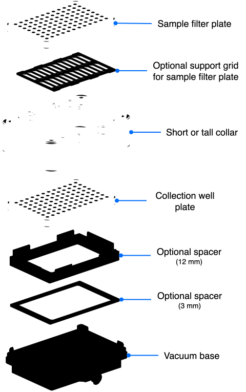
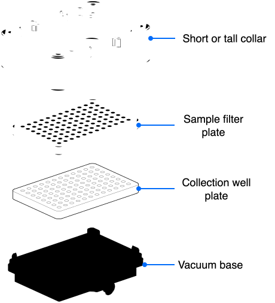
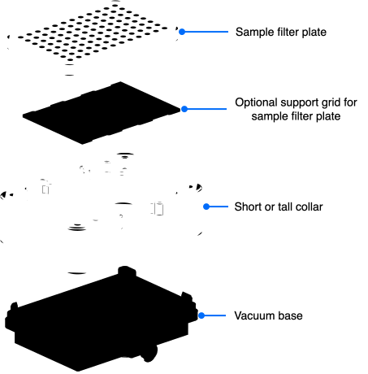

The Vacuum Module uses a modular deck stack system that supports a variety of filtration protocols. By combining specific collars and spacers, you can configure the system to either collect filtrate into standard labware or evacuate liquids directly to waste. Selecting the correct stack configuration ensures a reliable, airtight seal across different labware types and protocols.

## Stacking configurations

Each stack configuration helps you control the vertical clearance between the filter plate and collection plate seated over the vacuum base. Maintaining a tight, precise clearance between well plates helps ensure that extracted fluid drops directly into receiving wells..

### With spacers

This configuration uses internal spacers seated on the vacuum base to elevate a collection plate beneath the filter plate . Reducing the vertical distance between the two well plates ensures fluid droplets fall cleanly into the receiving wells. Adding modular spacers can help compensate for short plate skirts or shallow wells, closing the clearance gap so filtered material transfers cleanly with minimum loss.

!!! note
    Spacers are not gripper-compatible. You must place spacers onto the vacuum base manually during deck setup. During automated protocol runs, the Flex Gripper can move collars and well plates, but it cannot grasp the spacers.

Depending on your collection plate's skirt geometry and well depth, you can configure and control plate gaps by using the modular spacer system:

* **Available heights:** You get three flat shims (3.2 mm, 5.2 mm, and 7.25 mm) and a 12.8 mm spacer equipped with locating clips.
* **Stack limits:** Up to three spacers total per stack, using at most one of each height (no duplicate spacers).
* **Hierarchy:** Flat shims sit on the vacuum base or stack atop one another in any sequence. When used, the 12.8 mm spacer must always sit at the very top of the stack because its alignment clips secure the filter or collection well plate. You cannot place the other spacers on top of the 12.8 mm spacer.

See the [Deck Components section](specifications/deck-components.md#spacers) for more information about the spacers and stacking rules.

From top to bottom, a filtrate collection stack uses the pieces shown below. Always check and test your stack to ensure that a selected combination of pieces is appropriate for a particular protocol.

<figure markdown>
  { width="70%" }
  <figcaption>Filtrate collection stack with spacer</figcaption>
</figure>

### Without spacers

This stack omits spacers altogether to seat a sample filter plate directly on top of a collection well plate. Both plates rest on the vacuum base and are capped by a short or tall collar, which creates a vacuum seal among the stacked components. Stacking well plates without spacers also helps minimize the potential for sample loss or aerosol contamination.

<figure markdown>
  { width="80%" }
  <figcaption>Filtrate collection stack without spacers</figcaption>
</figure>

### Direct to waste

This stack omits both the spacers and the collection well plate. Instead, the filter plate rests directly on a short or tall collar, which sits on the vacuum base. When under vacuum, this configuration draws liquid through the filter plate and into the carboy.

<figure markdown>
  { width="80%" }
  <figcaption>Waste disposal stack</figcaption>
</figure>

## Stacking advice

Sometimes different combinations of collars, spacers, and labware don't stack up well or hold vacuum. A successful operation often depends on two physical characteristics that allow stacked pieces to create and maintain a good vacuum seal:

- **Stack height:** The spacer and collection plate must fit inside the collar so all seals and gaskets seat flush against labware surfaces. If a stack is too tall, the bottom of the collar may not sit flush against the vacuum base gasket. If the internal stack is too short, the collection plate may not seal tightly against the collar's inner gasket.

- **Seal integrity:** All mating surfaces must sit flush against each other and compress evenly to hold vacuum.

## Testing vacuum integrity

A visual inspection and an active vacuum test can help determine if a combination of collars, spacers, and well plates will hold vacuum.

| Test | Description |
|:----|:----|
| **Visual inspection** | Ensure stacked components sit flush against all sealing gaskets. The stack should rest firmly on the vacuum base without obvious titling or easily rocking back and forth. |
| **In App** | In the Opentrons App, go to the Devices tab and click your robot. From the Instruments and Modules section, find the tile for the Vacuum Module and click the three-button menu (⋮). Click **Pressure** or **Power** to start/stop the pump and listen for audible arc leaks. |
| **API** | Run an automated test by calling `start_set_vacuum_pressure()` with specific pressure, duration, and timeout arguments. If the system fails to reach the target pressure within the timeout interval, the API will raise an error. You may also hear audible air leaks. |
