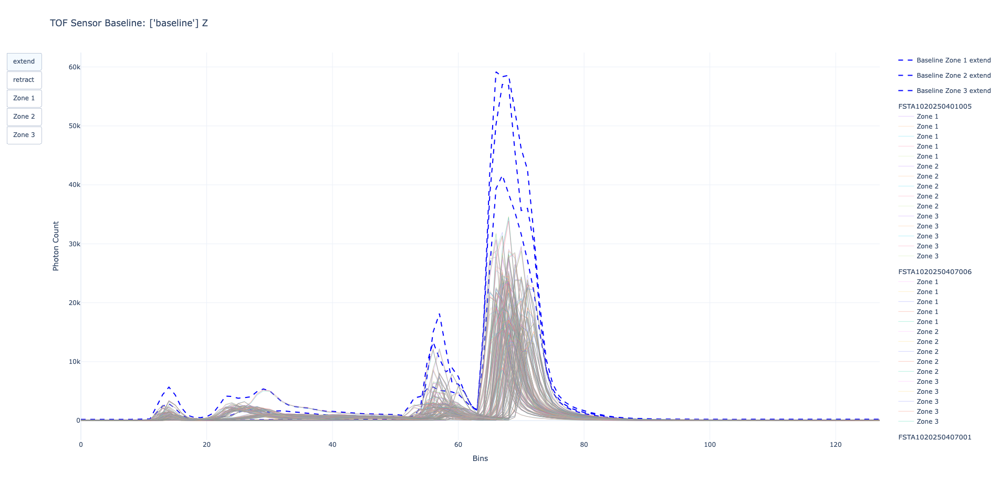
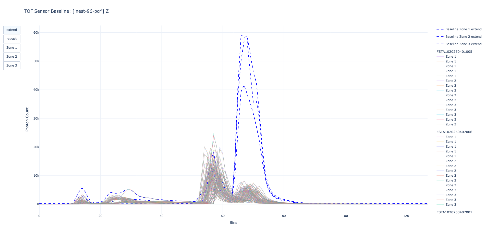

# Set of tools to analyze and plot TOF sensor histogram data

## Usage

python3 tof_analysis.py <action> \[options\]
python3 tof_analysis.py --help for all options

### Baseline Generator

Generates baselines to stdout or JSON file if `--output-file` is passed in, can specify additional options for filtering.
By default the baseline is generated without filtering, which means using all
- axis (x and z)
- platform (extend and retract)
- zones (0-9)
- bins (0-128)

```bash
python3 tof_analysis.py generate --dataframe <dataframe_path_csv> [--output-file <baseline_path_json>] [options]
```

The format for the JSON file is as followed, where the `TOFSensorBaseline` object
holds the `version` and axis `X` and `Z`, the axis then holds the platform
`extend` and `retract` for each axis. Each platform then holds a python dict string
containing the zones and list of 128 calculated values for that zone. We embed this into the [flexStackerModuleV1.json](https://github.com/Opentrons/opentrons/blob/9964abdcf0c8bde3171f4777f222d5a247efce8b/shared-data/module/definitions/3/flexStackerModuleV1.json#L197)
definition and serialize it with [load_tof_baseline_data](https://github.com/Opentrons/opentrons/blob/9964abdcf0c8bde3171f4777f222d5a247efce8b/shared-data/python/opentrons_shared_data/module/__init__.py#L103)
function when detecting labware in the [labware_detected](https://github.com/Opentrons/opentrons/blob/9964abdcf0c8bde3171f4777f222d5a247efce8b/api/src/opentrons/hardware_control/modules/flex_stacker.py#L533) method of the FlexStacker module.

```json
{
  "uniqueModuleData": {
    "TOFSensorBaseline": {
      "version": 1,
      "X": {
        "extend": "{zone: [0,2,3...], ...}",
        "retract": "{zone: [0,2,3...], ...}"
      },
      "Z": {
        "extend": "{zone: [0,2,3...], ...}",
        "retract": "{zone: [0,2,3...], ...}"
      },
    }
  }
}
```

### Baseline + Measurement Plotter

Plots the baseline and measurements to visually inspect overlaps in the baseline
and specific labware measurements. The 'extend' and 'retract' buttons let you filter the platform.
The 'Zone <n>' buttons let you filter out individual zones.

#### Baseline Plot
```bash
python3 tof_analysis.py plot --baseline <baseline_path_json> [--dataframe <dataframe_path_csv>] [options]
```


#### Baseline Plot + Labware Measurement
```bash
python3 tof_analysis.py plot --baseline <baseline_path_json> [--dataframe <dataframe_path_csv>] --labwares nest-96-pcr [options]
```



### Baseline Validator

```bash
python3 tof_analysis.py validate --baseline <baseline_path_json> --dataframe <dataframe_path_csv> [options]
```
