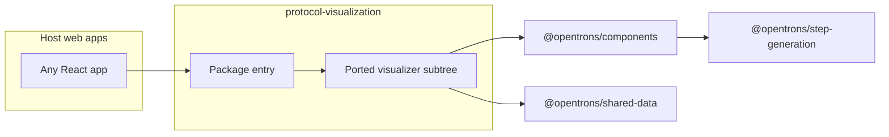

# `@opentrons/protocol-visualization` — implementation plan

This document is the working plan for extracting desktop protocol visualization into a standalone library. It lives in this package so reviewers and future PRs share one source of truth.

## Scaffold (initial PR)

- **Package shell** under `protocol-visualization/` with build, types, and a stub entrypoint (see [CHANGES/0001-scaffold-package.md](./CHANGES/0001-scaffold-package.md)).
- **CI** modeled on the components workflow: lint, test, typecheck, and lib build on relevant PRs.

## Goals (visualization work)

- Standalone React library that accepts **protocol analysis** as input and renders the desktop-style visualization experience from `app` (command list, deck, step detail), without modifying `app/`, `components/`, or `step-generation/` until an explicit follow-up chooses to consolidate.
- **Do not modify** those upstream folders during the port; only add and edit files under `protocol-visualization/` (plus normal monorepo root wiring).
- Depend on **`@opentrons/components`**, **`@opentrons/shared-data`**, and (when needed) **`@opentrons/step-generation`** via workspace `link:`.
- No “smart refactor” inside `components` during the port; duplication from `app` into this package is acceptable until a later consolidation.

## Current implementation in `app`

- Main shell: [`app/src/organisms/Desktop/ProtocolVisualization/VisualizerContainer/index.tsx`](../app/src/organisms/Desktop/ProtocolVisualization/VisualizerContainer/index.tsx).
- Subtree: [`app/src/organisms/Desktop/ProtocolVisualization/`](../app/src/organisms/Desktop/ProtocolVisualization/) (~85 files).
- **App coupling** in that container includes Redux (`stepDetailViewer*` actions, analytics), [`useMostRecentCompletedAnalysis`](../app/src/resources/runs), [`getProtocolDisplayName`](../app/src/transformations/protocols), and types from [`protocol-storage`](../app/src/redux/protocol-storage/types.ts).
- **Command list** uses [`AnnotatedSteps`](../app/src/organisms/Desktop/ProtocolDetails/AnnotatedSteps/index.tsx), which pulls in [`CommandIcon`](../app/src/molecules/Command/CommandIcon.tsx), [`ProtocolAnalysisErrorModal`](../app/src/organisms/Desktop/Devices/ProtocolRun/ProtocolRunHeader/RunHeaderModalContainer/modals/ProtocolAnalysisErrorModal.tsx), and more app-only modules.
- Other touches: [`SlotDetailsEmptyState`](../app/src/molecules/SlotDetailsEmptyState/index.tsx), [`getTopPortalEl`](../app/src/App/portal.tsx), [`usePipetteNameSpecs`](../app/src/local-resources/instruments/hooks/usePipetteNameSpecs.ts) (OEM display naming via app settings).

## Approach

Because upstream folders must stay untouched, **copy (port)** the needed UI into `protocol-visualization/src/` and **rewire only inside this package**.



### Port checklist

1. **Bulk port** the tree under `app/src/organisms/Desktop/ProtocolVisualization/` into `protocol-visualization/src/` (adjust imports to package-local paths).
2. **Port command-step dependencies**: `AnnotatedSteps` folder, `CommandIcon.tsx`, and related CSS.
3. **Port** `SlotDetailsEmptyState` (component + CSS).
4. **Types**: copy minimal `GroupedCommands` / `LeafNode` / `ParentNode` shapes from `app/src/redux/protocol-storage/types.ts` into this package (no Redux imports from `app`).
5. **Decouple in ported code only**:
   - Remove Redux, analytics, and `useMostRecentCompletedAnalysis`; public API takes a single `analysis` prop.
   - Replace `getProtocolDisplayName` with a prop or a copied pure helper.
   - Replace `usePipetteNameSpecs` with `getPipetteNameSpecs` from `@opentrons/shared-data` for standalone display names.
   - Replace `getTopPortalEl` with `document.body` or an optional `portalRoot` prop.
   - Replace `ProtocolAnalysisErrorModal` with a small modal built from `@opentrons/components` (no `CodeBlock` / run API hooks).
6. **i18n**: vendor [`app/src/assets/localization/en/protocol_visualization.json`](../app/src/assets/localization/en/protocol_visualization.json) (and `zh` if desired); document `registerProtocolVisualizationI18n(i18n)` or equivalent for hosts.

### Suggested public API (after port)

```ts
// Conceptual; names TBD
export function ProtocolVisualization(props: {
  analysis: ProtocolAnalysisOutput
  protocolDisplayName?: string
  groupedCommands?: GroupedCommands | null
  portalRoot?: HTMLElement | null
}): JSX.Element
```

### Non-goals (until explicitly scheduled)

- Wiring the Opentrons `app` to consume this package (requires `app/` edits later).
- Shared abstractions moved into `components/` first.

## Related docs

- [CONVENTIONS.md](./CONVENTIONS.md) — TypeScript and CSS module rules for this repo (with pointers to Cursor skills).
- [CHANGES/0001-scaffold-package.md](./CHANGES/0001-scaffold-package.md) — scaffold PR scope (package + tests + CI workflow).
