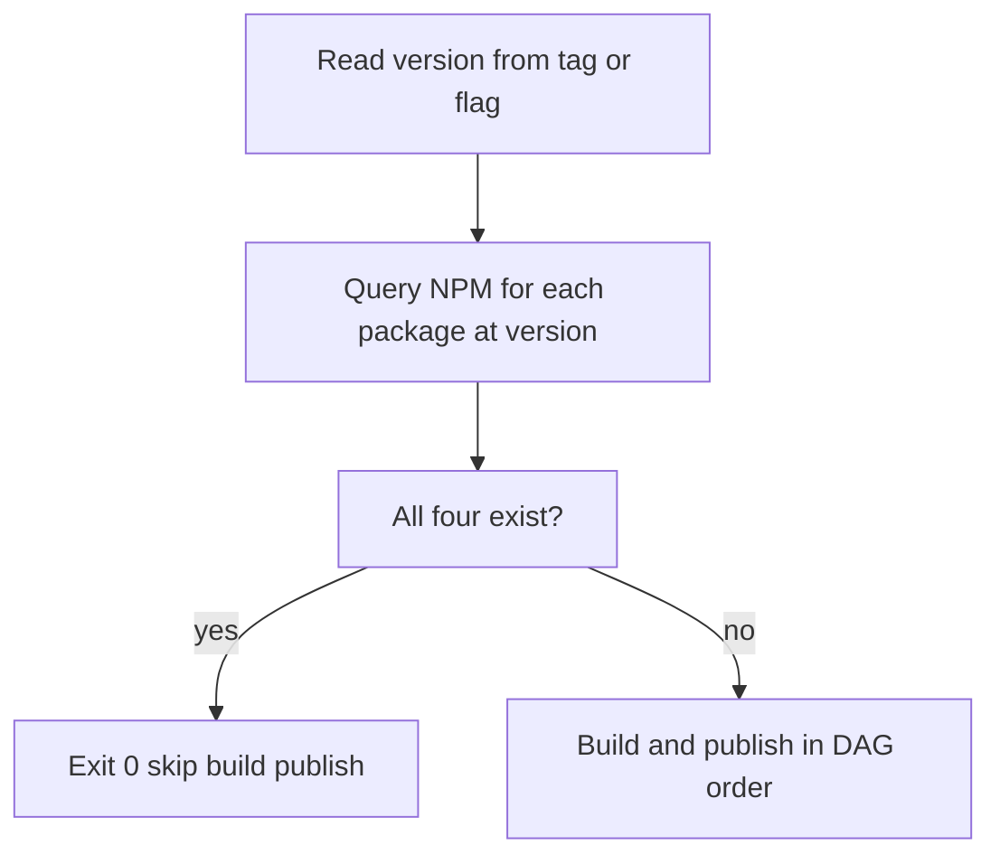

---

name: NPM publish + component testing
overview: Add a uv-managed Python CLI under `scripts/npm-release/` (Rich + Typer) that resolves one semver, checks the NPM registry for idempotency, rewrites manifests, builds, and publishes four NPM packages in order. If all four versions already exist (e.g. published locally before the tag push), skip build and publish and exit success. Remove NPM publish from existing workflows; add a dedicated workflow with a new tag pattern (TBD). Extend `components-testing` for pack/link parity.
todos:

- id: scaffold-cli
content: Add `scripts/npm-release/` uv project (Typer + Rich, version parse from new tag in CI, registry pre-check for all four packages, manifest rewrite, build/publish orchestration, skip-if-complete, dry-run/ci; handle partial-publish policy)
status: pending
- id: step-gen-shippable
content: Make `step-generation` publishable (remove `private`, add lib/vite build + `pack` Makefile target if missing, verify `files`/`exports` for npm)
status: pending
- id: ci-unify
content: Remove NPM publish jobs from shared-data and components workflows; add new workflow (single job, new tag glob) invoking the CLI; adjust notify job `needs` / conditions; keep shared-data PyPI deploy separate
status: pending
- id: components-testing-pv
content: Extend components-testing Makefile, package.json, vite smoke import, workflow paths, SKILL.md (pack/link step-generation + protocol-visualization as needed)
status: pending
- id: tests-docs
content: Add pytest for tag parsing and registry idempotency logic (mocked); document new tag, local-then-push workflow, and dependency graph
status: pending

---

# Unified NPM publish and components-testing for protocol-visualization

## Current behavior (pain points)

- Versioning and NPM manifest edits live only in CI: `[components-test-build-deploy.yaml](../../.github/workflows/components-test-build-deploy.yaml)` (`publish-components` on `components@*` tags) and `[shared-data-test-lint-deploy.yaml](../../.github/workflows/shared-data-test-lint-deploy.yaml)` (`publish-to-npm` gated by `publish-switch` for `shared-data@*` / `components@*` tags).
- NPM publishing is **split across two workflows** and can **race** (ordering not guaranteed).
- **NPM publish is coupled** to those broader test-and-deploy workflows instead of a single, intentional release entry point.
- Local rehearsal means reassembling CI shell by hand.
- `[components-testing](../../components-testing/)` packs only `[shared-data](../../shared-data/)` and `[components](../../components/)`; `[protocol-visualization](../../protocol-visualization/)` is not integrated yet.

## Target behavior

- **One Python CLI** for local and CI: version resolution, **NPM registry idempotency check**, manifest rewrites, ordered builds, `npm publish`.
- **Local-first or GitHub outage:** You can publish from a dev machine, then push the release tag when GitHub is back. CI must **not** fail or duplicate work: if the **tag semver already exists on the registry for all four packages**, the CLI exits **0** early and **skips** build and publish (log clearly: “already published”).
- **Four NPM packages**, same semver per release: `@opentrons/shared-data`, `@opentrons/step-generation`, `@opentrons/components`, `@opentrons/protocol-visualization`.
- **NPM publishing is not done inside** `[shared-data-test-lint-deploy.yaml](../../.github/workflows/shared-data-test-lint-deploy.yaml)` or `[components-test-build-deploy.yaml](../../.github/workflows/components-test-build-deploy.yaml)`. Remove those NPM publish jobs (and related `publish-switch` / notify wiring used only for NPM).
- **One new workflow** (dedicated file, e.g. `npm-packages-publish.yaml` or similar) with **one job** that runs on a **new tag pattern only** (exact prefix TBD; examples: `npm-packages@`*, `opentrons-npm@*`, `js-packages@*`). That job checks out the tag, sets up Node and uv, runs `uv run` on the publish CLI (`--ci`, version from tag). Yarn/setup-js runs only when the CLI proceeds past the registry check (see section 1).
- **Shared-data Python** (wheel / Test PyPI / PyPI in the existing workflow) **stays where it is** unless you later choose to merge it; this plan treats **unified deployment** as **unified NPM release of the four JS packages** only.

### Dependency graph (what consumers get)

```mermaid
flowchart TD
  sd[@opentrons/shared-data]
  sg[@opentrons/step-generation]
  co[@opentrons/components]
  pv[@opentrons/protocol-visualization]
  sd --> sg
  sd --> co
  sg --> co
  sd --> pv
  sg --> pv
  co --> pv
```


| Package                  | Stands alone               | Depends on                                     |
| ------------------------ | -------------------------- | ---------------------------------------------- |
| `shared-data`            | Yes                        | (no `@opentrons/*`)                            |
| `step-generation`        | Possible                   | `shared-data`                                  |
| `components`             | No (for this product line) | `shared-data`, `step-generation`               |
| `protocol-visualization` | No                         | `shared-data`, `step-generation`, `components` |


**Publish order:** `shared-data` → `step-generation` → `components` → `protocol-visualization`.

**Pattern:** Publish `@opentrons/step-generation` as its own package; pin exact internal versions; npm dedupes when `components` and `protocol-visualization` both depend on the same `step-generation` version.

```mermaid
flowchart LR
  resolve[Resolve version from new tag]
  rewrite[Rewrite package.json files]
  build_sd[Build shared-data]
  pub_sd[Publish shared-data]
  build_sg[Build step-generation]
  pub_sg[Publish step-generation]
  build_co[Build components]
  pub_co[Publish components]
  build_pv[Build protocol-visualization]
  pub_pv[Publish protocol-visualization]
  resolve --> rewrite --> build_sd --> pub_sd --> build_sg --> pub_sg --> build_co --> pub_co --> build_pv --> pub_pv
```




## 1. New CLI package: `scripts/npm-release/` (uv + Rich + Typer)

Mirror `[scripts/static-deploy/](../static-deploy/)`: `pyproject.toml`, `Makefile`, optional README.


| Capability        | Notes                                                                                                                                                                                                                |
| ----------------- | -------------------------------------------------------------------------------------------------------------------------------------------------------------------------------------------------------------------- |
| Parse version     | `--version` locally; in CI, parse from `GITHUB_REF` using the **new tag prefix only** (strip prefix to semver).                                                                                                      |
| Validate          | Reject invalid semver.                                                                                                                                                                                               |
| Registry check    | For each of the four scoped packages, determine whether **that exact version** already exists on the **public** NPM registry (`npm view <pkg>@<version> version`, or registry HTTP API). No auth required for reads. |
| Idempotent exit   | If **all four** already exist: print summary, **exit 0**, do **not** run builds or `npm publish`. Matches “published locally, tag pushed later” and avoids duplicate tarballs.                                       |
| Partial publish   | If **some** but not all exist: **do not** silently skip. **Default:** exit **failure** with a clear message (corrupt manual state).                                                                                  |
| Rewrite manifests | When continuing to publish: four packages; exact pins; do not strip `step-generation`.                                                                                                                               |
| Build / publish   | Per-package Make targets; `npm publish` in DAG order; only for packages that failed the “already exists” check (normally all or none).                                                                               |
| Modes             | `--dry-run` (show plan + registry query results); `--ci`; local Rich + confirm.                                                                                                                                      |


**CI ordering:** Run the CLI early; let it query the registry first. Optionally split workflow into “light check” vs “full build” steps only if you want a faster green check without installing yarn (registry-only step can use `curl`/`npm view` from a tiny setup). Simplest: one job, CLI handles short-circuit before `make setup-js`.




## 2. CI: remove NPM from old workflows; one new workflow + tag

**Remove**

- From `[shared-data-test-lint-deploy.yaml](../../.github/workflows/shared-data-test-lint-deploy.yaml)`: `publish-switch` (if only used for NPM gating), `publish-to-npm`, and any `notify-`* conditions that require `publish-to-npm`. **Keep** Python lint/test/deploy jobs unrelated to NPM.
- From `[components-test-build-deploy.yaml](../../.github/workflows/components-test-build-deploy.yaml)`: `publish-components` and adjust `notify-success` / `notify-failure` / `notify-cancelled` so they do not depend on a removed publish job (Storybook build/deploy and unit tests remain).

**Add**

- New workflow YAML: `on.push.tags` limited to the **new glob** (decide name with release owners; document in runbook).
- Single job: checkout + tag fix (if needed), `scripts/npm-release` `make setup`, `uv` (and Node if `npm view` is used from CLI), then `uv run ... publish --ci`. **Defer** `[js/setup](../../.github/actions/js/setup)` and `make setup-js` until the CLI decides work is needed (subprocess or second step), so tag pushes that only “catch up” after a local publish stay fast.
- Slack/notify step after success, parallel to other release workflows.

**Tag naming (TBD):** Pick something short and unambiguous (avoid clashing with `v`* or app tags). Document migration: releases that used `components@` / `shared-data@` for NPM move to the new tag for the four-package drop.

## 3. `step-generation`: first-class publish target

- Remove `private` for release artifacts; add `lib` build + `pack` Makefile chain; correct `exports` / `files` for npm.
- Old CI lines that delete `step-generation` from `components` go away with the removed `publish-components` job; the CLI is the only manifest rewriter for NPM.

## 4. `protocol-visualization` in the publish train

Publish fourth; pin `shared-data`, `step-generation`, and `components` to the same release version.

## 5. `components-testing`

Pack and link `step-generation` and `protocol-visualization`; update workflow path filters and SKILL.

## 6. Local developer workflow

CLI to query the current versions

CLI with `--version` (and `--dry-run`); no need for the new tag locally unless you want parity testing.

## 7. Testing and verification

- Pytest: tag parsing; **mocked registry responses** for all-present (skip), none-present (publish path), partial-present (expect failure unless resume flag).
- `make -C components-testing test` after Makefile changes.
- `components@ and shared-data@`**pushes:** do nothing
- update all readmes, skills and rules

